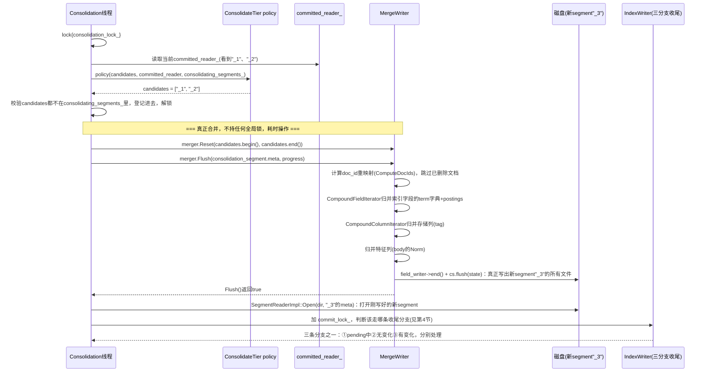
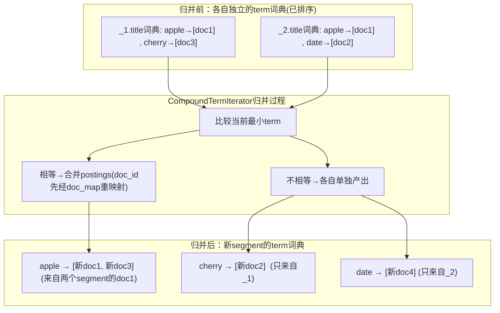
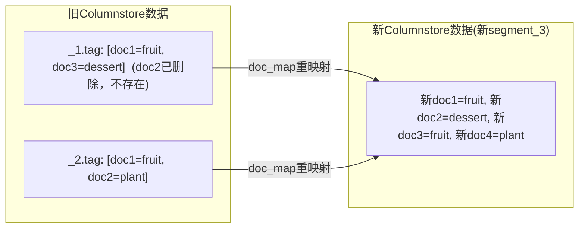
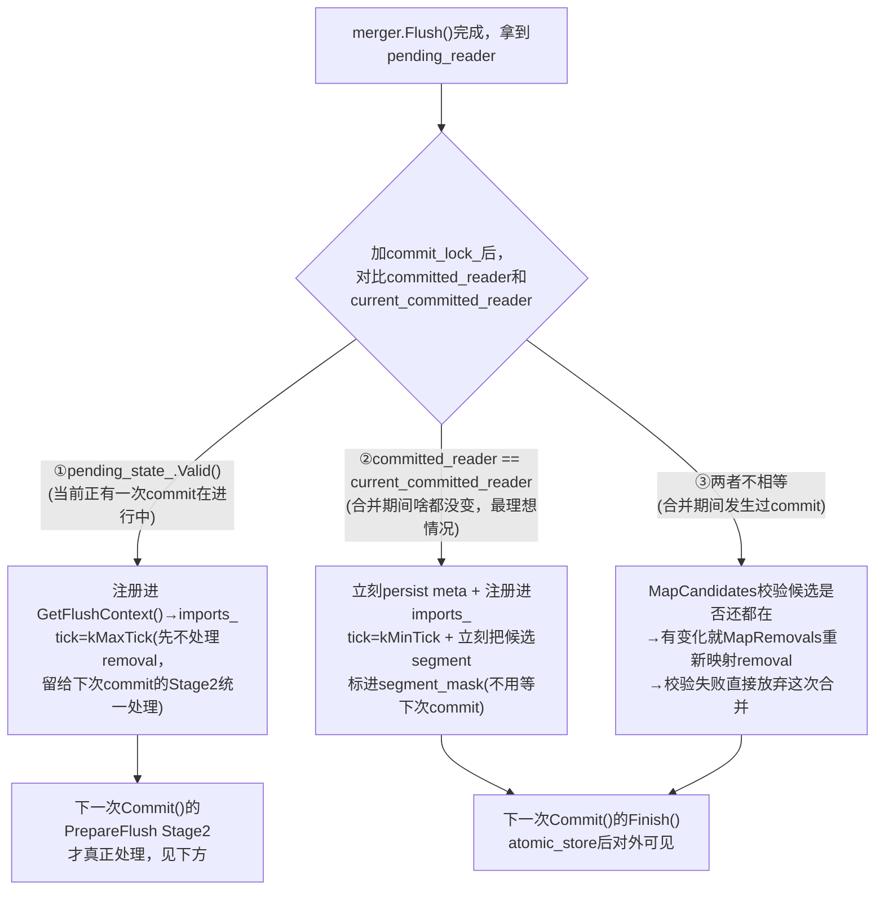

# Consolidation 段合并(Merge)工作流程笔记

个人学习笔记，整理自对 `core/index/merge_writer.cpp`、`core/index/index_writer.cpp`(`Consolidate()`/`MapCandidates`/`MapRemovals`)的逐行阅读。这是[writer_threads_collaboration.md](writer_threads_collaboration.md)第5节"重要纠正"的详细展开版——当时只给出了结论("不经过int_pool/byte_pool，走多segment归并迭代器"），这份文档把具体怎么归并、不同类型数据分别怎么处理、归并结果最终怎么被加载，逐一讲清楚。

---

## 0. 贯穿全文的例子：2个旧segment合并成1个新segment

```
旧segment "_1"：docs_count=3，doc_id=2已被标记删除(live_docs_count=2)
  title(索引,文本)： doc1="apple pie"   doc2(已删除)="banana split"   doc3="cherry cake"
  body(索引,文本,带Norm特征)： ...(内容略，只关心它也要走特征合并)
  tag(仅存储,不索引)： doc1="fruit"      doc2(已删除)="fruit"           doc3="dessert"

旧segment "_2"：docs_count=2，无删除(live_docs_count=2)
  title： doc1="apple sauce"   doc2="date palm"
  body(带Norm)： ...
  tag： doc1="fruit"            doc2="plant"
```
**特意设计"apple"这个词同时出现在"_1".doc1和"_2".doc1里**，用来演示"同一个term跨多个segment"时postings是怎么合并的；**特意保留"_1".doc2的删除**，用来演示"删除的文档在合并时会被彻底丢弃、doc_id重新收缩编号"。

---

## 1. 时间线：从触发到完成的完整过程



---

## 2. 不同类型的字段/特征，合并方式完全不同——举例说明

`MergeWriter::FlushUnsorted`(没配主排序时走的路径)内部，实际上是**两条独立的归并管线**，分别喂给同一个新建的`field_writer`和`Columnstore cs`：

| 数据类型 | 驱动迭代器 | 落地方式 | 本例对应字段 |
|---|---|---|---|
| **索引字段(term+postings)** | `CompoundFieldIterator` → `CompoundTermIterator` | `field_writer->write(field_itr, features)` | `title` |
| **特征列(如Norm)** | 同样走`CompoundFieldIterator`，但按`feature`遍历 | `cs.insert(feature_itr, ...)`写进新Columnstore | `body`的Norm |
| **纯存储列(不索引)** | `CompoundColumnIterator` | `WriteColumns(cs, ...)`写进新Columnstore | `tag` |

### 2.1 索引字段"title"怎么合并——k-way归并，同term跨segment的postings会被拼在一起

```cpp
// CompoundTermIterator::next() 核心逻辑
for (每个还在工作的term_iterator) {
  value = it->value();
  if (value < current_term_) { term_iterator_mask_.clear(); }   // 发现更小的term，重新开始收集
  if (value == current_term_) { term_iterator_mask_.emplace_back(i); }  // 跟当前最小term一样大，一起收进来
}
```
("_1"里的"title"字段按字典序排好后是:`apple, cherry`——注意doc2的"banana"因为被删，`docs_iterator()`根本不会吐出它;"_2"是`apple, date`)

**归并过程(逐步取最小term)**：
```
第1轮：两个segment当前term分别是"_1":apple, "_2":apple → 相等！两者都收进term_iterator_mask_
      → 合并产出term"apple"，postings来自两个segment
第2轮："_1"推进到"cherry"，"_2"推进到"date" → "cherry" < "date" → 只收"_1"
      → 产出term"cherry"，postings只来自"_1"
第3轮："_1"耗尽，"_2"还在"date" → 只收"_2"
      → 产出term"date"，postings只来自"_2"
```
**结果**：新segment"_3"的"title"字段词典里，`apple`这一个term的postings，是"_1".doc1和"_2".doc1**合并**后的结果(doc_id已经按下面3.1节重映射过)；`cherry`/`date`则各自保持独立。这正是"同一个term出现在不同旧segment"时的合并方式——**词典层面去重合并，postings层面取并集**。

### 2.2 特征列"body"的Norm怎么合并——不走field_writer，走Columnstore

```cpp
// WriteFields内部,对每个field的每个feature(比如Norm)：
feature_writer = factory({hdrs.data(), hdrs.size()});   // hdrs是各旧segment这个特征列的payload头，先汇总
res = cs.insert(feature_itr, info, finalizer, write_values);  // 直接写进新Columnstore，不经过field_writer
```
**Norm本质是列存数据(doc_id→归一化因子)，不是倒排词典**，所以合并时走的是Columnstore的插入接口，而不是`field_writer`的term写入接口——即使"body"是个索引字段，它的Norm特征依然走"列"这条路线，跟"title"的term合并是两套完全不同的代码路径。

### 2.3 纯存储列"tag"怎么合并——按文档逐篇搬运，不涉及任何"词"的概念

```cpp
WriteColumns(cs, remapping_itrs, *column_info_, columns_itr, progress);
// 内部：CompoundColumnIterator遍历所有旧segment的所有列
// 对每一列，逐个旧doc_id取出原始字节值，用doc_map重映射成新doc_id，写进新Columnstore
```
"tag"字段**没有"term"这个概念**——它只是"doc_id → 原始字节值"的映射，合并时就是单纯地把"_1"(跳过已删除的doc2)和"_2"的`tag`值，按新doc_id顺序搬进新的Columnstore，doc1="fruit"(来自_1.doc1)、doc2="dessert"(来自_1.doc3)、doc3="fruit"(来自_2.doc1)、doc4="plant"(来自_2.doc2)。

**三者对比一句话**：`title`要做"词典去重+postings拼接"；`body`的Norm要做"列存数据直接搬运，但走的是跟term无关的另一套Columnstore接口"；`tag`则是最简单的"按doc_id顺序搬运字节值"，连去重的概念都不需要。

---

## 3. 数据结构转换示意图——举例说明

### 3.1 第一步：doc_id重映射(`ComputeDocIds`)——删除的文档被彻底丢弃

```mermaid
graph LR
    subgraph seg1["旧segment _1 (docs_count=3)"]
      A1["doc1(live)"]
      A2["doc2(已删除)"]
      A3["doc3(live)"]
    end
    subgraph seg2["旧segment _2 (docs_count=2)"]
      B1["doc1(live)"]
      B2["doc2(live)"]
    end
    subgraph new3["新segment _3 (docs_count=4)"]
      N1["新doc1"]
      N2["新doc2"]
      N3["新doc3"]
      N4["新doc4"]
    end
    A1 -->|doc_id_map[1]=1| N1
    A2 -.->|doc_id_map[2]=eof，丢弃| X["(永久消失)"]
    A3 -->|doc_id_map[3]=2| N2
    B1 -->|doc_id_map[1]=3| N3
    B2 -->|doc_id_map[2]=4| N4
```
```cpp
for (auto docs_itr = reader.docs_iterator(); docs_itr->next(); ++next_id) {
  doc_id_map[docs_itr->value()] = next_id;   // docs_iterator()只吐出活着的文档，死的根本不出现在这里
}
```
**关键点**：`doc_id_map`初始全部填`doc_limits::eof()`(哨兵值，代表"无效/已删除")，只有`docs_iterator()`真正吐出来的(活着的)doc才会被赋上一个新doc_id——`"_1".doc2`因为是删除状态，`docs_iterator()`根本不会经过它，`doc_id_map[2]`永远停留在`eof()`，**这篇文档的数据在新segment里彻底不存在了**，不是"标记屏蔽"，是真正意义上的空间回收。

### 3.2 第二步：`CompoundTermIterator`怎么把两份term字典变成一份


注意`apple`的postings列表`[新doc1, 新doc3]`——**doc_id已经不是原来各自segment内部的"doc1"了，而是经过3.1节`doc_map`重映射后的全局新doc_id**。这是`CompoundDocIterator`(配合`RemappingDocIterator`)的职责：遍历某个term在某个来源segment里的原始postings时，实时把每个doc_id过一遍`doc_map`函数再吐出去。

### 3.3 第三步：Columnstore合并(`tag`字段)——没有"词"的概念，纯粹按doc_id搬运


`WriteColumns`就是把`CompoundColumnIterator`遍历到的每一条`(旧doc_id, 字节值)`，查一下`doc_map`拿到新doc_id，直接`out.Prepare(new_doc); out.write_bytes(value)`写进新的`Columnstore`——跟你之前深挖过的`BufferedColumn::Prepare`是同一套底层机制，只是数据来源从"实时写入"变成了"从旧文件读出来再搬运"。

---

## 4. Merge产出的新数据，最终如何被加载

`merger.Flush(...)`只是把新segment"_3"的**文件**写到了磁盘上——跟你之前研究过的`IndexWriter::Commit`一样，**物理落盘≠对查询可见**。真正"加载"分两段：**①Consolidate()自己先打开一次reader做校验，②真正并入`committed_reader_`要看走哪条收尾分支**。

### 4.1 先打开一次reader，验证新segment真的能读

```cpp
auto pending_reader = SegmentReaderImpl::Open(dir_, consolidation_segment.meta, committed_reader->Options());
```
这一步只是"打开文件、校验完整性"，拿到一个`pending_reader`对象——**此刻它只是一个局部变量，还没有交给任何人**。

### 4.2 三条收尾分支——取决于"合并这段耗时期间，世界有没有变化"

因为`merger.Flush()`是耗时操作、不持任何全局锁，等它跑完回来的时候，`committed_reader_`完全可能已经被别的commit换掉了(有新segment加入，或者候选segment被删空/被别的合并吃掉)。所以要重新判断现状：



**本例走最常见的②分支**(假设合并这几十毫秒里没有别的commit发生)：
```cpp
index_utils::FlushIndexSegment(dir, consolidation_segment);   // 持久化"_3"的meta
ctx->imports_.emplace_back(..., writer_limits::kMinTick, ...);  // 注册进当前FlushContext
segment_mask.emplace("_1");   // 立刻标记"_1"作废
segment_mask.emplace("_2");   // 立刻标记"_2"作废
```

### 4.3 回到你已经深挖过的 Stage2——下一次commit真正把它并入`readers`

不管走①②③哪条分支，`ctx->imports_`里现在有了这条"_3"的记录。等下一次`writer->Commit()`触发`PrepareFlush`时，Stage2会：
```cpp
for (import : ctx->imports_) {
  pending_consolidation = static_cast<bool>(import.consolidation_ctx.merger);  // true，这是合并结果
  MapCandidates(mappings, candidates=["_1","_2"], readers);   // 再次校验"_1"、"_2"是否还在readers里
  // 校验通过 → segment_mask再确认一次 → "_3"正式并入 readers / pending_meta.segments
}
```
(如果走的是②分支，这一步大部分校验工作在4.2里已经提前做完了，Stage2基本是"确认一下、正式收编"；如果走的是①分支，removal的映射工作会在这里才真正发生)

### 4.4 最终生效——跟普通commit完全一样的`ApplyFlush`+`Finish`

```cpp
pending_state_.commit = make_shared<DirectoryReaderImpl>(..., readers=[..., reader_"_3"]);
...
std::atomic_store(committed_reader_, pending_state_.commit);
// ★ 这一刻，"_3"才真正对查询可见；"_1"、"_2"因为在segment_mask里，不会出现在新的readers列表里 ★
```
旧的`"_1"`、`"_2"`的物理文件，此刻也不会立刻删除——要等**没有任何reader再引用它们**(比如所有正在进行中的查询都结束了)，才会被文件引用计数机制真正清理掉磁盘文件。

---

## 5. 一句话总结全流程

**合并本身(k-way归并term字典、Columnstore搬运)是纯CPU+磁盘I/O操作，不持任何全局锁，可以跟其他Index/Commit线程完全并行**；真正需要加锁协调的，只有"合并开始前挑候选"（`consolidation_lock_`）和"合并完成后要不要立刻生效"（`commit_lock_`，分化出①②③三条收尾分支，专门应对"合并期间世界可能已经变了"这个核心矛盾）；最终"让新segment真正可查询"，走的是跟普通文档commit完全同一套`ApplyFlush`+`Finish`机制，没有任何特殊通道。
