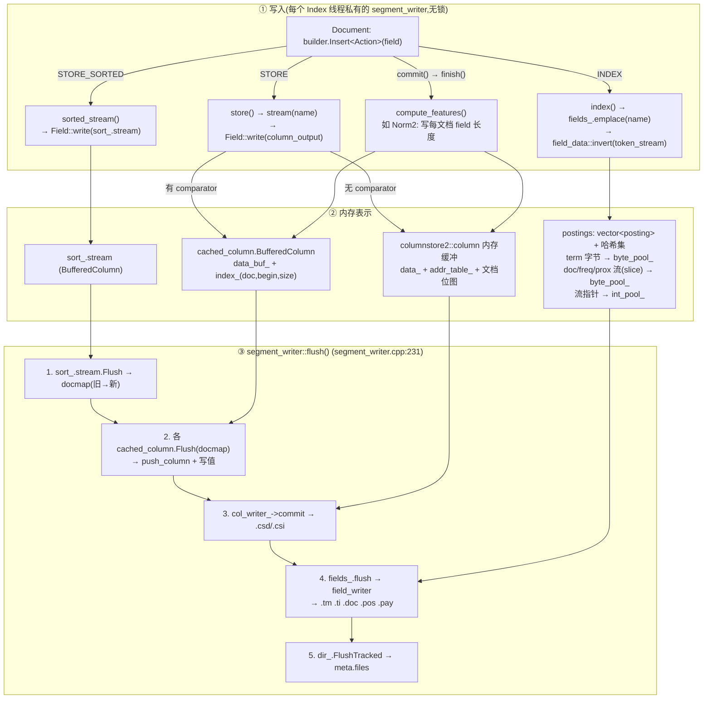
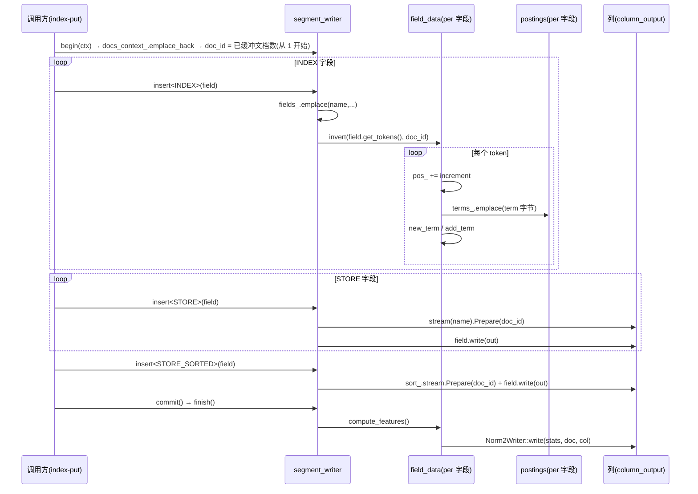
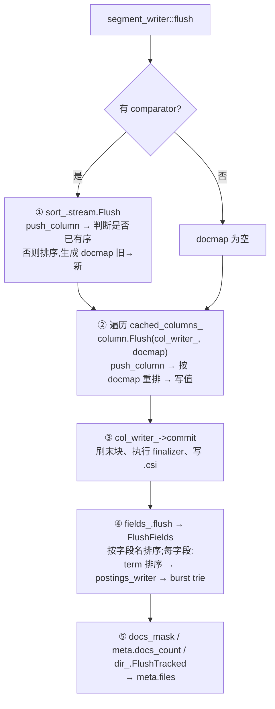
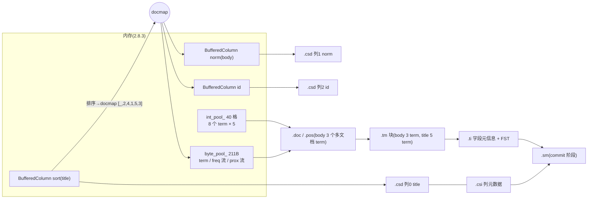

# Index / Store / Sorted 数据:写入 → 内存表示 → 落盘 全流程笔记

个人学习笔记。整理自 `segment_writer` / `field_data` / `block_pool` / `BufferedColumn` / `columnstore2` / `formats_burst_trie` / `formats_10` 的逐行阅读,配合 `utils/index-put.cpp` 里的真实 Field 类型。

> **版本说明**:落盘部分以 **format 1_4 及以后(columnstore2,文件 `.csd/.csi`)** 为主线。`index-put` 默认 `--format=1_0`([index-put.cpp:695](utils/index-put.cpp#L695)),1_0~1_3 用的是旧版 columnstore(`.cs/.cm`,[formats_10.cpp:3889](core/formats/formats_10.cpp#L3889)),块组织和压缩不同,但"列 = 每文档一个变长值"的上层模型一样。倒排部分(`.tm/.ti/.doc/.pos/.pay`)各版本基本一致。

---

## 0. 总览

### 0.1 三种 Action 对比

| | `Action::INDEX` | `Action::STORE` | `Action::STORE_SORTED` |
|---|---|---|---|
| 目的 | 可被查询的倒排索引 | 按 doc_id 取回原值(列存) | 主排序键(决定 segment 内文档顺序) |
| Field 需要提供 | `name()` `get_tokens()` `features()` `index_features()` | `name()` `write(data_output&)` | `write(data_output&)`(**不用 name**) |
| 值怎么提取 | `token_stream` 迭代出 (term, 位置增量[, offset, payload]) | `Field::write` 把原值序列化成字节 | 同 STORE |
| 内存里放哪 | `field_data` → `postings` + `byte_pool_` + `int_pool_` | 无 comparator:`columnstore2::column` 的内存缓冲;有 comparator:`cached_column` → `BufferedColumn` | `sort_.stream`(`BufferedColumn`,**必须有 comparator**) |
| 落盘 | `fields_data::flush` → `field_writer` → `.tm .ti .doc .pos .pay` | `col_writer_->commit` → `.csd .csi` | `BufferedColumn::Flush` 排序出 docmap,再作为一列写入 columnstore |
| 代码入口 | [segment_writer.hpp:317](core/index/segment_writer.hpp#L317) `index()` | [segment_writer.hpp:292](core/index/segment_writer.hpp#L292) `store()` | [segment_writer.hpp:306](core/index/segment_writer.hpp#L306) `store_sorted()` |

`insert<Action>` 用 `if constexpr` 在编译期分发([segment_writer.hpp:91-119](core/index/segment_writer.hpp#L91-L119));`INDEX|STORE`、`INDEX|STORE_SORTED` 组合走 `index_and_store`,先 index 再 store。

### 0.2 全流程图



> 关键顺序:**列存先 commit,倒排后 flush**。原因之一是倒排的 wand writer 要通过 `flush_state.columns`(即 `segment_writer` 自己,实现了 `ColumnProvider`)读 norm 列的值([segment_writer.cpp:236-240](core/index/segment_writer.cpp#L236-L240))。

---

## 1. 生产写入:Field 类型与值的提取

### 1.1 Field 是什么(duck typing,不是基类)

`segment_writer` 没有 `Field` 基类,是模板按"概念"调用成员。`index-put.cpp` 里的 `Doc::Field`([index-put.cpp:166](utils/index-put.cpp#L166))是示例实现:

```cpp
struct Field {
  std::string_view name() const;                 // 列名 / 倒排字段名
  const features_t& features() const;            // 额外特征: norm / granularity_prefix ...
  IndexFeatures index_features() const;          // FREQ / POS / OFFS / PAY
  virtual token_stream& get_tokens() const = 0;  // INDEX 用: 产出 term 序列
  virtual bool write(data_output& out) const = 0;// STORE / STORE_SORTED 用: 序列化原值
};
```

同一个 Field 对象可以既被 INDEX 又被 STORE:INDEX 走 `get_tokens()`,STORE 走 `write()`,两条路互相独立。

### 1.2 index-put 里的三种具体 Field,以及它们被放进哪类 Action

| Field 类 | `get_tokens()` 用的流 | 用在 | index_features | features | `write()` 序列化 |
|---|---|---|---|---|---|
| `StringField` | `string_token_stream`(不分词,整串一个 term) | `id` `title` `date` | `NONE` | 空 | `write_string` = vint(长度) + 字节 |
| `NumericField` | `numeric_token_stream`(按精度步长出多个 term) | `timesecnum` | `NONE` | `granularity_prefix`(标记,供 range 查询识别) | `write_zvlong` = zigzag + vlong |
| `TextField` | 分析器(默认 `segmentation`,分词) | `body` | `FREQ\|POS` | `Norm2`(1_4+)或 `Norm`(1_0~1_3 legacy) | `write_string` |

`WikiDoc` 的分配([index-put.cpp:271-314](utils/index-put.cpp#L271-L314)):

| 字段 | `elements`(INDEX) | `store`(STORE) | `sorted`(STORE_SORTED) |
|---|---|---|---|
| id | ✔ | 未被选为排序键时 ✔ | `--sorted-field=id` 时 |
| title | ✔ | ✘ | `--sorted-field=title` 时 |
| date(字符串) | ✔ | ✔(见下方疑点) | `--sorted-field=date` 时 |
| timesecnum(数值) | ✔ | ✘ | ✘ |
| body(文本) | ✔ | ✘ | ✘ |

调用点:[index-put.cpp:625-635](utils/index-put.cpp#L625-L635),`elements` 逐个 `Insert<INDEX>`,`store` 逐个 `Insert<STORE>`,`sorted` 非空则 `Insert<STORE_SORTED>`。

> ⚠️ **疑点(只读代码得出,未运行验证)**:`date` 在 [index-put.cpp:297](utils/index-put.cpp#L297) 无条件 `store.push_back(date)`,随后 [index-put.cpp:301](utils/index-put.cpp#L301) 的 `else` 分支又 `store.emplace_back(date)`,所以不按 date 排序时它在 `store` 里出现两次。`stream(name)` 按列名取同一个列,同一文档第二次 `Prepare(doc)` 是 no-op(`column::Prepare` 只在 `key > pend_` 时新建条目),于是 date 的存储值会是**两段 `write_string` 首尾拼接**。看起来像笔误。

### 1.3 INDEX:从 Field 提取 term(文本 / 数值)

`token_stream` 协议:`reset(值)` 后循环 `next()`,每次通过属性暴露当前 token:

| 属性 | 含义 | 谁必须有 |
|---|---|---|
| `term_attribute.value` (`bytes_view`) | 当前 term 的字节 | **必须**,否则 `invert` 报错返回 false |
| `increment.value` (`uint32`) | 相对上一 token 的位置增量,`0` 表示与上一个同位置 | **必须** |
| `offset{start,end}` | 字符偏移 | 仅当请求了 `OFFS` |
| `payload.value` | 每位置附带字节 | 仅当请求了 `OFFS` 且流提供 |

([field_data.cpp:986-1015](core/index/field_data.cpp#L986-L1015))

#### 字符串 / 文本

- **`string_token_stream`**([token_streams.cpp:36](core/analysis/token_streams.cpp#L36)):`next()` 第一次返回整串作为唯一 term,`offset={0,len}`,`increment` 默认 1,第二次返回 false。
- **`TextField` + 分析器**:分析器把文本切成多个 token,每个 token 一个 term,`increment` 通常为 1(同义词/多形式可为 0)。
- 其它核心流:`boolean_token_stream`(单 term:`0xFF` / `0x00`)、`null_token_stream`(单个**空** term)。

#### 数值:`numeric_token_stream`

数值被编码成**多个不同精度的 term**(类似 Lucene 的 trie 数值),为 range 查询服务。默认精度步长 `PRECISION_STEP_DEF = 16`:

- int64 → shift = 0, 16, 32, 48,共 **4 个 term**;int32 → shift = 0, 16,共 2 个 term([token_streams.cpp:78-91](core/analysis/token_streams.cpp#L78-L91))。
- 每个 term 的字节 = `1 字节头(TYPE_MAGIC + shift)` + `符号位翻转后、低 shift 位清零的值的大端高位字节`([numeric_utils.cpp:96-111](core/utils/numeric_utils.cpp#L96-L111)),保证字节序比较 = 数值序比较。
  - `TYPE_MAGIC`:int32=`0x00`,float=`0x20`,int64=`0x60`,double=`0xA0`。
- `increment`:第一个 term 为 1,其余为 0 → **同一个数的 4 个 term 在同一位置**(会累加 `stats.num_overlap`)。

例:`int64 value = 5`

```
shift= 0 : 60 | 80 00 00 00 00 00 00 05     (1+8 = 9 字节)
shift=16 : 70 | 80 00 00 00 00 00           (1+6 = 7 字节)
shift=32 : 80 | 80 00 00 00                 (1+4 = 5 字节)
shift=48 : 90 | 80 00                       (1+2 = 3 字节)
```

### 1.4 STORE / STORE_SORTED:不分词,直接序列化

流程:取(或建)列的 `column_output` → `Field::write(out)` 往里写字节 → 返回 false 则 `out.reset()` 回滚本文档的值并标记整个文档无效([segment_writer.hpp:275-290](core/index/segment_writer.hpp#L275-L290))。

- **STORE**:`stream(name, doc)`([segment_writer.cpp:202](core/index/segment_writer.cpp#L202))按列名在 `columns_`(哈希表)里 `lazy_emplace` 一个 `stored_column`。构造时二选一(`cache = (comparator != nullptr)`):
  - **无 comparator**:`columnstore.push_column(...)` 直接拿到 columnstore 的 `column`(写入即进入列存的内存缓冲);
  - **有 comparator**:建 `cached_column`(内部 `BufferedColumn`),先全缓冲在内存,flush 时按 docmap 重排再写。
- **STORE_SORTED**:`sorted_stream(doc)` → `sort_.stream.Prepare(doc)`,**永远**是 `BufferedColumn`;没有 comparator 直接 `valid_=false`。
- `index-put` 的 `StringComparer`([index-put.cpp:351](utils/index-put.cpp#L351))用 `to_string<bytes_view>` 解析**带 vint 长度前缀**的字符串,所以排序列必须用 `write_string` 写;它返回 `rhs.compare(lhs)`,即**降序**。

### 1.5 单个文档的时序



注:`seen_` 标志保证一个文档里同一字段多次 insert,也只把 `field_data` 放进 `doc_` 一次,避免 norm 被重复计算([segment_writer.cpp:190-193](core/index/segment_writer.cpp#L190-L193))。

---

## 2. 内存表示

### 2.1 INDEX:`fields_data` 的整体结构

```
segment_writer
 └─ fields_data fields_
     ├─ fields_            deque<field_data>            每个字段一个 field_data(地址稳定)
     ├─ fields_map_        flat_hash_set  name → field_data*
     ├─ byte_pool_         byte_block_pool   ← 所有字段、所有 term 共享!
     ├─ byte_writer_       byte_pool_ 的写入游标
     ├─ int_pool_          int_block_pool    ← 同上
     └─ int_writer_        int_pool_ 的写入游标

field_data (per 字段)
 ├─ meta_            field_meta{name, index_features, features}
 ├─ terms_           postings
 │    ├─ postings_   vector<posting>     下标 = term 的"序号"(插入顺序)
 │    └─ terms_      flat_hash_set       存 {序号, hash};比较时回 postings_[序号].term
 ├─ stats_           field_stats{len, num_overlap, max_term_freq, num_unique}  (当前文档)
 ├─ features_        每个 feature 一个 writer + 一个列(如 Norm2)
 └─ byte_writer_/int_writer_  指向 fields_data 里共享的两个游标
```

**所有字段共享同一对池**([field_data.hpp:260-263](core/index/field_data.hpp#L260-L263)),所以池里的内容是各字段、各 term 的数据交错存放;靠 `posting.int_start` 和 int_pool 里存的偏移来把它们串起来。`reset()` 只是把游标拨回池头,**块不释放**,下一个 segment 复用([field_data.cpp:1165](core/index/field_data.cpp#L1165))。

### 2.2 `block_pool`:分块的"只追加"内存池

([block_pool.hpp](core/utils/block_pool.hpp))

| | `byte_block_pool` | `int_block_pool` |
|---|---|---|
| 定义 | `block_pool<byte_type, 32768, ...>`([postings.hpp:54](core/index/postings.hpp#L54)) | `block_pool<size_t, 8192, ...>`([field_data.hpp:55](core/index/field_data.hpp#L55)) |
| 块大小 | 32 KiB | 8192 × 8B = 64 KiB |
| 存什么 | **① term 字节 ② freq 流 ③ prox 流** | **每个 term 的"流指针"**(见 2.4) |

- 地址 = **全局池偏移**(`block_idx * BLOCK_SIZE + 块内偏移`),不是裸指针 → 块增长不会让地址失效。
- 只追加:`inserter` 持有游标;块写满就 `alloc_buffer()` 追加新块。

### 2.3 `byte_block_pool` 里放了什么

#### (a) term 字节(连续存放)

`postings::emplace(term)`([postings.cpp:44](core/index/postings.cpp#L44)):新 term 把原始字节 `write` 进 byte_pool,`posting.term` 是指向池内的 `bytes_view`。**一个 term 不跨块**:放不下就跳到下一块起点;term 长于块大小(32 KiB)直接丢弃并告警。

#### (b) freq 流 / prox 流:用"分级链式 slice"存放

每个 term 有两条**不断增长**的字节流,但池是只追加的,于是用 **slice 链**:先给小块,写满再申请更大的块并用指针串起来。

| level | 0 | 1 | 2 | 3 | 4 | 5 | 6 | 7 | 8 | 9 |
|---|---|---|---|---|---|---|---|---|---|---|
| slice 字节数 | 5 | 14 | 20 | 30 | 40 | 40 | 80 | 80 | 120 | 200 |
| 下一级 | 1 | 2 | 3 | 4 | 5 | 6 | 7 | 8 | 9 | 9 |

([block_pool.hpp:383](core/utils/block_pool.hpp#L383),`LEVELS[]`)

```
新建 slice(level0,5B),内容全 0,最后一字节 = "下一级编号"(非 0 = 末尾哨兵):
  ┌───┬───┬───┬───┬────┐
  │ 0 │ 0 │ 0 │ 0 │ 01 │      ← 写入时遇到"当前字节非 0"就知道 slice 满了
  └───┴───┴───┴───┴────┘

写满、需要扩容时(sliced_inserter::alloc_slice, block_pool.hpp:790):
  1) 申请 level1 的新 slice(14B)
  2) 把旧 slice 末尾 3 个数据字节搬到新 slice 开头
  3) 旧 slice 最后 4 字节(3 数据字节 + 哨兵)改写成 uint32 = 新 slice 的池偏移
  ┌───┬─────────────────────┐          ┌─────────────────────────────┬────┐
  │ d0│ → addr(新 slice) 4B │ ───────▶ │ d1 d2 d3 | 新数据 ........  │ 02 │
  └───┴─────────────────────┘          └─────────────────────────────┴────┘
```

读取时 `sliced_reader(pool, begin, end)` 沿地址链顺序读到 `end`。

- **freq 流**(= 文档流,名字有历史原因):逐文档的 `doc_code`(+freq)。
- **prox 流**:逐出现位置的 `shift_pack(位置增量, 有无 payload)`,可选 payload、offset。
- 有 comparator 时(`random_access`),prox 用 **greedy slice**:slice 头部多 1 字节记 level,配合"cookie"(`slice偏移<<8 | 片内偏移`)让**每个文档的位置数据可独立寻址**,原理与例子见 2.9。

### 2.4 `int_block_pool` 里放了什么

每个 term 在 int_pool 里占一小段"控制块",`posting.int_start` 指向它的起点。**存的是两条流的读写指针**(byte_pool 的池偏移):

| 模式 | 布局(从 `int_start` 起) | 代码 |
|---|---|---|
| 顺序(无 comparator) | `[0]` freq 流**末尾** `[1]` prox 流**末尾** `[2]` freq 流**起点** `[3]` prox 流**起点** | [field_data.cpp:745](core/index/field_data.cpp#L745) `new_term` |
| 随机访问(有 comparator) | `[0]` freq 末尾 `[1]` freq 起点 `[2]` prox **末尾 cookie** `[3]` prox **起点 cookie**(最近一个文档的) `[4]` 上一个起点 cookie | [field_data.cpp:854](core/index/field_data.cpp#L854) `new_term_random_access` |

为什么单独放 int_pool:`end` 指针每写一个字节都会更新,而且随机访问模式要 5 个、顺序模式 4 个,长度随模式变化,放进定长的 `posting` 不合适(这是我的推测,代码里没有说明)。作者自己在 [field_data.hpp:262](core/index/field_data.hpp#L262) 也留了 "FIXME why don't to use std::vector<size_t>?",说明这个设计并非定论。

#### 2.4.1 为什么 freq 流的 "末尾" 和 "起点" 要分开存,而且不是连续的?

先澄清两件事:`[0]freq 末尾 [1]prox 末尾 [2]freq 起点 [3]prox 起点` 是 **4 个指针、属于 2 条流**——每条流各有 "起点" 和 "末尾" 两个指针;而每条流本身又**不是一段连续内存**,而是一条 slice 链(见 2.3(b))。所以 "起点" 和 "末尾" 之间既不连续,也不能互相推导:

| 指针 | 谁用 | 何时变 | 作用 |
|---|---|---|---|
| **末尾**(`[0]` `[1]`) | 写入方 | **每追加一个条目就变**。写完后 `doc_stream_end = doc_out.pool_offset()` 回写([field_data.cpp:803-835](core/index/field_data.cpp#L803-L835)) | 下一次从哪里接着写;读取时也是终点(`sliced_reader` 在 `pool_offset == end` 时 eof) |
| **起点**(`[2]` `[3]`) | 读取方(flush 时) | `new_term` 里**只写一次**,之后不变 | 沿链往后读的出发点 |

不能省掉其中任何一个,原因是(排布顺序的问题见 2.4.2):

1. **链只有 "向后" 的指针**:slice 写满时,旧 slice 的最后 4 字节被改写成**下一个** slice 的地址;新 slice 没有 "回指" 旧 slice。所以只有末尾指针时没法回到起点;只有起点指针时,每次追加都要从头走一遍链才能找到末尾。
2. **`末尾 − 起点` 不是流的长度**。2.8.3 里 `body.apple` 的 freq 流:起点 = 50,末尾 = 165,但真正的数据只在两个 slice 里:`50..54`(5B 里只有 1B 数据 + 4B 地址)和 `160..164`(5 个字节),差值 115 没有任何含义。只有流还在**第一个 slice 内**时(例如 2.6 的 `a`:起点 1、末尾 3)两者之差才碰巧等于已写字节数。
随机访问模式下(有 comparator)只保留 freq 流的 "末尾" 和 "起点"(`[0]` `[1]`);prox 流不再需要起点/末尾对,而是改存 **cookie**(`[2]` `[3]` `[4]`),由 cookie 直接定位到每个文档的位置数据,见 2.9。

#### 2.4.2 为什么顺序是 `[freq 末尾, prox 末尾, freq 起点, prox 起点]`,而不是 `[freq 末尾, freq 起点, prox 末尾, prox 起点]`?

**结论:代码里没有给出理由,两种排布在功能上等价,我也没有找到决定性的依据。** 下面是我核实过的事实和能做的推断,请区分开看。

核实过的事实:

1. **所有访问都是 "常量偏移 + 单独 `seek`"**,没有任何地方把某两个槽当成一个整体处理:`seek(int_start)`(freq 末尾)、`seek(int_start+1)`(prox 末尾)、`term_iterator::postings` 里按 `*ptr; ++ptr` 依次读 4 个([field_data.cpp:588-595](core/index/field_data.cpp#L588-L595))。只要 `new_term` 的写入顺序([field_data.cpp:754-757](core/index/field_data.cpp#L754-L757))和这些读取处的下标一致,换成另一种排布功能完全不变,只是几处常量(`+1`、`+2`、`+3`)的含义互换。
2. **这个顺序是最初就有的**:`postings.hpp` 里 `[0] freq stream end [1] prox stream end [2] freq stream begin [3] prox stream begin` 的注释从仓库第一个提交(`a1254d87 Initial commit`)就在,注释只列顺序,不解释原因;`git log -S` 也没有任何提交说明排布动机。
3. **同一个仓库里的另一种排布并不是 "按角色分组"**:后来加的随机访问模式(`8f2d0ca6 further implementation of sorted index`)用的是 `[freq 末尾, freq 起点, end cookie, start cookie, last start cookie]`,即 **freq 的一对排在一起**。而且 `sort_postings` 读的恰好是 `[0]`、`[1]` 这一对([field_data.cpp:610-615](core/index/field_data.cpp#L610-L615))。所以 "末尾在前、起点在后" 并不是一条被其它代码依赖的约定。

我的推断(**没有代码依据,只是一种看起来合理的解释**):

- 顺序模式下 `[0]`、`[1]` 是**会随每次写入被改写**的槽(两条流各一个末尾),`[2]`、`[3]` 是**写一次不再变**的槽。按 "可变 / 不可变" 分组是一种自然的写法;写路径(`add_term`)只触碰前两个槽。
- 随机访问模式保留了 `[0]` = freq 末尾,因此 `add_term_random_access` 里 `seek(int_start)` 取 freq 末尾的代码与顺序模式相同;这一点说明二者是从同一份代码演化来的。
- 性能上两种排布没有可观的差别:一个 term 的 4~5 个 `size_t` 一共 32~40 字节,几乎总在同一两个缓存行里,谁挨着谁影响很小。

所以如果只是为了读懂代码,可以把这 4 个槽当作 "两条流 × (末尾, 起点)" 的一个 2×2 表,具体排成哪个顺序只需要记住 `new_term` 里写入的次序即可。

### 2.5 `posting` 结构:term 的"当前文档"不在流里

([postings.hpp:57](core/index/postings.hpp#L57))

| 字段 | 含义 |
|---|---|
| `term` | 指向 byte_pool 中 term 字节 |
| `int_start` | 在 int_pool 中控制块的起点 |
| `doc` / `freq` / `doc_code` | **最近一个文档**的 id、词频、待写的编码值 —— **还没写进 freq 流** |
| `pos` | 最近一次出现的位置(用于算 delta) |
| `offs` | 最近一次 offset 起点(用于算 delta) |
| `size` | 文档数(仅随机访问模式递增) |

**"延迟写"设计**:term 遇到新文档时,才把**上一个**文档的 `(doc_code[, freq])` 刷进 freq 流([field_data.cpp:800-815](core/index/field_data.cpp#L800-L815));当前文档由于 freq 还在累加,留在 `posting` 里。读取时 `doc_iterator::next()` 在 freq 流读完后,最后吐出 `posting_->doc/freq`([field_data.cpp:290-303](core/index/field_data.cpp#L290-L303))。

流内编码:

- `doc_code = (本文档号 − 上一个文档号) << 1`,**刷出时**再把最低位置成 `freq==1`;`freq != 1` 时紧跟一个 `vint(freq)`(无 FREQ 特征时 `doc_code` 就是裸增量)。生成时机和规则见 2.5.2。
- 位置:同一文档内首次出现写**绝对位置**,之后写**与上一次的差**;`vint(shift_pack(delta, has_payload))`(`shift_pack` 见 2.5.1)。位置从 1 开始(`pos_` 初值 0,第一个 token 的 `increment=1`)。
- 随机访问模式下,每个新文档在 freq 流里额外写一个 `cookie` 增量(prox 起点),这样 flush 时文档被 docmap 重排后仍能按 cookie 找回各自的位置数据([field_data.cpp:947](core/index/field_data.cpp#L947));原理与例子见 2.9。

#### 2.5.1 `shift_pack` / `shift_unpack`:把一个布尔标志塞进最低位

定义([store_utils.hpp:254-280](core/store/store_utils.hpp#L254-L280)):

```cpp
shift_pack_32(val, b)   = (val << 1) | b        // val ≤ 0x7FFFFFFF(64 位版 ≤ 0x7FFF...F)
shift_unpack_32(in,out): out = in >> 1;  return in & 1;
```

即 **值左移 1 位,最低位放一个 bool**。拆包时 `>> 1` 取值,`& 1` 取标志。结果再交给 `vint/vlong`(7 位一组的变长编码)写出去。这样一个标志位不需要单独占一个字节。

| `(val, flag)` | `shift_pack` | `vint` 字节 | 说明 |
|---|---|---|---|
| `(1, true)` | `3` | `03` | 例:doc_code 里 "增量 1,freq==1" |
| `(1, false)` | `2` | `02` | "增量 1,freq≠1,后面还有 vint(freq)" |
| `(0, true)` | `1` | `01` | 例:term 的第一个文档就是 doc1 且 freq==1(`.doc` 里增量从 1 算起,为 0) |
| `(63, true)` | `127` | `7f`(1 字节) | 1 字节能装的最大 `val` 是 63 |
| `(64, false)` | `128` | `80 01`(2 字节) | 比裸写 `64`(1 字节)多一字节:代价是每个值的可用范围减半 |

用到 `shift_pack` 的地方(标志含义不同,编码方式相同):

| 位置 | `val` | 标志位 |
|---|---|---|
| freq 流 / `.doc` 尾部文档 | 文档号增量 | `freq == 1`(为真则**省掉** `vint(freq)`,大量文档 freq=1,所以平均更省) |
| prox 流 / `.pos` | 位置增量 | 本位置是否带 payload / 与上一个 payload 长度是否不同 |
| `.pos` 的 offset | offset 起点增量 | 长度是否变化 |
| `.tm` 块头 | 条目数 | 是不是栈上最后一块 |
| `.tm` 块头 | 后缀区字节数 | 是不是叶子块(`leaf`) |

#### 2.5.2 `doc_code` 的生成规则:**到来时算好,下一个文档到来时才写出**

规则(FREQ 打开时,`add_term` / `new_term`,[field_data.cpp:745-852](core/index/field_data.cpp#L745-L852)):

```
一个 term 的第一个文档(new_term):   p.doc_code = did << 1            // 相当于 (did − 0) << 1
同一 term 的后续新文档(add_term):
    ① 先把【上一个文档】写进 freq 流:    freq == 1 ? vwrite64(p.doc_code | 1)
                                                   : vwrite64(p.doc_code) + vwrite32(p.freq)
    ② 再给【当前新文档】算它自己的码:    p.doc_code = (did − p.doc) << 1   // p.doc 此刻仍是"上一个文档"
       p.doc = did;  p.freq = 1
```

要点:

1. `doc_code` 记的永远是 **"本文档 − 它前一个文档"** 的增量(左移 1 位),**不是** "下一个文档 − 本文档"。
2. 它在文档**第一次出现时就计算好**、存在 `posting` 里;**写进流**要等到这个 term 在**更晚的文档**里出现(此时 `freq` 才确定),或者永远不写(最后一个文档留在 `posting` 里,flush 时直接取 `posting.doc/freq`)。
3. 最低位在内存里始终是 0;**写出时**才按 `freq == 1` 用 `| 1` 补上。
4. 读取时反向:`delta = v >> 1`,`flag = v & 1`;`flag` 为 1 则 `freq = 1`,否则再读一个 `vint` 作 freq;`doc += delta`(**累加**,不是绝对值)。

回答 "为什么 doc3 到来时刷出 doc1 的码是 `(1<<1)=2`,而不是 `(2<<1)`":你算的 "doc3 与 doc1 差 2" 是对的,但这个差值属于 **doc3 自己的 doc_code**,不是 doc1 的。用 2.6 的 term `a`(doc1 出现 2 次 → doc3 出现 1 次)走一遍:

| 时刻 | 动作 | `p.doc` | `p.doc_code` | `p.freq` | freq 流(已写入) |
|---|---|---|---|---|---|
| doc1,`a`@1 | `new_term` | 1 | `1<<1 = 2`(相对 0 的增量 1) | 1 | (空) |
| doc1,`a`@3 | 同一文档,`freq++` | 1 | 2 | 2 | (空) |
| doc3,`a`@1 | `add_term` 新文档:**① 刷出 doc1**:`freq=2≠1` → `vwrite64(2)` `vwrite32(2)`;**② 为 doc3 算码**:`(3−1)<<1 = 4` | 3 | **4**(你说的 "差 2" 在这里,左移后是 4) | 1 | `02 02` |
| (若还有 doc4,`a`) | ① 刷出 doc3:`freq==1` → `vwrite64(4\|1 = 5)`;② `(4−3)<<1 = 2` | 4 | 2 | 1 | `02 02 05` |

读出来验证:`02` → `delta = 1`、`flag = 0` → 再读 `02` 得 `freq = 2`,`doc = 0 + 1 = 1` ✓;doc3 在假设的 `05` 里:`delta = 2`、`flag = 1`(`freq = 1`),`doc = 1 + 2 = 3` ✓。如果按你设想的 "doc1 的码 = 差 2" 写,读出来就是 `doc = 0 + 2`,变成 doc2,是错的。

**为什么要延迟到下一个文档到来才写?** 因为写 `doc_code` 要同时知道 `freq`,而同一文档里 term 还可能继续出现(`freq++`);只有看到该 term 出现在**另一个**文档里,才能确定前一个文档的 `freq` 已经定型。

补充几个分支:

- **无 FREQ**(如 2.8 的 `title`):`doc_code` 不左移,首个文档 `doc_code = did`,之后 `doc_code = did − p.doc`;刷出时直接 `vwrite32(doc_code)`,没有标志位、没有 freq。
- **2.8 例子里的 `body.apple`**:doc1 到来码 `2`;doc2 到来码 `(2−1)<<1 = 2`;doc4 到来码 `(4−2)<<1 = 4`。所以 2.8 里看到 doc4 处理完后 `posting.doc_code=4`,而 doc1、doc2 的码已经先后被刷进 freq 流(`03`、`03`,都是 `2 | 1`)。
- **`.doc` 文件里的增量基准和内存里不同**:内存流里第一个文档的增量相对 0;写 `.doc` 时 `postings_writer` 的基准是 `doc_limits::min()=1`(2.8 的 `.doc` 里第一个文档增量是 `doc−1`),并且已经是 docmap 重排后的新 doc id。

### 2.6 小例子:`body` 字段(FREQ|POS,无 comparator)

> 这是**无 comparator(顺序模式)**下最小的单 term 例子,用来理解 freq/prox 流的编码。含 STORE / STORE_SORTED、有 comparator 的完整 5 文档例子见 **2.8**。

三篇文档(doc_id 从 1 开始):`doc1="a b a"`, `doc2="b"`, `doc3="a"`。假设这是池里的第一个字段、第一个 term,处理顺序:`a(new) b(new) a(add)`、`b(add)`、`a(add)`。

**byte_pool(偏移 = 十进制,字节为十六进制)**

```
off  0        : 'a'                           ← term "a" 字节
off  1..5     : 02 02 00 00 |01               ← a 的 freq 流 slice(level0 5B,末尾 01=哨兵)
off  6..10    : 02 04 02 00 |01               ← a 的 prox 流 slice
off 11        : 'b'
off 12..16    : 03 00 00 00 |01               ← b 的 freq 流
off 17..21    : 04 02 00 00 |01               ← b 的 prox 流
```

逐字节来历:

| 字节 | 来历 |
|---|---|
| a.freq `02 02` | **doc1 到来时**就算好 `doc_code=(1−0)<<1=2`;doc3 到来时才把 doc1 刷出:`freq=2≠1` → `vwrite64(2)` + `vwrite32(2)`。"doc3 − doc1 = 2" 这个差值属于 doc3 自己的码 `(3−1)<<1=4`,见 2.5.2 |
| a.prox `02 04 02` | doc1 位置 1 → `shift_pack(1)=2`;位置 3 与上次差 2 → `shift_pack(2)=4`;doc3 位置 1 → `2` |
| b.freq `03` | doc2 到来时刷出 doc1:doc1 的码 `2`(到来时算好),`freq==1` → `doc_code\|1 = 3` |
| b.prox `04 02` | doc1 位置 2 → `4`;doc2 位置 1 → `2` |

**int_pool**(`size_t` 为单位)

```
int_start=0 (term a): [ 3 , 9 , 1 , 6 ]    freq_end=3  prox_end=9  freq_begin=1  prox_begin=6
int_start=4 (term b): [13 ,19 ,12 ,17 ]
```

**posting**

```
a: {term→off0 len1, int_start=0, doc=3, doc_code=(3-1)<<1=4, freq=1, pos=1}   ← doc3 还没进流
b: {term→off11 len1, int_start=4, doc=2, doc_code=(2-1)<<1=2, freq=1, pos=1}   ← doc2 还没进流
```

flush 时读 a:freq 流解出 `doc=1,freq=2`(`02` → `shift_unpack` flag=0 → 读 freq=2,delta=1),流读完后补上 posting 里的 `doc=3,freq=1`。

### 2.7 STORE / STORE_SORTED:列的内存表示

> 两种结构的适用场景、设计取舍与逐文档的详细例子见 **2.10**;下面 (A)(B)(C) 只是简述。

#### (A) 有 comparator 或排序列:`BufferedColumn`

([buffered_column.hpp](core/index/buffered_column.hpp))

```
data_buf_ : [ doc1 的值字节 | doc4 的值字节 | doc5 的值字节 | ... ]   一整块连续字节串
index_    : [ {key=1, begin=0,  size=7},
              {key=4, begin=7,  size=3},
              {key=5, begin=10, size=9}, ... ]                     只记"有值"的文档
pending_key_ / pending_offset_ : 正在写的这个文档(尚未并入 index_)
```

- `Prepare(doc)`:若 doc 与 `pending_key_` 不同,把上一个文档封成一条 `BufferedValue` 并开新文档;同一文档重复 `Prepare` 是追加。最后一个文档在 flush 时 `Prepare(eof)` 封口。
- `reset()`:`data_buf_.resize(pending_offset_)`,回滚当前文档的值。
- 没有值的文档**不在 `index_` 里**,所以列天然稀疏;key 单调递增(`IRS_ASSERT(key >= pending_key_)`)。

#### (B) 无 comparator 的 STORE 列、以及 norm 列:`columnstore2::column`

([columnstore2.hpp:41](core/formats/columnstore2.hpp#L41) 的 `column`)

```
data_       memory_output   当前这一块(≤65536 文档)的值字节
addr_table_ uint64[65536]   每个文档的值在 data_ 里的起始偏移
docs_       memory_output   "哪些文档有值"的稀疏位图(sparse_bitmap_writer 写入)
blocks_     vector<column_block>  已刷出块的元数据 {addr, avg, data, last_size, bits}
```

`Prepare(key)`([columnstore2.cpp:1312](core/formats/columnstore2.cpp#L1312)):`docs_writer_.push_back(key)` + `addr_table_.push_back(data_ 当前偏移)`;`addr_table_` 满 65536 项就 `flush_block()` 写入 `.csd`。因此即使"直写"模式,内存里也最多驻留每列一个 64K 文档的块。

#### (C) feature 列与 `Norm2`(norm)

**1. 这是什么**

- `IndexFeatures`(`FREQ/POS/OFFS/PAY`)决定倒排里存什么;而 **feature**(`field.features()` 返回的类型 id 列表,例如 `Norm2`、`granularity_prefix`)是**另一类**东西:字段级、**每个文档一个值**的附加统计,存成**独立的列**。
- **`Norm2` 存的是 "该文档该字段的 token 总数"**(`field_stats.len`,`invert` 每吐出一个 token 加 1)。BM25 / TFIDF 打分时用它做**文档长度归一化**:同样出现一次,在短字段里的权重比在长字段里大。没有 norm 时 BM25 会假装所有字段长度都是 1([bm25.cpp:487-489](core/search/bm25.cpp#L487-L489))。
- 不是每个 feature 都有列:`NumericField` 的 `granularity_prefix` 只是个**标记**(供 range 查询识别),它的 writer 工厂为空,`field_data` 构造时直接 `continue`,不建列([field_data.cpp:706-707](core/index/field_data.cpp#L706-L707))。
- `Norm2` 的 legacy 版本是 `Norm`(1_0~1_3 用):存 `zvfloat(1/√len)`,值恰为 1.0(`len=1`)时**不写**,没有列头;`Norm2` 存的是整数 `len`,并在列头里记 min/max 以便按宽度压缩。

**2. 生命周期**

| 阶段 | 发生的事 | 代码 |
|---|---|---|
| 字段第一次出现(`field_data` 构造) | 调 `feature_columns(Norm2)` 得到 `Norm2Writer<uint32_t>` 与 `ColumnInfo`;建一个列:**有 comparator(或 wand 需要)→ `cached_column`/`BufferedColumn`,否则 `push_column` 直写**;`meta_.features[Norm2]` 先置为 invalid,等列 id 确定后由指针回填 | [field_data.cpp:696-726](core/index/field_data.cpp#L696-L726) |
| 每个文档处理 token | `stats_.len` 累加(**同一文档里同一字段被 insert 多次时是累加的**,因为 `reset(doc)` 在同一文档内直接返回) | [field_data.cpp:729-743](core/index/field_data.cpp#L729-L743) |
| 文档 `commit()` → `finish()` | 对本文档出现过、带 feature 的字段(`doc_` 里,靠 `seen_` 去重)调 `compute_features()` → `Norm2Writer::write(stats, doc, column)`:`hdr_.Reset(len)`(更新 min/max)、`column.Prepare(doc)`、`write_int(len)` | [segment_writer.hpp:372-377](core/index/segment_writer.hpp#L372-L377)、[norm.hpp](core/index/norm.hpp) |
| flush | `BufferedColumn::Flush` → `push_column` 得到**列 id**,通过 `id_` 指针写回 `meta_.features[Norm2]`;按 docmap 重排值;`commit` 时 finalizer 把 `Norm2Header` 写成**列 payload** | [field_data.hpp:75-85](core/index/field_data.hpp#L75-L85) |
| 落盘 | 值在 `.csd`;列头、payload 在 `.csi`;**字段 → norm 列 id 的映射**在 `.ti` 字段元信息里(`vlong(feature 序号)`、`vlong(列 id + 1)`) | 例子见 3.2.7 |
| 查询 | scorer 从字段的 features 映射找到 `Norm2` 列 id → 读列 payload 得每值字节数 → 迭代器 `seek(doc)` → 取值 | [bm25.cpp:464-478](core/search/bm25.cpp#L464-L478) |

**为什么放在 `commit()` 而不是 `invert` 里写?** 因为 `len` 要等该文档该字段**所有** token 处理完才确定。

**宽度**:flush 路径上 `Norm2::MakeWriter({})` 的 `headers` 为空,默认 `sizeof(uint32_t)`,所以值固定 **4 字节大端**([norm.cpp:148-172](core/index/norm.cpp#L148-L172));merge 时传入各源列的头,会按其中最大值取 1/2/4 字节(更窄)。

**列头 payload(`Norm2Header`,10 字节)**:`[version=0][encoding=字节宽度][min: 4B 大端][max: 4B 大端]`。

**3. 例子:2.8 中的 `norm(body)` 列**

5 个文档的 `body` 的 token 数就是该文档的 norm 值:

| 文档 | `body` | `len`(= norm) | commit 时写入列的 4 字节 | 列内 `Prepare` 的 key |
|---|---|---|---|---|
| doc1 | `red apple red` | 3 | `00 00 00 03` | 1 |
| doc2 | `apple pie` | 2 | `00 00 00 02` | 2 |
| doc3 | `red pie` | 2 | `00 00 00 02` | 3 |
| doc4 | `apple apple` | 2 | `00 00 00 02` | 4 |
| doc5 | `pie` | 1 | `00 00 00 01` | 5 |

内存变化已在 2.8.2 每个文档的 ⑤ 步展示(`data_buf_` 每次追加 4 字节、`index_` 追加 `{key,begin,size}`)。之后在 **3.2.7** 里:

1. flush 时 `Prepare(eof)` 封口,按 docmap `[_,2,4,1,5,3]` 重排成新 doc 顺序 `[2,3,1,2,2]`(新 doc1 = 旧 doc3 …),`FlushDense` 写入 `column` 缓冲。
2. `.csd`:值区 20 字节 `00 00 00 02 00 00 00 03 00 00 00 01 00 00 00 02 00 00 00 02`,从偏移 71 开始。
3. `.csi`:列 1 的 payload = `Norm2Header` = `00 04 00 00 00 01 00 00 00 03`(版本 0、宽度 4、min=1、max=3);这是定长列,只记 `avg=4`、`data=71`。
4. `.ti`:`body` 字段元信息里 `01 00 02` = "1 个 feature、序号 0、列 id=1(+1=2)"。
5. 查询时:BM25 通过 `.ti` 知道 `body` 的 `Norm2` 在列 1 → 读 `.csi` 得宽度 4、定位 `data=71`;要取新 doc2 的 norm,定长列按 `data + (序号)×avg` 定位 → `71 + 1×4 = 75`,读到 `00 00 00 03`,即该文档 body 长度为 3(旧 doc1 `red apple red`)。

若某文档没有 `body` 字段(本例没有),它不会进 `doc_`,列里就没有这个 key,`.csi` 会带稀疏位图(`docs_index ≠ 0`)。查询时该文档在列里 `seek` 不到,`Norm2::MakeReader` 的兜底是返回 `1`(debug 构建下会先触发断言,[norm.hpp](core/index/norm.hpp) 的 `MakeReader`)。

### 2.8 完整例子:5 个文档 × (INDEX + STORE + STORE_SORTED)

> 本节所有字节、偏移都是我按源码逐行写了一个模拟器算出来的(`block_pool` 分级 slice、`new_term_random_access / add_term_random_access`、`BufferedColumn`、`columnstore2`、`burst_trie` 的写入逻辑都按 C++ 复刻),并在模拟里把 flush 阶段从内存池解码回 posting 做了自检。**没有真正运行 iresearch**;个别假设在文中标注。

#### 2.8.1 示例数据与配置

| doc | `id`(STORE) | `title`(INDEX + STORE_SORTED) | `body`(INDEX,FREQ\|POS,带 Norm2) |
|---|---|---|---|
| doc1 | `a1` | `pear` | `red apple red` |
| doc2 | `a2` | `fig` | `apple pie` |
| doc3 | `a3` | `plum` | `red pie` |
| doc4 | `a4` | `apple` | `apple apple` |
| doc5 | `a5` | `kiwi` | `pie` |

配置(仿照 `index-put`):

- **format = 1_4**:`columnstore2`、`Norm2`、burst trie `IMMUTABLE_FST`、postings 位置零基(`POSITIONS_ZEROBASED`)。
- **有 comparator**(`StringComparer`,降序,见 1.4):所以走**随机访问布局**(int_pool 每 term 5 个 int、prox 用 greedy slice + cookie),STORE 列、norm 列全部进 `BufferedColumn`。要演示 STORE_SORTED,必须有 comparator,所以本例只能走这个模式。
- 三个字段对应的 Field 类型:`id` → `StringField`,只 `Insert<STORE>`;`title` → `StringField`(`string_token_stream`,整串 1 个 term,`index_features=NONE`),`Insert<INDEX>` + `Insert<STORE_SORTED>`;`body` → `TextField`(分词,`FREQ|POS`,features=`Norm2`),只 `Insert<INDEX>`。(数值字段 `NumericField` 的处理方式相同,只是每个值多出 4 个 term,这里省略以免图太大。)
- 每个文档的插入顺序:`INDEX title` → `INDEX body` → `STORE id` → `STORE_SORTED title` → `commit()`(触发 Norm2)。
- 假设 `body` 的分析器按空格切词、不转换大小写(示例文本本来就是小写)。
- `Norm2` 的宽度:`Norm2::MakeWriter({})` 在 `headers` 为空时取 `sizeof(uint32_t)`,所以 norm 值固定 **4 字节大端**([norm.cpp:148-172](core/index/norm.cpp#L148-L172))。

**内存中会出现的对象**(下文 "变化前/后" 表里用到的名字):

| 名字 | 是什么 |
|---|---|
| `byte_pool_` | 共享字节池;表里 "池偏移" 是全局偏移。每个新 term 依次分配:term 字节 → freq 流 slice(L0,5B)→ prox 流 greedy slice(L1,14B) |
| `int_pool_` | 共享 int 池;每个 term 占 5 格:`[0]` freq 流末尾 `[1]` freq 流起点 `[2]` prox 末尾 cookie `[3]` prox 当前文档起点 cookie `[4]` 上一文档起点 cookie |
| `posting` | `body.red` 这类 "字段.term" 的状态:`doc/doc_code/freq/pos/size/int_start` |
| 列 `id` | `stored_column("id")` → `cached_column` → `BufferedColumn`(STORE) |
| 列 `sort(title)` | `sort_.stream`(`BufferedColumn`,STORE_SORTED) |
| 列 `norm(body)` | body 字段的 `Norm2` feature 列,`cached_column` → `BufferedColumn`(在 `body` 的 `field_data` 构造时创建) |

`cookie c(a,b)` 表示 `(slice 起点偏移 a << 8) | 片内偏移 b`,即 `a*256+b`(原理和用法见 2.9)。greedy slice 的 14 字节布局:`[0]`=level(01) `[1..9]`=数据 `[10]`=下一级哨兵(02) `[11..13]`=补零(将来被改写成地址)。L0 freq slice 的 5 字节:`[0..3]`=数据 `[4]`=哨兵(01)。

**初始状态**:`byte_pool_` 游标=0,`int_pool_` 长度=0,`fields_` 为空,三个 `BufferedColumn` 都还未创建。

#### 2.8.2 逐文档、逐字段的内存变化


---

##### 文档 doc1:`id=a1` `title=pear` `body=red apple red`

`segment_writer::begin(ctx)`:`docs_context_.emplace_back`,`LastDocId()` = **1**。

###### doc1 ① INDEX title = `pear`

路径:`segment_writer::index` → `fields_.emplace("title")` → `field_data::invert`

- token `pear`@1: `postings::emplace` 发现新 term → term 字节写入 byte_pool_,走 `new_term_random_access`

`byte_pool_` 写游标: **0 → 23**

| 池偏移 | 区域 | 变化前 | 变化后 |
|---|---|---|---|
| 0..3 | term title.pear | `(未分配)` | `"pear"` |
| 4..8 | freq流 title.pear | `(未分配)` | `00 00 00 00 01` |
| 9..22 | prox流 title.pear | `(未分配)` | `01 00 00 00 00 00 00 00 00 00 02 00 00 00` |

`int_pool_` 长度 0 → 5,变化项:

| 下标 | 含义 | 变化前 | 变化后 |
|---|---|---|---|
| 0 | title.pear [0] freq 流末尾 | (无) | 4 |
| 1 | title.pear [1] freq 流起点 | (无) | 4 |
| 2 | title.pear [2] prox 末尾 cookie | (无) | c(9,1) |
| 3 | title.pear [3] prox 起点 cookie | (无) | c(9,1) |
| 4 | title.pear [4] 上个起点 cookie | (无) | 0 |

`posting` 变化:

- 变化前: (不存在)
- 变化后: title.pear: {term→@0, int_start=0, doc=1, doc_code=1, freq=0, pos=0, size=1}

###### doc1 ② INDEX body = `red apple red`

路径:`segment_writer::index` → `fields_.emplace("body")` → `field_data::invert`(每个 token:`pos_ += increment` → `postings::emplace` → `new_term/add_term_random_access`)

`field_stats`:`len=3`(本文档 body 的 token 数,稍后写入 norm)。

- token `red`@1: `postings::emplace` 发现新 term → term 字节写入 byte_pool_,走 `new_term_random_access`
- `byte_pool_[32] ← 02`:prox: red 在 doc1 首次出现, 位置 1 (绝对值) → vint(shift_pack(1,0))
- token `apple`@2: `postings::emplace` 发现新 term → term 字节写入 byte_pool_,走 `new_term_random_access`
- `byte_pool_[56] ← 04`:prox: apple 在 doc1 首次出现, 位置 2 (绝对值) → vint(shift_pack(2,0))
- token `red`@3: 已有 term,同一文档内再次出现(freq++) → `add_term_random_access`
- `byte_pool_[33] ← 04`:prox: red 在 doc1 再次出现, 位置 3, 与上次 1 之差 2 → vint(shift_pack(2,0))

`byte_pool_` 写游标: **23 → 69**

| 池偏移 | 区域 | 变化前 | 变化后 |
|---|---|---|---|
| 23..25 | term body.red | `(未分配)` | `"red"` |
| 26..30 | freq流 body.red | `(未分配)` | `00 00 00 00 01` |
| 31..44 | prox流 body.red | `(未分配)` | `01 02 04 00 00 00 00 00 00 00 02 00 00 00` |
| 45..49 | term body.apple | `(未分配)` | `"apple"` |
| 50..54 | freq流 body.apple | `(未分配)` | `00 00 00 00 01` |
| 55..68 | prox流 body.apple | `(未分配)` | `01 04 00 00 00 00 00 00 00 00 02 00 00 00` |

`int_pool_` 长度 5 → 15,变化项:

| 下标 | 含义 | 变化前 | 变化后 |
|---|---|---|---|
| 5 | body.red [0] freq 流末尾 | (无) | 26 |
| 6 | body.red [1] freq 流起点 | (无) | 26 |
| 7 | body.red [2] prox 末尾 cookie | (无) | c(31,3) |
| 8 | body.red [3] prox 起点 cookie | (无) | c(31,1) |
| 9 | body.red [4] 上个起点 cookie | (无) | 0 |
| 10 | body.apple [0] freq 流末尾 | (无) | 50 |
| 11 | body.apple [1] freq 流起点 | (无) | 50 |
| 12 | body.apple [2] prox 末尾 cookie | (无) | c(55,2) |
| 13 | body.apple [3] prox 起点 cookie | (无) | c(55,1) |
| 14 | body.apple [4] 上个起点 cookie | (无) | 0 |

`posting` 变化:

- 变化前: (不存在)
- 变化后: body.red: {term→@23, int_start=5, doc=1, doc_code=2, freq=2, pos=3, size=1}
- 变化前: (不存在)
- 变化后: body.apple: {term→@45, int_start=10, doc=1, doc_code=2, freq=1, pos=2, size=1}

列 `norm(body)`:
- 变化前: (未创建)
- 变化后: data_buf_=[] (0B), index_=[], pending_key_=0, pending_offset_=0

###### doc1 ③ STORE id = `a1`

路径:`segment_writer::store` → `stream("id")` → `cached_column::Stream()` → `Field::write` → `BufferedColumn::Prepare/write_bytes`

- `id.data_buf_ += 02 61 31`:write_string('a1') = vint(len)+字节


列 `id`:
- 变化前: (未创建)
- 变化后: data_buf_=[02 61 31] (3B), index_=[], pending_key_=1, pending_offset_=0

###### doc1 ④ STORE_SORTED title = `pear`

路径:`segment_writer::store_sorted` → `sorted_stream(doc)` → `sort_.stream.Prepare(doc)` + `Field::write`

- `sort(title).data_buf_ += 04 70 65 61 72`:write_string('pear')


列 `sort(title)`:
- 变化前: (未创建)
- 变化后: data_buf_=[04 70 65 61 72] (5B), index_=[], pending_key_=1, pending_offset_=0

###### doc1 ⑤ commit→Norm2 = `len=3`

路径:`segment_writer::commit` → `finish()` → `field_data::compute_features` → `Norm2Writer::write(stats, doc, column)`

- `norm(body).data_buf_ += 00 00 00 03`:Norm2Writer<uint32_t>::write: write_int(stats.len=3)


列 `norm(body)`:
- 变化前: data_buf_=[] (0B), index_=[], pending_key_=0, pending_offset_=0
- 变化后: data_buf_=[00 00 00 03] (4B), index_=[], pending_key_=1, pending_offset_=0

---

##### 文档 doc2:`id=a2` `title=fig` `body=apple pie`

`segment_writer::begin(ctx)`:`docs_context_.emplace_back`,`LastDocId()` = **2**。

###### doc2 ① INDEX title = `fig`

路径:`segment_writer::index` → `fields_.emplace("title")` → `field_data::invert`

- token `fig`@1: `postings::emplace` 发现新 term → term 字节写入 byte_pool_,走 `new_term_random_access`

`byte_pool_` 写游标: **69 → 91**

| 池偏移 | 区域 | 变化前 | 变化后 |
|---|---|---|---|
| 69..71 | term title.fig | `(未分配)` | `"fig"` |
| 72..76 | freq流 title.fig | `(未分配)` | `00 00 00 00 01` |
| 77..90 | prox流 title.fig | `(未分配)` | `01 00 00 00 00 00 00 00 00 00 02 00 00 00` |

`int_pool_` 长度 15 → 20,变化项:

| 下标 | 含义 | 变化前 | 变化后 |
|---|---|---|---|
| 15 | title.fig [0] freq 流末尾 | (无) | 72 |
| 16 | title.fig [1] freq 流起点 | (无) | 72 |
| 17 | title.fig [2] prox 末尾 cookie | (无) | c(77,1) |
| 18 | title.fig [3] prox 起点 cookie | (无) | c(77,1) |
| 19 | title.fig [4] 上个起点 cookie | (无) | 0 |

`posting` 变化:

- 变化前: (不存在)
- 变化后: title.fig: {term→@69, int_start=15, doc=2, doc_code=2, freq=0, pos=0, size=1}

###### doc2 ② INDEX body = `apple pie`

路径:`segment_writer::index` → `fields_.emplace("body")` → `field_data::invert`(每个 token:`pos_ += increment` → `postings::emplace` → `new_term/add_term_random_access`)

`field_stats`:`len=2`(本文档 body 的 token 数,稍后写入 norm)。

- token `apple`@1: 已有 term,出现在新文档(刷出上一个文档) → `add_term_random_access`
- `byte_pool_[50] ← 03`:freq流: 刷出 doc1 (freq=1): vwrite64(doc_code|1 = 3)
- `byte_pool_[51] ← 01`:freq流: cookie 增量低字节 (片内偏移差) = 1, 增量=c(55,1) - 0
- `byte_pool_[52] ← 37`:freq流: cookie 增量高部分 vint(slice偏移差=55)
- `byte_pool_[57] ← 02`:prox: apple 在 doc2 首次出现, 位置 1 (绝对值) → vint(shift_pack(1,0))
- token `pie`@2: `postings::emplace` 发现新 term → term 字节写入 byte_pool_,走 `new_term_random_access`
- `byte_pool_[100] ← 04`:prox: pie 在 doc2 首次出现, 位置 2 (绝对值) → vint(shift_pack(2,0))

`byte_pool_` 写游标: **91 → 113**

| 池偏移 | 区域 | 变化前 | 变化后 |
|---|---|---|---|
| 50..54 | freq流 body.apple | `00 00 00 00 01` | `03 01 37 00 01` |
| 55..68 | prox流 body.apple | `01 04 00 00 00 00 00 00 00 00 02 00 00 00` | `01 04 02 00 00 00 00 00 00 00 02 00 00 00` |
| 91..93 | term body.pie | `(未分配)` | `"pie"` |
| 94..98 | freq流 body.pie | `(未分配)` | `00 00 00 00 01` |
| 99..112 | prox流 body.pie | `(未分配)` | `01 04 00 00 00 00 00 00 00 00 02 00 00 00` |

`int_pool_` 长度 20 → 25,变化项:

| 下标 | 含义 | 变化前 | 变化后 |
|---|---|---|---|
| 10 | body.apple [0] freq 流末尾 | 50 | 53 |
| 12 | body.apple [2] prox 末尾 cookie | c(55,2) | c(55,3) |
| 13 | body.apple [3] prox 起点 cookie | c(55,1) | c(55,2) |
| 14 | body.apple [4] 上个起点 cookie | 0 | c(55,1) |
| 20 | body.pie [0] freq 流末尾 | (无) | 94 |
| 21 | body.pie [1] freq 流起点 | (无) | 94 |
| 22 | body.pie [2] prox 末尾 cookie | (无) | c(99,2) |
| 23 | body.pie [3] prox 起点 cookie | (无) | c(99,1) |
| 24 | body.pie [4] 上个起点 cookie | (无) | 0 |

`posting` 变化:

- 变化前: body.apple: {term→@45, int_start=10, doc=1, doc_code=2, freq=1, pos=2, size=1}
- 变化后: body.apple: {term→@45, int_start=10, doc=2, doc_code=2, freq=1, pos=1, size=2}
- 变化前: (不存在)
- 变化后: body.pie: {term→@91, int_start=20, doc=2, doc_code=4, freq=1, pos=2, size=1}

###### doc2 ③ STORE id = `a2`

路径:`segment_writer::store` → `stream("id")` → `cached_column::Stream()` → `Field::write` → `BufferedColumn::Prepare/write_bytes`

- `id.data_buf_ += 02 61 32`:write_string('a2') = vint(len)+字节


列 `id`:
- 变化前: data_buf_=[02 61 31] (3B), index_=[], pending_key_=1, pending_offset_=0
- 变化后: data_buf_=[02 61 31 02 61 32] (6B), index_=[{1,0,3}], pending_key_=2, pending_offset_=3

###### doc2 ④ STORE_SORTED title = `fig`

路径:`segment_writer::store_sorted` → `sorted_stream(doc)` → `sort_.stream.Prepare(doc)` + `Field::write`

- `sort(title).data_buf_ += 03 66 69 67`:write_string('fig')


列 `sort(title)`:
- 变化前: data_buf_=[04 70 65 61 72] (5B), index_=[], pending_key_=1, pending_offset_=0
- 变化后: data_buf_=[04 70 65 61 72 03 66 69 67] (9B), index_=[{1,0,5}], pending_key_=2, pending_offset_=5

###### doc2 ⑤ commit→Norm2 = `len=2`

路径:`segment_writer::commit` → `finish()` → `field_data::compute_features` → `Norm2Writer::write(stats, doc, column)`

- `norm(body).data_buf_ += 00 00 00 02`:Norm2Writer<uint32_t>::write: write_int(stats.len=2)


列 `norm(body)`:
- 变化前: data_buf_=[00 00 00 03] (4B), index_=[], pending_key_=1, pending_offset_=0
- 变化后: data_buf_=[00 00 00 03 00 00 00 02] (8B), index_=[{1,0,4}], pending_key_=2, pending_offset_=4

---

##### 文档 doc3:`id=a3` `title=plum` `body=red pie`

`segment_writer::begin(ctx)`:`docs_context_.emplace_back`,`LastDocId()` = **3**。

###### doc3 ① INDEX title = `plum`

路径:`segment_writer::index` → `fields_.emplace("title")` → `field_data::invert`

- token `plum`@1: `postings::emplace` 发现新 term → term 字节写入 byte_pool_,走 `new_term_random_access`

`byte_pool_` 写游标: **113 → 136**

| 池偏移 | 区域 | 变化前 | 变化后 |
|---|---|---|---|
| 113..116 | term title.plum | `(未分配)` | `"plum"` |
| 117..121 | freq流 title.plum | `(未分配)` | `00 00 00 00 01` |
| 122..135 | prox流 title.plum | `(未分配)` | `01 00 00 00 00 00 00 00 00 00 02 00 00 00` |

`int_pool_` 长度 25 → 30,变化项:

| 下标 | 含义 | 变化前 | 变化后 |
|---|---|---|---|
| 25 | title.plum [0] freq 流末尾 | (无) | 117 |
| 26 | title.plum [1] freq 流起点 | (无) | 117 |
| 27 | title.plum [2] prox 末尾 cookie | (无) | c(122,1) |
| 28 | title.plum [3] prox 起点 cookie | (无) | c(122,1) |
| 29 | title.plum [4] 上个起点 cookie | (无) | 0 |

`posting` 变化:

- 变化前: (不存在)
- 变化后: title.plum: {term→@113, int_start=25, doc=3, doc_code=3, freq=0, pos=0, size=1}

###### doc3 ② INDEX body = `red pie`

路径:`segment_writer::index` → `fields_.emplace("body")` → `field_data::invert`(每个 token:`pos_ += increment` → `postings::emplace` → `new_term/add_term_random_access`)

`field_stats`:`len=2`(本文档 body 的 token 数,稍后写入 norm)。

- token `red`@1: 已有 term,出现在新文档(刷出上一个文档) → `add_term_random_access`
- `byte_pool_[26] ← 02`:freq流: 刷出 doc1 (freq=2): vwrite64(doc_code = 2)
- `byte_pool_[27] ← 02`:freq流: vwrite32(freq = 2)
- `byte_pool_[28] ← 01`:freq流: cookie 增量低字节 (片内偏移差) = 1, 增量=c(31,1) - 0
- `byte_pool_[29] ← 1f`:freq流: cookie 增量高部分 vint(slice偏移差=31)
- `byte_pool_[34] ← 02`:prox: red 在 doc3 首次出现, 位置 1 (绝对值) → vint(shift_pack(1,0))
- token `pie`@2: 已有 term,出现在新文档(刷出上一个文档) → `add_term_random_access`
- `byte_pool_[94] ← 05`:freq流: 刷出 doc2 (freq=1): vwrite64(doc_code|1 = 5)
- `byte_pool_[95] ← 01`:freq流: cookie 增量低字节 (片内偏移差) = 1, 增量=c(99,1) - 0
- `byte_pool_[96] ← 63`:freq流: cookie 增量高部分 vint(slice偏移差=99)
- `byte_pool_[101] ← 04`:prox: pie 在 doc3 首次出现, 位置 2 (绝对值) → vint(shift_pack(2,0))

`byte_pool_` 写游标: **136 → 136**

| 池偏移 | 区域 | 变化前 | 变化后 |
|---|---|---|---|
| 26..30 | freq流 body.red | `00 00 00 00 01` | `02 02 01 1f 01` |
| 31..44 | prox流 body.red | `01 02 04 00 00 00 00 00 00 00 02 00 00 00` | `01 02 04 02 00 00 00 00 00 00 02 00 00 00` |
| 94..98 | freq流 body.pie | `00 00 00 00 01` | `05 01 63 00 01` |
| 99..112 | prox流 body.pie | `01 04 00 00 00 00 00 00 00 00 02 00 00 00` | `01 04 04 00 00 00 00 00 00 00 02 00 00 00` |

`int_pool_` 长度 30 → 30,变化项:

| 下标 | 含义 | 变化前 | 变化后 |
|---|---|---|---|
| 5 | body.red [0] freq 流末尾 | 26 | 30 |
| 7 | body.red [2] prox 末尾 cookie | c(31,3) | c(31,4) |
| 8 | body.red [3] prox 起点 cookie | c(31,1) | c(31,3) |
| 9 | body.red [4] 上个起点 cookie | 0 | c(31,1) |
| 20 | body.pie [0] freq 流末尾 | 94 | 97 |
| 22 | body.pie [2] prox 末尾 cookie | c(99,2) | c(99,3) |
| 23 | body.pie [3] prox 起点 cookie | c(99,1) | c(99,2) |
| 24 | body.pie [4] 上个起点 cookie | 0 | c(99,1) |

`posting` 变化:

- 变化前: body.red: {term→@23, int_start=5, doc=1, doc_code=2, freq=2, pos=3, size=1}
- 变化后: body.red: {term→@23, int_start=5, doc=3, doc_code=4, freq=1, pos=1, size=2}
- 变化前: body.pie: {term→@91, int_start=20, doc=2, doc_code=4, freq=1, pos=2, size=1}
- 变化后: body.pie: {term→@91, int_start=20, doc=3, doc_code=2, freq=1, pos=2, size=2}

###### doc3 ③ STORE id = `a3`

路径:`segment_writer::store` → `stream("id")` → `cached_column::Stream()` → `Field::write` → `BufferedColumn::Prepare/write_bytes`

- `id.data_buf_ += 02 61 33`:write_string('a3') = vint(len)+字节


列 `id`:
- 变化前: data_buf_=[02 61 31 02 61 32] (6B), index_=[{1,0,3}], pending_key_=2, pending_offset_=3
- 变化后: data_buf_=[02 61 31 02 61 32 02 61 33] (9B), index_=[{1,0,3}, {2,3,3}], pending_key_=3, pending_offset_=6

###### doc3 ④ STORE_SORTED title = `plum`

路径:`segment_writer::store_sorted` → `sorted_stream(doc)` → `sort_.stream.Prepare(doc)` + `Field::write`

- `sort(title).data_buf_ += 04 70 6c 75 6d`:write_string('plum')


列 `sort(title)`:
- 变化前: data_buf_=[04 70 65 61 72 03 66 69 67] (9B), index_=[{1,0,5}], pending_key_=2, pending_offset_=5
- 变化后: data_buf_=[04 70 65 61 72 03 66 69 67 04 70 6c 75 6d] (14B), index_=[{1,0,5}, {2,5,4}], pending_key_=3, pending_offset_=9

###### doc3 ⑤ commit→Norm2 = `len=2`

路径:`segment_writer::commit` → `finish()` → `field_data::compute_features` → `Norm2Writer::write(stats, doc, column)`

- `norm(body).data_buf_ += 00 00 00 02`:Norm2Writer<uint32_t>::write: write_int(stats.len=2)


列 `norm(body)`:
- 变化前: data_buf_=[00 00 00 03 00 00 00 02] (8B), index_=[{1,0,4}], pending_key_=2, pending_offset_=4
- 变化后: data_buf_=[00 00 00 03 00 00 00 02 00 00 00 02] (12B), index_=[{1,0,4}, {2,4,4}], pending_key_=3, pending_offset_=8

---

##### 文档 doc4:`id=a4` `title=apple` `body=apple apple`

`segment_writer::begin(ctx)`:`docs_context_.emplace_back`,`LastDocId()` = **4**。

###### doc4 ① INDEX title = `apple`

路径:`segment_writer::index` → `fields_.emplace("title")` → `field_data::invert`

- token `apple`@1: `postings::emplace` 发现新 term → term 字节写入 byte_pool_,走 `new_term_random_access`

`byte_pool_` 写游标: **136 → 160**

| 池偏移 | 区域 | 变化前 | 变化后 |
|---|---|---|---|
| 136..140 | term title.apple | `(未分配)` | `"apple"` |
| 141..145 | freq流 title.apple | `(未分配)` | `00 00 00 00 01` |
| 146..159 | prox流 title.apple | `(未分配)` | `01 00 00 00 00 00 00 00 00 00 02 00 00 00` |

`int_pool_` 长度 30 → 35,变化项:

| 下标 | 含义 | 变化前 | 变化后 |
|---|---|---|---|
| 30 | title.apple [0] freq 流末尾 | (无) | 141 |
| 31 | title.apple [1] freq 流起点 | (无) | 141 |
| 32 | title.apple [2] prox 末尾 cookie | (无) | c(146,1) |
| 33 | title.apple [3] prox 起点 cookie | (无) | c(146,1) |
| 34 | title.apple [4] 上个起点 cookie | (无) | 0 |

`posting` 变化:

- 变化前: (不存在)
- 变化后: title.apple: {term→@136, int_start=30, doc=4, doc_code=4, freq=0, pos=0, size=1}

###### doc4 ② INDEX body = `apple apple`

路径:`segment_writer::index` → `fields_.emplace("body")` → `field_data::invert`(每个 token:`pos_ += increment` → `postings::emplace` → `new_term/add_term_random_access`)

`field_stats`:`len=2`(本文档 body 的 token 数,稍后写入 norm)。

- token `apple`@1: 已有 term,出现在新文档(刷出上一个文档) → `add_term_random_access`
- `byte_pool_[53] ← 03`:freq流: 刷出 doc2 (freq=1): vwrite64(doc_code|1 = 3)
- `byte_pool_` 扩容: 旧 slice 末尾 4B 改写为地址 160, 旧末 3 数据字节搬到新 slice 开头
- `byte_pool_[163] ← 01`:freq流: cookie 增量低字节 (片内偏移差) = 1, 增量=c(55,2) - c(55,1)
- `byte_pool_[164] ← 00`:freq流: cookie 增量高部分 vint(slice偏移差=0)
- `byte_pool_[58] ← 02`:prox: apple 在 doc4 首次出现, 位置 1 (绝对值) → vint(shift_pack(1,0))
- token `apple`@2: 已有 term,同一文档内再次出现(freq++) → `add_term_random_access`
- `byte_pool_[59] ← 02`:prox: apple 在 doc4 再次出现, 位置 2, 与上次 1 之差 1 → vint(shift_pack(1,0))

`byte_pool_` 写游标: **160 → 174**

| 池偏移 | 区域 | 变化前 | 变化后 |
|---|---|---|---|
| 50..54 | freq流 body.apple | `03 01 37 00 01` | `03 00 00 00 a0` |
| 55..68 | prox流 body.apple | `01 04 02 00 00 00 00 00 00 00 02 00 00 00` | `01 04 02 02 02 00 00 00 00 00 02 00 00 00` |
| 160..173 | freq流 body.apple (L1 扩容) | `(未分配)` | `01 37 03 01 00 00 00 00 00 00 00 00 00 02` |

`int_pool_` 长度 35 → 35,变化项:

| 下标 | 含义 | 变化前 | 变化后 |
|---|---|---|---|
| 10 | body.apple [0] freq 流末尾 | 53 | 165 |
| 12 | body.apple [2] prox 末尾 cookie | c(55,3) | c(55,5) |
| 13 | body.apple [3] prox 起点 cookie | c(55,2) | c(55,3) |
| 14 | body.apple [4] 上个起点 cookie | c(55,1) | c(55,2) |

`posting` 变化:

- 变化前: body.apple: {term→@45, int_start=10, doc=2, doc_code=2, freq=1, pos=1, size=2}
- 变化后: body.apple: {term→@45, int_start=10, doc=4, doc_code=4, freq=2, pos=2, size=3}

###### doc4 ③ STORE id = `a4`

路径:`segment_writer::store` → `stream("id")` → `cached_column::Stream()` → `Field::write` → `BufferedColumn::Prepare/write_bytes`

- `id.data_buf_ += 02 61 34`:write_string('a4') = vint(len)+字节


列 `id`:
- 变化前: data_buf_=[02 61 31 02 61 32 02 61 33] (9B), index_=[{1,0,3}, {2,3,3}], pending_key_=3, pending_offset_=6
- 变化后: data_buf_=[02 61 31 02 61 32 02 61 33 02 61 34] (12B), index_=[{1,0,3}, {2,3,3}, {3,6,3}], pending_key_=4, pending_offset_=9

###### doc4 ④ STORE_SORTED title = `apple`

路径:`segment_writer::store_sorted` → `sorted_stream(doc)` → `sort_.stream.Prepare(doc)` + `Field::write`

- `sort(title).data_buf_ += 05 61 70 70 6c 65`:write_string('apple')


列 `sort(title)`:
- 变化前: data_buf_=[04 70 65 61 72 03 66 69 67 04 70 6c 75 6d] (14B), index_=[{1,0,5}, {2,5,4}], pending_key_=3, pending_offset_=9
- 变化后: data_buf_=[04 70 65 61 72 03 66 69 67 04 70 6c 75 6d 05 61 70 70 6c 65] (20B), index_=[{1,0,5}, {2,5,4}, {3,9,5}], pending_key_=4, pending_offset_=14

###### doc4 ⑤ commit→Norm2 = `len=2`

路径:`segment_writer::commit` → `finish()` → `field_data::compute_features` → `Norm2Writer::write(stats, doc, column)`

- `norm(body).data_buf_ += 00 00 00 02`:Norm2Writer<uint32_t>::write: write_int(stats.len=2)


列 `norm(body)`:
- 变化前: data_buf_=[00 00 00 03 00 00 00 02 00 00 00 02] (12B), index_=[{1,0,4}, {2,4,4}], pending_key_=3, pending_offset_=8
- 变化后: data_buf_=[00 00 00 03 00 00 00 02 00 00 00 02 00 00 00 02] (16B), index_=[{1,0,4}, {2,4,4}, {3,8,4}], pending_key_=4, pending_offset_=12

---

##### 文档 doc5:`id=a5` `title=kiwi` `body=pie`

`segment_writer::begin(ctx)`:`docs_context_.emplace_back`,`LastDocId()` = **5**。

###### doc5 ① INDEX title = `kiwi`

路径:`segment_writer::index` → `fields_.emplace("title")` → `field_data::invert`

- token `kiwi`@1: `postings::emplace` 发现新 term → term 字节写入 byte_pool_,走 `new_term_random_access`

`byte_pool_` 写游标: **174 → 197**

| 池偏移 | 区域 | 变化前 | 变化后 |
|---|---|---|---|
| 174..177 | term title.kiwi | `(未分配)` | `"kiwi"` |
| 178..182 | freq流 title.kiwi | `(未分配)` | `00 00 00 00 01` |
| 183..196 | prox流 title.kiwi | `(未分配)` | `01 00 00 00 00 00 00 00 00 00 02 00 00 00` |

`int_pool_` 长度 35 → 40,变化项:

| 下标 | 含义 | 变化前 | 变化后 |
|---|---|---|---|
| 35 | title.kiwi [0] freq 流末尾 | (无) | 178 |
| 36 | title.kiwi [1] freq 流起点 | (无) | 178 |
| 37 | title.kiwi [2] prox 末尾 cookie | (无) | c(183,1) |
| 38 | title.kiwi [3] prox 起点 cookie | (无) | c(183,1) |
| 39 | title.kiwi [4] 上个起点 cookie | (无) | 0 |

`posting` 变化:

- 变化前: (不存在)
- 变化后: title.kiwi: {term→@174, int_start=35, doc=5, doc_code=5, freq=0, pos=0, size=1}

###### doc5 ② INDEX body = `pie`

路径:`segment_writer::index` → `fields_.emplace("body")` → `field_data::invert`(每个 token:`pos_ += increment` → `postings::emplace` → `new_term/add_term_random_access`)

`field_stats`:`len=1`(本文档 body 的 token 数,稍后写入 norm)。

- token `pie`@1: 已有 term,出现在新文档(刷出上一个文档) → `add_term_random_access`
- `byte_pool_[97] ← 03`:freq流: 刷出 doc3 (freq=1): vwrite64(doc_code|1 = 3)
- `byte_pool_` 扩容: 旧 slice 末尾 4B 改写为地址 197, 旧末 3 数据字节搬到新 slice 开头
- `byte_pool_[200] ← 01`:freq流: cookie 增量低字节 (片内偏移差) = 1, 增量=c(99,2) - c(99,1)
- `byte_pool_[201] ← 00`:freq流: cookie 增量高部分 vint(slice偏移差=0)
- `byte_pool_[102] ← 02`:prox: pie 在 doc5 首次出现, 位置 1 (绝对值) → vint(shift_pack(1,0))

`byte_pool_` 写游标: **197 → 211**

| 池偏移 | 区域 | 变化前 | 变化后 |
|---|---|---|---|
| 94..98 | freq流 body.pie | `05 01 63 00 01` | `05 00 00 00 c5` |
| 99..112 | prox流 body.pie | `01 04 04 00 00 00 00 00 00 00 02 00 00 00` | `01 04 04 02 00 00 00 00 00 00 02 00 00 00` |
| 197..210 | freq流 body.pie (L1 扩容) | `(未分配)` | `01 63 03 01 00 00 00 00 00 00 00 00 00 02` |

`int_pool_` 长度 40 → 40,变化项:

| 下标 | 含义 | 变化前 | 变化后 |
|---|---|---|---|
| 20 | body.pie [0] freq 流末尾 | 97 | 202 |
| 22 | body.pie [2] prox 末尾 cookie | c(99,3) | c(99,4) |
| 23 | body.pie [3] prox 起点 cookie | c(99,2) | c(99,3) |
| 24 | body.pie [4] 上个起点 cookie | c(99,1) | c(99,2) |

`posting` 变化:

- 变化前: body.pie: {term→@91, int_start=20, doc=3, doc_code=2, freq=1, pos=2, size=2}
- 变化后: body.pie: {term→@91, int_start=20, doc=5, doc_code=4, freq=1, pos=1, size=3}

###### doc5 ③ STORE id = `a5`

路径:`segment_writer::store` → `stream("id")` → `cached_column::Stream()` → `Field::write` → `BufferedColumn::Prepare/write_bytes`

- `id.data_buf_ += 02 61 35`:write_string('a5') = vint(len)+字节


列 `id`:
- 变化前: data_buf_=[02 61 31 02 61 32 02 61 33 02 61 34] (12B), index_=[{1,0,3}, {2,3,3}, {3,6,3}], pending_key_=4, pending_offset_=9
- 变化后: data_buf_=[02 61 31 02 61 32 02 61 33 02 61 34 02 61 35] (15B), index_=[{1,0,3}, {2,3,3}, {3,6,3}, {4,9,3}], pending_key_=5, pending_offset_=12

###### doc5 ④ STORE_SORTED title = `kiwi`

路径:`segment_writer::store_sorted` → `sorted_stream(doc)` → `sort_.stream.Prepare(doc)` + `Field::write`

- `sort(title).data_buf_ += 04 6b 69 77 69`:write_string('kiwi')


列 `sort(title)`:
- 变化前: data_buf_=[04 70 65 61 72 03 66 69 67 04 70 6c 75 6d 05 61 70 70 6c 65] (20B), index_=[{1,0,5}, {2,5,4}, {3,9,5}], pending_key_=4, pending_offset_=14
- 变化后: data_buf_=[04 70 65 61 72 03 66 69 67 04 70 6c 75 6d 05 61 70 70 6c 65 04 6b 69 77 69] (25B), index_=[{1,0,5}, {2,5,4}, {3,9,5}, {4,14,6}], pending_key_=5, pending_offset_=20

###### doc5 ⑤ commit→Norm2 = `len=1`

路径:`segment_writer::commit` → `finish()` → `field_data::compute_features` → `Norm2Writer::write(stats, doc, column)`

- `norm(body).data_buf_ += 00 00 00 01`:Norm2Writer<uint32_t>::write: write_int(stats.len=1)


列 `norm(body)`:
- 变化前: data_buf_=[00 00 00 03 00 00 00 02 00 00 00 02 00 00 00 02] (16B), index_=[{1,0,4}, {2,4,4}, {3,8,4}], pending_key_=4, pending_offset_=12
- 变化后: data_buf_=[00 00 00 03 00 00 00 02 00 00 00 02 00 00 00 02 00 00 00 01] (20B), index_=[{1,0,4}, {2,4,4}, {3,8,4}, {4,12,4}], pending_key_=5, pending_offset_=16

---

#### 2.8.3 doc5 处理完后的完整内存状态(flush 前)

`byte_pool_` 共 **211** 字节(写游标=211),按分配顺序的所有区域:

| 池偏移 | 区域 | 字节 |
|---|---|---|
| 0..3 | term title.pear | `"pear"` |
| 4..8 | freq流 title.pear | `00 00 00 00 01` |
| 9..22 | prox流 title.pear | `01 00 00 00 00 00 00 00 00 00 02 00 00 00` |
| 23..25 | term body.red | `"red"` |
| 26..30 | freq流 body.red | `02 02 01 1f 01` |
| 31..44 | prox流 body.red | `01 02 04 02 00 00 00 00 00 00 02 00 00 00` |
| 45..49 | term body.apple | `"apple"` |
| 50..54 | freq流 body.apple | `03 00 00 00 a0` |
| 55..68 | prox流 body.apple | `01 04 02 02 02 00 00 00 00 00 02 00 00 00` |
| 69..71 | term title.fig | `"fig"` |
| 72..76 | freq流 title.fig | `00 00 00 00 01` |
| 77..90 | prox流 title.fig | `01 00 00 00 00 00 00 00 00 00 02 00 00 00` |
| 91..93 | term body.pie | `"pie"` |
| 94..98 | freq流 body.pie | `05 00 00 00 c5` |
| 99..112 | prox流 body.pie | `01 04 04 02 00 00 00 00 00 00 02 00 00 00` |
| 113..116 | term title.plum | `"plum"` |
| 117..121 | freq流 title.plum | `00 00 00 00 01` |
| 122..135 | prox流 title.plum | `01 00 00 00 00 00 00 00 00 00 02 00 00 00` |
| 136..140 | term title.apple | `"apple"` |
| 141..145 | freq流 title.apple | `00 00 00 00 01` |
| 146..159 | prox流 title.apple | `01 00 00 00 00 00 00 00 00 00 02 00 00 00` |
| 160..173 | freq流 body.apple (L1 扩容) | `01 37 03 01 00 00 00 00 00 00 00 00 00 02` |
| 174..177 | term title.kiwi | `"kiwi"` |
| 178..182 | freq流 title.kiwi | `00 00 00 00 01` |
| 183..196 | prox流 title.kiwi | `01 00 00 00 00 00 00 00 00 00 02 00 00 00` |
| 197..210 | freq流 body.pie (L1 扩容) | `01 63 03 01 00 00 00 00 00 00 00 00 00 02` |

`int_pool_`(40 格,按 term 分组;"cookie" 一列为解码形式):

| term | int_start | `[0]`freq末尾 | `[1]`freq起点 | `[2]`prox末尾cookie | `[3]`prox起点cookie | `[4]`上个起点cookie |
|---|---|---|---|---|---|---|
| title.pear | 0 | 4 | 4 | c(9,1) | c(9,1) | 0 |
| body.red | 5 | 30 | 26 | c(31,4) | c(31,3) | c(31,1) |
| body.apple | 10 | 165 | 50 | c(55,5) | c(55,3) | c(55,2) |
| title.fig | 15 | 72 | 72 | c(77,1) | c(77,1) | 0 |
| body.pie | 20 | 202 | 94 | c(99,4) | c(99,3) | c(99,2) |
| title.plum | 25 | 117 | 117 | c(122,1) | c(122,1) | 0 |
| title.apple | 30 | 141 | 141 | c(146,1) | c(146,1) | 0 |
| title.kiwi | 35 | 178 | 178 | c(183,1) | c(183,1) | 0 |

`posting`(每个 term 最后一个文档**还留在 posting 里,没进 freq 流**):

| term | doc | doc_code | freq | pos | size |
|---|---|---|---|---|---|
| title.pear | 1 | 1 | 0 | 0 | 1 |
| body.red | 3 | 4 | 1 | 1 | 2 |
| body.apple | 4 | 4 | 2 | 2 | 3 |
| title.fig | 2 | 2 | 0 | 0 | 1 |
| body.pie | 5 | 4 | 1 | 1 | 3 |
| title.plum | 3 | 3 | 0 | 0 | 1 |
| title.apple | 4 | 4 | 0 | 0 | 1 |
| title.kiwi | 5 | 5 | 0 | 0 | 1 |

三个 `BufferedColumn`(最后一个文档仍在 `pending_*`,要到 flush 时 `Prepare(eof)` 才封口):

| 列 | `data_buf_` | `index_` `{key,begin,size}` | pending |
|---|---|---|---|
| `id` | `02 61 31 02 61 32 02 61 33 02 61 34 02 61 35` | `{1,0,3}` `{2,3,3}` `{3,6,3}` `{4,9,3}` `{5,12,3}` | key=4294967295, offset=15 |
| `sort(title)` | `04 70 65 61 72 03 66 69 67 04 70 6c 75 6d 05 61 70 70 6c 65 04 6b 69 77 69` | `{1,0,5}` `{2,5,4}` `{3,9,5}` `{4,14,6}` `{5,20,5}` | key=4294967295, offset=25 |
| `norm(body)` | `00 00 00 03 00 00 00 02 00 00 00 02 00 00 00 02 00 00 00 01` | `{1,0,4}` `{2,4,4}` `{3,8,4}` `{4,12,4}` `{5,16,4}` | key=4294967295, offset=20 |

---

### 2.9 cookie 机制(随机访问模式):原理 + 用 2.8 的 `body.apple` 做例子

#### 2.9.1 要解决的问题

- **顺序模式**(无 comparator):flush 时文档的读取顺序 = 它们在流里的存储顺序,reader 只要从头连续读:freq 流读到一个文档,就从 prox 流**接着**读 `freq` 个位置。不需要知道每个文档的位置从哪个字节开始。
- **随机访问模式**(有 comparator):flush 时文档要换成 **docmap 之后的新顺序**,依次访问的是 "新 doc1 = 旧 doc3、新 doc2 = 旧 doc1 …",访问 prox 流是**乱序**的。可是 prox 流里每个位置是变长 `vint`,文档间没有分隔符,**`freq` 只能告诉你有几个位置,告诉不了它占多少字节**;想读 "旧 doc4" 的位置,只能从流头把前面所有文档解码一遍——对每个 term 每个文档都这样做代价是 O(n²)。

所以要在写入时就**记下每个文档的位置数据从哪里开始**。这个 "地址" 就是 **cookie**。

#### 2.9.2 cookie 是什么

```
cookie = (slice 起点的池偏移 << 8) | 片内偏移        (uint64,实际占 40 位)
```

- **为什么不是一个普通的池偏移?** prox 流用 **greedy slice**:每个 slice 第 1 个字节是它的 level,level 决定 slice 大小,读取时要靠 slice 起点读出 level 才知道**这一片到哪里结束、末尾地址在哪**(`block_pool_sliced_greedy_reader`:`init` 读 `*where_` 得 level,`next_slice` 读末尾 4 字节地址并 `+1` 跳过下一片的头)。裸偏移不带这个信息,所以要拆成 "slice 起点 + 片内偏移"。
- 片内偏移最大不超过 slice 大小(最大 200),**1 个字节**够用;slice 起点是 32 位。
- 对比:**普通 slice**(freq 流用的)没有头部、读取必须从流头(level 0)开始一级级往后走,**不能从中间切入**,所以 prox 才需要 greedy slice。

#### 2.9.3 cookie 放在哪里

| 位置 | 内容 | 谁更新 |
|---|---|---|
| `int_pool_[+2]` **end cookie** | prox 流的**写指针**:下一个位置字节写到哪 | 每写一个位置字节就更新 |
| `int_pool_[+3]` **start cookie** | **最近一个文档**(还在 `posting` 里那个)的位置数据起点 | 新文档到来时 ← end cookie |
| `int_pool_[+4]` **last start cookie** | 再前一个文档的起点 | 新文档到来时 ← 旧的 start cookie |
| **freq 流** 每个已刷出文档后面 | 该文档起点相对**前一个文档起点**的 cookie **整数差**:`1 字节(差 & 0xFF)` + `vint((差 >> 8) & 0xFFFFFFFF)` | 刷出该文档时追加 |

freq 流里一个已刷出文档的条目布局(FREQ 打开、随机访问模式):

```
[ doc_code vint ] [ freq vint(仅 freq≠1) ] [ cookie 差:低 8 位 1B ] [ cookie 差:高位 vint ]
```

最近一个文档的 cookie 不进 freq 流,直接读 `int_pool_[+3]`。

#### 2.9.4 写入的状态转换(`add_term_random_access`,[field_data.cpp:900-984](core/index/field_data.cpp#L900-L984))

**term 的第一个文档**:申请 prox greedy slice,`start = end = cookie(slice, 1)`(`1` 是跳过 slice 头),`last = 0`,然后写第一个位置,`end` 随之后移。

**同一文档里再出现**:只在 `end cookie` 处追加位置字节,更新 `end`。

**出现在新文档**(设旧文档 k,新文档 k+1):

```
① 把文档 k 的 (doc_code[,freq]) 写进 freq 流
② delta = start − last                  // 文档 k 的起点 相对 文档 k−1 的起点
   在 freq 流里写 delta(1 字节低位 + vint 高位)
③ last  ← start                          // 现在 last = 文档 k 的起点
   start ← end                            // 新文档 k+1 的起点 = 文档 k 位置数据的结尾
④ 在 end 处写新文档的第一个位置;end ← 写完后的 cookie
```

注意 `delta` 是**整数差**,不是 "slice 差、偏移差" 分别相减。例如跨 slice 时 `start = c(55,9)`、下一个文档起点 `c(210,1)`:整数差 `= (210−55)×256 + (1−9) = 39672`,低字节 `0xF8`、高部分 `154`(`154×256 + 248 = 39672`)。读取时 `(高<<8)|低` 恰好还原这个整数差,所以不用担心 "借位"。

#### 2.9.5 读取(flush 时)

1. 沿 freq 流读出每个已刷出文档的 `(doc 增量, freq, cookie 差)`,**累加**得到每个文档的 `doc` 和 `cookie`;最后一个文档的 `doc/freq` 取自 `posting`、`cookie` 取自 `int_pool_[+3]`([field_data.cpp:287-326](core/index/field_data.cpp#L287-L326))。
2. 用 docmap 把旧 doc id 换成新 id,按新 id 排序,得到 `doc_entry{doc, freq, cookie}` 列表([field_data.cpp:479-501](core/index/field_data.cpp#L479-L501))。
3. 迭代到某个文档时,`greedy_reader(pool, cookie)` **直接定位**到该文档的位置数据,读 `freq` 个位置就停(`pos_iterator` 在 `pos_ == freq` 时终止)。

#### 2.9.6 例子:2.8 中 `body.apple` 的 cookie 全过程

`apple` 的 prox greedy slice 在池偏移 **55..68**(55 是 level 头,56..64 是 9 字节数据区,65 是哨兵 `02`,66..68 补零)。出现情况:doc1 位置 `[2]`;doc2 位置 `[1]`;doc4 位置 `[1,2]`。

| 步骤 | `prox` 写入 | freq 流写入 | `int_pool_` `[+2] end` / `[+3] start` / `[+4] last` |
|---|---|---|---|
| doc1 `apple`@2 `new_term` | `[56] ← 04`(位置 2:`shift_pack(2)`) | — | `c(55,2)` / `c(55,1)` / `0` |
| doc2 `apple`@1 新文档 | `[57] ← 02`(位置 1) | 刷出 doc1:`03`(`2\|1`);`delta = c(55,1) − 0 = 55×256+1 = 14081` → 低字节 `01`、高部分 `vint(55)=37` → **`01 37`** | `c(55,3)` / `c(55,2)` / `c(55,1)` |
| doc4 `apple`@1 新文档 | `[58] ← 02`(位置 1) | 刷出 doc2:`03`;`delta = c(55,2) − c(55,1) = 1` → **`01 00`** | `c(55,4)` / `c(55,3)` / `c(55,2)` |
| doc4 `apple`@2 同一文档 | `[59] ← 02`(与上次位置差 1) | — | `c(55,5)` / `c(55,3)` / `c(55,2)` |

最终 prox slice(55..68):`01 | 04 02 02 02 | 00 00 00 00 00 | 02 | 00 00 00`,可以按 cookie 标出每个文档的位置数据:

```
 池偏移:   55   56   57   58   59   60..64      65   66..68
 字节  :   01   04   02   02   02   00 ×5       02   00 00 00
           │    ▲    ▲    ▲────▲
           │    │    │    └ c(55,3):doc4 的位置数据(freq=2 → 读 2 个字节:58、59)
           │    │    └ c(55,2):doc2 的位置数据(freq=1 → 读 1 个字节:57)
           │    └ c(55,1):doc1 的位置数据(freq=1 → 读 1 个字节:56)
           └ slice 起点 55(level 头)
```

freq 流的逻辑内容(因为 slice 扩容,物理上分在 `50` 和 `160` 两处,见 2.8.2 doc4):`03 01 37 03 01 00`:

```
03  01 37        03  01 00
└doc1 码 └cookie 差   └doc2 码 └cookie 差
```

flush 时解码:`03` → `delta=1,flag=1(freq=1)` → `doc=1`;`01 37` → `cookie = 0 + (0x37<<8 | 0x01) = c(55,1)`;`03` → `doc=2`;`01 00` → `cookie += 1 → c(55,2)`;最后一个文档取自 `posting`:`doc=4,freq=2`,`cookie = int_pool[+3] = c(55,3)`。再读位置:`c(55,1)` → `[56]=04` → `04>>1 = 2` → 位置 2;`c(55,2)` → `[57]=02` → 位置 1;`c(55,3)`、`freq=2` → `[58]=02`、`[59]=02` → 增量 1、1 → 位置 1、2。

最后按 docmap(`1→2, 2→4, 4→5`)换成新 doc 并排序:`(doc2: [2])`、`(doc4: [1])`、`(doc5: [1,2])`,与 3.3.3 ③ 的 `body.apple` 一致。

---

### 2.10 两种列写入结构:`BufferedColumn` 与 `columnstore2::column`

> 本节的字节/状态同样来自模拟器([study/simulator/columns_demo.py](study/simulator/columns_demo.py)),按源码逻辑手工复刻。**没有用真实 iresearch 跑过。**

#### 2.10.1 谁用哪一个

`stored_column` / `field_data` 在**创建列的那一刻**决定用哪种结构([segment_writer.cpp:52-74](core/index/segment_writer.cpp#L52-L74)、[field_data.cpp:714-725](core/index/field_data.cpp#L714-L725)):

| 场景 | STORE 列 | feature 列(如 norm) | STORE_SORTED 排序列 |
|---|---|---|---|
| **无 comparator**,scorer 不需要 wand | `column`(直写) | `column`(直写) | 不允许(`store_sorted` 里 `valid_=false`) |
| **无 comparator**,但 scorer 需要 wand 的 feature(`wand_features_` 含该 feature) | `column` | **`BufferedColumn`** | 不允许 |
| **有 comparator** | **`BufferedColumn`**(`cache = comparator != nullptr`) | **`BufferedColumn`**(`random_access` 为真) | `sort_.stream`(**永远** `BufferedColumn`) |

`wand_features_` 来自 scorer 的 `get_features`([index_writer.cpp:1169](core/index/index_writer.cpp#L1169)),例如 BM25 需要 `Norm2` 就把它加进去。

两种结构对 `Field::write(out)` 完全透明:`stored_column::writer` 是个 `column_output*`,要么指向 `column`(`push_column` 返回的),要么指向 `cached_column::Stream()`(即 `BufferedColumn`,它**自己也实现了 `column_output`**)。所以字段代码不用关心。

#### 2.10.2 为什么要分开设计成两个结构

一句话:**`column` 是只能追加的流式写入器;`BufferedColumn` 是放在它前面的 "暂存区"**,用来满足 "写之前必须重排" 和 "写之前必须能读回" 这两个流式写入器做不到的需求。具体原因(都能在代码里对上):

1. **`column` 只能追加、key 严格递增**:`column::Prepare(key)` 只在 `key > pend_` 时才登记,并把 "当前 `data_` 偏移" 追加进 `addr_table_`([columnstore2.cpp:1312-1326](core/formats/columnstore2.cpp#L1312-L1326))。一个文档的值在文件里的位置 = 它的到达顺序。
2. **docmap 要等整列排序列缓冲完才知道**:新 doc id 取决于**所有**文档的排序值(2.8 / 3.2.6 的 `[_,2,4,1,5,3]`),最后一个文档来了才能算。所以有 comparator 时,任何一列的任何一个值都**不能提前定稿写出**,必须全部暂存,flush 时按 docmap 重排再写。
3. **有些读者要在 flush 期间读列**:排序要比较排序值(`GetPayload`);wand writer 在写倒排时要读 norm([formats_10.cpp:480-499](core/formats/formats_10.cpp#L480-L499) 的 `PrepareWriters` → `scorer.prepare_scorer(ColumnProvider...)`)。`column` 是只写的(值进了 `memory_output` 就没有读接口),`BufferedColumn` 则提供 `BufferedColumnIterator`("only used for access during the segment flushing",[buffered_column_iterator.hpp:52-53](core/index/buffered_column_iterator.hpp#L52-L53))。
4. **无 comparator 时不想付缓冲的代价**:`BufferedColumn` 要把**整个 segment 的这一列**都放在内存里,写出时还要再拷一次(从 `data_buf_` 拷进 `column`)。没有重排需求时,值直接进 `column` 的块缓冲,**满 65536 个文档就落到 `.csd` 并清空**,内存上限是 "一个块",不随 segment 增大。
5. (推论)把暂存区做成**独立的、同接口的装饰层**,比改造 `column` 让它支持重排要简单:`column` 的块/地址表编码依赖递增偏移,而 `BufferedColumn` 的 `index_` 只是个 `{key,begin,size}` 数组,重排只是改这个数组。

| | `BufferedColumn`(暂存) | `columnstore2::column`(直写) |
|---|---|---|
| 值停留在哪 | `data_buf_` 里**直到 flush** | `data_` 块缓冲里,**满 65536 个文档就写到 `.csd`** |
| 文档顺序 | 可随意重排(docmap) | 只能按 key 递增追加 |
| 能否读回 | 能(`BufferedColumnIterator`,`seek` 可回退) | 不能 |
| 内存占用 | 该列**全部**值 + 每个值 24 字节的 `BufferedValue` | 至多一块;但每列**固定**预分配 `addr_table_` = 65536×8B = **512 KiB**([columnstore2.hpp:83-87](core/formats/columnstore2.hpp#L83-L87)) |
| 拷贝次数 | 2 次(进缓冲、再进 `column`) | 1 次 |
| 回滚当前文档的值 | `data_buf_.resize(pending_offset_)` | `truncate` + `addr_table_.pop_back()` + 位图 `erase` |
| 计入 `segment_writer::memory_active()` | 是(`cached_columns_`、`sort_.stream`) | 否(该函数不累加直写列) |

#### 2.10.3 有 comparator:`BufferedColumn` 的内存布局与工作原理

**对象关系**

```
segment_writer
 ├─ columns_         node_hash_set<stored_column>   按列名找列
 │     stored_column{name, writer, cached*, id}       writer → &cached->Stream()
 ├─ cached_columns_  deque<cached_column>             STORE 列 + feature 列,地址稳定
 │     cached_column{ id_*, stream_: BufferedColumn, finalizer_, name_, payload_ }
 ├─ column_ids_      flat_hash_map<field_id, cached_column*>   flush 后才填,供 ColumnProvider 按 id 取
 └─ sort_            { id, stream: BufferedColumn, finalizer }  排序列,不在 cached_columns_ 里
```

**一个 `BufferedColumn` 的布局**(以 2.8 的 `id` 列、写完 5 个文档、flush 之前为例):

```
data_buf_  : 02 61 31 | 02 61 32 | 02 61 33 | 02 61 34 | 02 61 35        一整块连续字节,按到达顺序首尾相接(15B)
              └ doc1     └ doc2     └ doc3     └ doc4     └ doc5(还是 pending)
index_     : [ {key=1,begin=0,size=3}, {2,3,3}, {3,6,3}, {4,9,3} ]       只记 "有值" 的文档;doc5 还没封口
pending    : pending_key_=5, pending_offset_=12                           正在写的这个文档
```

**写阶段**(`Prepare` / `write_byte(s)` / `reset`,[buffered_column.hpp:53-83](core/index/buffered_column.hpp#L53-L83))

- `Prepare(key)`:`key` 与 `pending_key_` 相同 → 什么也不做(继续往同一个文档追加);不同 → 把**上一个**文档封成一条 `BufferedValue{key, begin, size=当前data_buf_长度−begin}` 追加进 `index_`,再开始新文档。因此 **`index_` 总比文档少一条(最后一个文档在 pending)**,flush 时 `Prepare(eof)` 补上封口。
- `write_byte(s)`:直接追加到 `data_buf_`。
- `reset()`(`Field::write` 失败时回滚):`data_buf_.resize(pending_offset_)`,`pending_key_` 置无效,丢弃这个文档的半成品值。
- 没有值的文档**根本不进 `index_`**,所以列天然稀疏;`key` 单调递增是 `Prepare` 里断言保证的。

**flush 阶段**:先 `Prepare(eof)` 封口,再 `push_column` 拿到真正的 `column`(含列 id),按下表选路径,最后都是 "`writer.Prepare(新key)` + 把 `data_buf_` 里对应字节拷进 `column`":

| 条件 | 路径 | 做法 | 复杂度 |
|---|---|---|---|
| **排序列**(`Flush(..., Comparer)`) | `FlushSparsePrimary` / `FlushAlreadySorted` | 已按 comparer 有序 → 原样写,**docmap 为空**;否则稳定排序下标,**生成 docmap**,按新顺序写 | O(n log n) |
| **其它列,`docmap` 为空** | `FlushAlreadySorted` | 原样写 | O(n) |
| **其它列,`UseDenseSort(size, total)` 为真**(`size·ln(size) ≥ total`,`total` = segment 文档数) | `FlushDense` | 开一个长度 `total` 的数组 `buffer`,`buffer[新key−1] = {新key, begin, size}`,顺序扫一遍写出,再用它**重建 `index_`** | O(total) |
| **其它列,否则** | `FlushSparse` | 原地把 `index_[i].key` 改成 `docmap[key]`,按 key `std::sort`,写出 | O(size log size) |

注意两个细节:

- **`data_buf_` 在重排时根本不动**,只有 `index_` 被改写成 "新 key 递增、但 `begin` 乱序" 的样子——写出的字节是按 `index_` 顺序从 `data_buf_` 里一段段拷出来的。
- Dense/Sparse 路径都会**更新 `index_` 里的 key**,所以之后读这列(wand writer 通过 `column_ids_` 取 `cached_column::iterator()` → `BufferedColumnIterator`)看到的已经是**新 doc id**,和倒排里重排后的 doc id 一致。

##### 例 A:`id` 列走 `FlushDense`(接 2.8,`docmap = [_,2,4,1,5,3]`)

flush 前(已 `Prepare(eof)`):

```
data_buf_ : 02 61 31 | 02 61 32 | 02 61 33 | 02 61 34 | 02 61 35
index_    : [{1,0,3}, {2,3,3}, {3,6,3}, {4,9,3}, {5,12,3}]
```

`UseDenseSort(5, 5)`:5·ln5 ≈ 8.05 ≥ 5 → 走 Dense。

| 步骤 | 做了什么 | 结果 |
|---|---|---|
| ① | `buffer.resize(5)`,全部 key=无效 | `[_,_,_,_,_]` |
| ② | 扫 `index_`,`new_key = docmap[旧key]`,放进 `buffer[new_key−1]`:旧1→2、旧2→4、旧3→1、旧4→5、旧5→3 | `buffer = [{1,6,3}, {2,0,3}, {3,12,3}, {4,3,3}, {5,9,3}]` |
| ③ | `index_.clear()`;按 `buffer` 顺序:`writer.Prepare(新key)` → 把 `data_buf_[begin..begin+size)` 拷进 `column` → `index_` 追加该项 | `column` 里的字节顺序:`02 61 33`(a3)`02 61 31`(a1)`02 61 35`(a5)`02 61 32`(a2)`02 61 34`(a4) |
| ④ | 结束 | `data_buf_` **未变**;`index_ = [{1,6,3},{2,0,3},{3,12,3},{4,3,3},{5,9,3}]`(key 递增,`begin` 乱序) |

步骤 ② 的详细对应(**`docmap` 是 "旧号→新号",`buffer` 是按 "新号" 排的数组**,所以 `buffer` 里看起来是反过来的):`id` 列每个值 3 字节,旧 doc `k` 的 `begin = (k−1)×3`。

| 旧 doc `k` | `begin` | `docmap[k]`(新号) | 放进 `buffer[新号−1]` | 内容 `{新key, begin, size}` |
|---|---|---|---|---|
| 1 | 0 | 2 | `buffer[1]` | `{2, 0, 3}` |
| 2 | 3 | 4 | `buffer[3]` | `{4, 3, 3}` |
| 3 | 6 | 1 | `buffer[0]` | `{1, 6, 3}` |
| 4 | 9 | 5 | `buffer[4]` | `{5, 9, 3}` |
| 5 | 12 | 3 | `buffer[2]` | `{3, 12, 3}` |

按位置读出 `buffer = [{1,6,3},{2,0,3},{3,12,3},{4,3,3},{5,9,3}]`:第一个数是新文档号(递增,即写出顺序),`begin` 是该文档的值在**未改动的 `data_buf_`** 里的位置(新 doc1 取自旧 doc3,偏移 6;新 doc2 取自旧 doc1,偏移 0……)。可以理解为:`docmap` 回答"旧 doc 变成谁",`buffer` 回答"新 doc 的内容在哪里"。

##### 例 B:稀疏列走 `FlushSparse`(假设 STORE 了一个 `tag` 列:doc2 `"x"`,doc3 `"hello"`,doc5 `"yz"`)

```
data_buf_ : 01 78 | 05 68 65 6c 6c 6f | 02 79 7a        (11B)
index_    : [{2,0,2}, {3,2,6}, {5,8,3}]
```

`UseDenseSort(3, 5)`:3·ln3 ≈ 3.30 < 5 → **Sparse**。

| 步骤 | 结果 |
|---|---|
| ① 原地改 key(`docmap[2]=4`、`docmap[3]=1`、`docmap[5]=3`) | `index_ = [{4,0,2}, {1,2,6}, {3,8,3}]` |
| ② 按 key 排序 | `index_ = [{1,2,6}, {3,8,3}, {4,0,2}]` |
| ③ `FlushAlreadySorted`:逐项 `Prepare(key)` + 拷字节 | `column` 里的字节:`05 68 65 6c 6c 6f`(新doc1)`02 79 7a`(新doc3)`01 78`(新doc4);有值文档 `{1,3,4}` |

##### 例 C:排序列里有缺失值(`FlushSparsePrimary`)

假设排序列只有 doc1 `pear`、doc3 `plum`、doc4 `apple`(doc2、doc5 没有排序值),comparator 降序:

| 步骤 | 映射 |
|---|---|
| 排序后的下标顺序 | `plum`(旧3)→ `pear`(旧1)→ `apple`(旧4) |
| 处理 `plum`(旧3):它前面有一个无值文档旧2,**先给无值文档分配新 id** | 旧2 → 新1;旧3 → 新2 |
| 处理 `pear`(旧1) | 旧1 → 新3 |
| 处理 `apple`(旧4) | 旧4 → 新4 |
| 收尾:最后一个有值文档之后的无值文档,按原序追加 | 旧5 → 新5 |

`docmap = [_, 3, 1, 2, 4, 5]`;排序列写出 `新2=plum,新3=pear,新4=apple`;新1(旧2)和新5(旧5)没有排序值。规律:**无值文档跟着它后面第一个有值文档一起移动,排在它前面**。

#### 2.10.4 无 comparator:`columnstore2::column` 的内存布局与工作原理

**对象**:每个 STORE 列、每个 feature 列(无 wand)各一个 `column`,由 `writer::push_column` 创建、存在 `writer::columns_`(deque)里;`stored_column::writer` 直接指向它。列 id = 创建时 `columns_.size()`,所以**按列第一次被写入的顺序编号**。

```
column("tag")                                                         ← 内存里的东西
 ├─ data_        memory_output   当前块的值字节,首尾相接(按到达顺序)
 ├─ addr_table_  uint64[65536]   第 i 个"有值文档"的值在 data_ 里的起点;构造时一次性分配 512 KiB
 ├─ docs_        memory_output   稀疏位图的输出目标;位图本身先累积在 sparse_bitmap_writer.bits_[1024](8 KiB)里,
 │                               换块 / finish() 时才写进 docs_
 ├─ blocks_      vector<column_block>   已刷出的块的元数据(至多 65536 块)
 └─ pend_ / prev_ / docs_count_ / fixed_length_ / payload_ / name_ ...
```

**写入**(`Prepare(key)` + `write_byte(s)`,[columnstore2.cpp:1312-1326](core/formats/columnstore2.cpp#L1312-L1326)):

```
Prepare(key):
    if key > pend_:                      // 新文档(同一文档重复 Prepare 无效,值会接着追加)
        if addr_table_ 已满(65536 项):  flush_block()   // 把当前块写进 .csd,清空 data_ 和 addr_table_
        prev_ = pend_;  pend_ = key
        docs_writer_.push_back(key)      // 位图里置位
        addr_table_.push_back(data_ 当前偏移)   // 记录这个文档的值从哪开始
write_byte(s) → 追加到 data_
```

**回滚**(`reset()`,字段写失败时):`docs_writer_.erase(pend_)`、`data_` 截断到 `addr_table_.back()`、`addr_table_.pop_back()`、`pend_ = prev_`。因为每次 `Prepare` 之前才可能 `flush_block`,**当前文档的条目一定还在当前块里**,所以总是能回滚。

**例**:5 个文档、两个 STORE 列(无 comparator,所以没有 docmap、也没有重排):`id`(每个文档都有,2 字节字符串)和 `tag`(只有 doc2 `"x"`、doc3 `"hello"`、doc5 `"yz"`)。列 id:`id`=0(doc1 首次出现时创建)、`tag`=1(doc2 首次出现时创建)。

逐文档状态(只列有变化的列,`write_string` 即 `vint(长度)+字节`):

| 步骤 | `data_` | `addr_table_` | 位图 `bits_` | `pend_` / `prev_` |
|---|---|---|---|---|
| doc1 `id`=`a1` → 新建列 0 | `02 61 31` | `[0]` | `{1}` | 1 / 0 |
| doc2 `id`=`a2` | `02 61 31 02 61 32` | `[0,3]` | `{1,2}` | 2 / 1 |
| doc2 `tag`=`x` → 新建列 1 | `01 78` | `[0]` | `{2}` | 2 / 0 |
| doc3 `id`=`a3` | `…02 61 33`(9B) | `[0,3,6]` | `{1,2,3}` | 3 / 2 |
| doc3 `tag`=`hello` | `01 78 05 68 65 6c 6c 6f`(8B) | `[0,2]` | `{2,3}` | 3 / 2 |
| doc4 `id`=`a4` | `…02 61 34`(12B) | `[0,3,6,9]` | `{1,2,3,4}` | 4 / 3 |
| doc5 `id`=`a5` | `…02 61 35`(15B) | `[0,3,6,9,12]` | `{1,2,3,4,5}` | 5 / 4 |
| doc5 `tag`=`yz` | `01 78 05 68 65 6c 6c 6f 02 79 7a`(11B) | `[0,2,8]` | `{2,3,5}` | 5 / 3 |

`addr_table_` 的元素个数 = **有值的文档数**(`id` 5 个,`tag` 3 个),和文档号无关——doc4 没有 `tag`,表里就没有对应项。

**回滚例**(假设 doc4 的 `tag` 写了一半失败):

| 时刻 | `data_` | `addr_table_` | `bits_` | `pend_` |
|---|---|---|---|---|
| `Prepare(4)` + 已写入 `02 61 62` | 11B | `[0,2,8]` | `{2,3,4}` | 4 |
| `reset()` 之后 | 回到 8B(截断到 `addr_table_.back()=8`) | `[0,2]`(pop) | `{2,3}`(erase 4) | 3(`= prev_`) |

**commit**(`writer::commit` → `column::finalize` → `flush_block`,然后 `column::finish`):

1. `flush_block()`:把 `addr_table_` 压缩后写进 `.csd`,再追加 `data_` 的值字节。压缩用 "均值 + 残差":偏移近似等差数列,用 `base + i×avg` 预测第 `i` 个偏移,只存 `zigzag(实际 − 预测)`;残差有正有负,zigzag 把 "绝对值小" 映射成 "无符号数小"(`0,−1,1,−2 → 0,1,2,3`),这样位宽才会小,再按位宽打包。原理、公式和更多例子见 **3.2.3**。下面是本例的两列:
   - `id`:偏移 `[0,3,6,9,12]`,`avg=3`,残差全 0 → `bits=ALL_EQUAL`、偏移表省略;`last_size=3 == avg` → **定长列 `kFixed`**。
   - `tag`:偏移 `[0,2,8]`,`avg = round(8/2) = 4`,预测 `0,4,8`,残差 `[0, zigzag(2−4)=3, 0]`,位宽 2 → 偏移表 `64×2 bit = 16B`;`last_size = 11−8 = 3`,最后一个值长度与 `avg` 不同 → **变长列 `kSparse`**。
2. `column::finish`:`tag` 不是 "每个文档都有"(`min + docs_count − 1 = 2+3−1 = 4 ≠ pend_ = 5`),所以把 `docs_` 里的稀疏位图追加到 `.csd`,并在列头里记 `docs_index`。`id` 满足 `1+5−1 = 5 == pend_`,不需要位图。

落盘结果(format 1_4,`.csd` 共 112 B):

| `.csd` 偏移 | 长度 | 内容 |
|---|---|---|
| 0 | 38 | header |
| 38 | 15 | `id` 值区:`02 61 31 02 61 32 02 61 33 02 61 34 02 61 35` |
| 53 | 16 | `tag` 偏移表(位打包:64 项 × 2 bit,残差 `[0,3,0]`;元素 1 的值 3 放在第 2 位,小端字节 `0c 00 … 00` 共 16 B) |
| 69 | 11 | `tag` 值区:`01 78 05 68 65 6c 6c 6f 02 79 7a` |
| 80 | 16 | `tag` 稀疏位图:`00 00 00 02 00 02 00 03 00 05 ff ff 00 00 ff ff`(块号 0、3 个文档 `2,3,5`,再加一个 eof 哨兵块) |
| 96 | 16 | footer |

`.csi`(224 B)按列名排序:`id` 在前、`tag` 在后。`id`:`docs_index=0, id=0, min=1, docs_count=5, type=kFixed`,`string(列名)="id"`,`long(avg=3)`,`long(data=38)`。`tag`:`docs_index=80, id=1, min=2, docs_count=3, type=kSparse`,`string(列名)="tag"`,`write_int(0)`(位图块数 ≤ 2,不写块索引),块元数据 `addr=53, avg=4, bits=2, data=69, last_size=3`。

读取 `tag` 里 doc3 的值:位图里 `{2,3,5}` → doc3 是第 **1** 个有值文档(从 0 起)→ 偏移 = `base + 1×avg + zigzag解码(残差[1]=3) = 0 + 4 + (−2) = 2` → 值起点 `69+2 = 71`;终点是下一项的偏移 `0 + 2×4 + 0 = 8`(→ `69+8`),长度 6 → `05 68 65 6c 6c 6f` = `"hello"`。最后一个值的长度取 `last_size`。`id` 是定长列,doc `k` 的值直接在 `data + (k−1)×3`。

#### 2.10.5 同一份 `tag` 数据,两种模式对比

| | 无 comparator(直写) | 有 comparator(暂存) |
|---|---|---|
| 写入时 | 值进 `data_`,`addr_table_`/位图随之增长 | 值进 `data_buf_`,`index_` 追加 `{key,begin,size}` |
| flush 前 | 一个块在内存,满 65536 文档先落盘 | 整列在内存 |
| 重排 | 无 | `UseDenseSort(3,5)` 假 → `FlushSparse`,key `2,3,5 → 4,1,3 → 排序 → 1,3,4` |
| 写进 `.csd` 的值顺序 | `x`(doc2)`hello`(doc3)`yz`(doc5) | `hello`(新1)`yz`(新3)`x`(新4) |
| 有值文档集合 | `{2,3,5}` | `{1,3,4}` |
| 内存拷贝 | 1 次 | 2 次 |

#### 2.10.6 小结:怎么选 / 常见疑问

- **要不要重排**决定一切:有 comparator → 必须暂存;没有 → 直写。
- **feature(norm)列**在无 comparator 时一般直写,**只有当 scorer 需要 wand 的该 feature** 才改成暂存,因为 wand writer 要在写倒排时读回这些值。
- **直写列并不是 "不占内存"**:每列固定预分配约 512 KiB 的 `addr_table_`,列很多、每列文档很少时,这是不小的固定开销;暂存列没有固定开销,但会随文档数线性增长,所以才有 `segment_memory_max` 去限制 segment 的大小(`memory_active()` 只统计暂存列)。
- **merge(consolidation)** 里也有类似逻辑:`merge_writer.cpp:1378` 对 `scorers_features` 里的 feature 同样选用缓冲列。

---

## 3. 持久化:`segment_writer::flush` 与各种序列化

入口:`IndexWriter::SegmentContext::Flush()` → `segment_writer::flush(segment, docs_mask)`([segment_writer.cpp:231-294](core/index/segment_writer.cpp#L231-L294))。



### 3.1 通用序列化原语

| 原语 | 编码 | 用在 |
|---|---|---|
| `write_vint/vlong` | 7 位一组,高位续接标志;小值 1 字节 | 几乎所有长度、计数、偏移 |
| `shift_pack_32/64(v, flag)` | `(v<<1)\|flag`,详见 2.5.1 | doc_code、位置增量、块头、`leaf` 标志 |
| `write_zvlong` | zigzag 后 vlong | `NumericField::write` |
| `write_string` | `vint(长度)` + 字节 | `StringField::write`、字段名、term 最小/最大值 |
| `write_int/long` | 定长大端 | 列头、块地址表、`.ti` 的字段计数 |
| `bitpack::write_block32` | 128 个 uint32:**全相等**→ `0x00` + `vint(值)`;否则 `1 字节位宽` + 位打包字 | `.doc` `.pos` `.pay` 的满块 |
| `format_utils::write_header/footer` | 魔数 + 格式名 + 版本 / 校验和 | 每个文件首尾 |

### 3.2 STORE / STORE_SORTED → `.csd` + `.csi`(columnstore2)

> 本节先讲机制(3.2.1~3.2.4),再用 2.8 的同一批数据给出三种列从内存布局到文件字节的完整转换例子:**3.2.5 STORE 列 `id`**、**3.2.6 STORE_SORTED 列 `title`**、**3.2.7 feature 列 `norm(body)`**。

#### 3.2.1 sorted 列与 docmap([buffered_column.cpp:25-95](core/index/buffered_column.cpp#L25-L95))

1. `push_column` 拿到列。
2. `FlushSparsePrimary`:若 `index_` 已按 comparer 有序 → 返回 false,走 `FlushAlreadySorted`(原样写,**docmap 为空**)。
3. 否则对下标做排序(**值相等时按原序**,稳定),生成 `docmap[旧id]=新id`:
   - **没有排序值的文档跟着它后面第一个有值的文档一起移动**(排在它前面);
   - 最后一个有值文档之后的无值文档,按原序追加在末尾。
4. 按新顺序 `Prepare(new_doc)` + 写值。

#### 3.2.2 其它缓冲列:按 docmap 重排([buffered_column.cpp:146-174](core/index/buffered_column.cpp#L146-L174))

- `docmap` 为空 → `FlushAlreadySorted` 原样写;
- 否则 `FlushDense`(文档占比高时,用 `buffer[new_key]` 直接定位)或 `FlushSparse`(改 key 后 `std::sort`),再写。

#### 3.2.3 `columnstore2::column::flush_block` 一块的落盘([columnstore2.cpp:1340](core/formats/columnstore2.cpp#L1340))

一块 = 最多 65536 个文档的值:

```
.csd 内一块:
  [ 打包后的 addr_table(每文档值的偏移,位宽 bits;全等则省略) ]
  [ 值字节(data_ 全量拷出;有加密则逐段加密) ]
块元数据(留在内存 blocks_,commit 时写入 .csi):
  addr      该块在 .csd 的起点
  avg/data  偏移的"平均步长"编码基准 / 值区起点
  bits      偏移表位宽(ALL_EQUAL = 定长值)
  last_size 最后一个值的长度
```

**偏移表怎么压缩:均值 + 残差 + zigzag**(`encode::avg::encode`,[store_avg_utils.hpp:30-52](core/store/store_avg_utils.hpp#L30-L52))

*要压缩什么*:`addr_table_` 记录块里每个有值文档的值在 `data_` 中的**起始偏移**,是一个递增数列,如 `[0, 5, 10, 15, 19]`。逐个存 8 字节太浪费。

*思路*:值的长度通常相近,所以偏移**近似等差数列**。用首尾两个偏移拟合一条直线,每个偏移只存 "实际值与直线预测值的差"(残差),差很小,几个比特就够:

```
base = 第一个偏移
avg  = round( (最后一个偏移 − base) / (个数 − 1) )     // 平均步长
第 i 个偏移的预测值 = base + i × avg
残差[i] = zigzag( 实际偏移[i] − 预测值 )                 // 残差[0] 恒为 0
bits   = 所有残差按位或之后的位宽
```

*为什么要 zigzag*:残差 `实际 − 预测` 可能为负。位打包只保留每个数的**低 `bits` 位**,`bits` 由所有数里最大的那个决定。而负数的补码高位全是 1(`-1` 在 64 位里是 `0xFFFF…FFFF`),按无符号数看是 `2^64−1`,位宽直接变成 64,压缩就失效了。zigzag 让正负数交替映射,**绝对值小 → 无符号数小**:

| 有符号数 | 0 | −1 | 1 | −2 | 2 | −3 | 3 |
|---|---|---|---|---|---|---|---|
| zigzag 后 | 0 | 1 | 2 | 3 | 4 | 5 | 6 |

规律:非负数 `x → 2x`,负数 `x → −2x−1`(公式 `(x<<1) ^ (x>>63)`)。解码 `x = (z>>1) ^ −(z&1)`:奇数对应负数,偶数对应非负数。

*存储*:残差补零到 64 的整数倍,按 `bits` 位宽打包,占 `64 × bits / 8` 字节。块元数据里记 `base`(实际存的是 `base + 值区起点`,即 `block.data`)、`avg`、`bits`;最后一个值的长度单独记在 `last_size`。

*读取*:`偏移[i] = base + i×avg + zigzag解码(残差[i])`(`avg::visit_packed` 就是边累加 `base += avg` 边解码);一个值的长度 = 下一个偏移 − 本偏移,最后一个值用 `last_size`。

*全部残差为 0*(所有值等长):`bits = ALL_EQUAL`,**偏移表整个省略**,只记 `avg`;如果最后一个值长度也等于 `avg`,整列是定长列 `kFixed`,读第 `k` 个文档直接算 `data + (k−1)×avg`。

例子(数字都按上面公式算出,与 2.8、2.10.4 的列一致):

| 值的长度 | 偏移 | `avg` | 预测 | 残差(zigzag 后) | `bits` | 偏移表大小 |
|---|---|---|---|---|---|---|
| 3,3,3,3,3(`id`) | `[0,3,6,9,12]` | 3 | `0,3,6,9,12` | `[0,0,0,0,0]` | ALL_EQUAL | **省略** |
| 5,5,5,4,6(`sort(title)`) | `[0,5,10,15,19]` | round(19/4)=5 | `0,5,10,15,20` | `[0,0,0,0,1]`(实际 19 比预测 20 小 1,zigzag(−1)=1) | 1 | 8 B |
| 2,6,3(`tag`) | `[0,2,8]` | round(8/2)=4 | `0,4,8` | `[0,3,0]`(2−4=−2,zigzag(−2)=3) | 2 | 16 B |
| 1,100,1,100,…(假设,长度起伏很大) | `[0,1,101,102,202]` | round(202/4)=51 | `0,51,102,153,204` | `[0,99,1,101,3]` | 7 | 56 B |

zigzag 的作用可以用第二行直观看到:残差 `[0,0,0,0,−1]` 若直接存补码,`−1` 让位宽变成 64,偏移表是 `64×64/8 = 512 B`;zigzag 后最大是 1,位宽 1,只要 **8 B**。最后一行说明长度起伏越大残差越大、位宽越大,但**编码始终正确**,只是压缩效果变差。以 `tag` 读第 1 个值(doc3)为例:`0 + 1×4 + 解码(3) = 4 + (−2) = 2`,下一个值 `0 + 2×4 + 解码(0) = 8`,长度 6,正是 `hello`。

#### 3.2.4 `writer::commit` 与 `.csi`([columnstore2.cpp:1632](core/formats/columnstore2.cpp#L1632))

1. 弹出尾部空列;全空则**删掉 `.csd`**,返回 false。
2. 每列 `finalize()`:刷末块 + 调 `finalizer`(拿到列名;feature 列在这里把 `Norm2Header{min,max,字节数}` 写进列 payload)。
3. 按列名排序(`IsNull(name)` 的匿名列排最前),写 `.csi`:`vint(列数)` + 逐列 `column::finish`:

```
  string 压缩器名
  column_header{ docs_index, id, min(最小doc), docs_count, type, props }   定长
  string payload
  [string 列名]                      (kNoName 则无)
  [bitmap 索引]                      仅当该列不是"每个文档都有值"
  按 type:
    kSparse     : 逐块 {addr, avg, bits, data, last_size}
    kFixed      : avg + 逐块 data
    kDenseFixed : avg + 首块 data   (合并后才可能)
    kMask       : 无数据(值恒为空,只有"有无"信息)
```

列类型由 `fixed_length_`/`prev_avg_` 推断:所有值等长 → `kFixed`(等长且为 0 → `kMask`);否则 `kSparse`。"哪些文档有值"的位图由 `sparse_bitmap_writer` 按 65536 文档一块记录,块内:**>4095 个文档用 bitset**(满块则省略),否则写**uint16 数组**;并写到 `.csd`(`docs_index`)。

#### 3.2.5 例:STORE 列 `id` —— 从 `BufferedColumn` 到 `.csd` / `.csi` 的字节

沿用 2.8:5 个文档,`id` 依次为 `a1..a5`,有 comparator,所以 `id` 是 `cached_column` → `BufferedColumn`。flush 时三列的处理顺序是:排序列(列 id 0)→ `cached_columns_[0]` = `norm(body)`(列 id 1)→ `cached_columns_[1]` = `id`(列 id 2)。列 id 就是 `push_column` 的先后顺序。

**① flush 前的内存**(2.8.3):

```text
BufferedColumn "id"
  data_buf_ : 02 61 31 | 02 61 32 | 02 61 33 | 02 61 34 | 02 61 35        (15B,旧文档顺序)
  index_    : [{1,0,3} {2,3,3} {3,6,3} {4,9,3}]      pending: key=5, offset=12
```

**② 重排并写入 `column`**(`Prepare(eof)` 封口 → `push_column` 得到列 id **2** → `FlushDense`,`buffer` 的来历见 2.10.3 例 A)。按新 doc 顺序逐个 `Prepare(新key)` + 拷值,`column` 内存缓冲的变化:

| 新 doc | 取自 | `data_`(累计) | `addr_table_` | 位图 `bits_` |
|---|---|---|---|---|
| 新1 | 旧 doc3 | `02 61 33` | `[0]` | `{1}` |
| 新2 | 旧 doc1 | `02 61 33 02 61 31` | `[0, 3]` | `{1,2}` |
| 新3 | 旧 doc5 | `02 61 33 02 61 31 02 61 35` | `[0, 3, 6]` | `{1,2,3}` |
| 新4 | 旧 doc2 | `02 61 33 02 61 31 02 61 35 02 61 32` | `[0, 3, 6, 9]` | `{1,2,3,4}` |
| 新5 | 旧 doc4 | `02 61 33 02 61 31 02 61 35 02 61 32 02 61 34` | `[0, 3, 6, 9, 12]` | `{1,2,3,4,5}` |

**③ commit → `flush_block`**(偏移表压缩原理见 3.2.3):

- `addr_table_ = [0,3,6,9,12]`,`avg = 3`,残差全 0 → `bits = ALL_EQUAL`,**偏移表整个省略**。`last_size = 15 − 12 = 3 == avg` → 这是**定长列**(`kFixed`)。
- 此时 `.csd` 已有 header(38 B)+ 列 0 块(33 B)+ 列 1 块(20 B)= 91 B,所以本块 `block.addr = 91`;值区 15 B 追加在 `.csd[91, 106)`;因为没有偏移表,`block.data = 0 + 91 = 91`。
- `column::finish`:`min + docs_count − 1 = 1 + 5 − 1 = 5 == pend_`,说明 doc 1..5 **每个文档都有值**,**不写稀疏位图**,`docs_index = 0`。

**④ `.csi` 里 `id` 的记录**(列按列名排序,匿名列在前,`id` 排在最后):

| `.csi` 偏移 | 长度 | 字节 | 含义 |
|---|---|---|---|
| 207 | 29 | `1c 69 72 65 73 65 61 72 63 68 3a 3a 63 6f 6d 70 72 65 73 73 69 6f 6e 3a 3a 6e 6f 6e 65` | string(压缩器名) |
| 236 | 24 | `00 00 00 00 00 00 00 00 00 00 00 02 00 00 00 01 00 00 00 05 00 02 00 00` | column_header{docs_index=0, id=2, min=1, docs_count=5, type=kFixed, props=kNormal} |
| 260 | 1 | `00` | string(payload)=空 |
| 261 | 3 | `02 69 64` | string(列名)="id" |
| 264 | 8 | `00 00 00 00 00 00 00 03` | long(avg=3) |
| 272 | 8 | `00 00 00 00 00 00 00 5b` | 块×1: long(data=91) |

**⑤ 内存 → 文件字节 对应表**

| 内存里的东西 | 变成了文件里的什么 |
|---|---|
| `data_buf_` 15 B(旧顺序 a1…a5) | `.csd[91,106)` 15 B:**字节内容不变,顺序按 docmap 重排**为 a3 a1 a5 a2 a4 |
| `index_` 5 条 `{key,begin,size}` | **不落盘**,只用来重排;落盘的是等长规则 `avg=3` + `data=91` |
| `column.addr_table_ [0,3,6,9,12]` | 压缩后**没有表**(`ALL_EQUAL`) |
| `column` 位图 `{1..5}` | 不落盘(`docs_index=0` 表示每个文档都有值) |
| `stored_column.name = "id"` | `.csi` 的 `string(列名)` = `02 69 64` |
| 列 id 2(`push_column` 顺序) | `column_header.id` = `00 00 00 02` |

**⑥ 读回验证**:读新 doc2 的 `id`。定长列:`data + (2−1)×avg = 91 + 3 = 94`,读到 `02 61 31` = `"a1"`。2.8 里 `docmap[1] = 2`,即旧 doc1 变成新 doc2,值 `a1` 正是旧 doc1 的 `id`。

#### 3.2.6 例:STORE_SORTED 列 `title`(排序列)—— 从 `sort_.stream` 到 docmap、`.csd` / `.csi`

**① flush 前的内存**(2.8.3):`sort_.stream` 是一个 `BufferedColumn`,不在 `cached_columns_` 里:

```text
sort_.stream
  data_buf_ : 04 70 65 61 72 | 03 66 69 67 | 04 70 6c 75 6d | 05 61 70 70 6c 65 | 04 6b 69 77 69     (25B)
                pear           fig            plum             apple              kiwi
  index_    : [{1,0,5} {2,5,4} {3,9,5} {4,14,6}]      pending: key=5, offset=20
```

**② 排序并生成 docmap**(`Flush(..., Comparer)`,`FlushSparsePrimary`):

1. `Prepare(eof)` 封口,`index_` 补上 `{5,20,5}`;`push_column` → 列 id **0**(排序列最先 flush,所以是 0;`sort_.id = 0`,稍后写进 `meta.sort`)。
2. `is_sorted` 判断 `pear fig plum apple kiwi` 是否已是降序(`StringComparer` 降序)→ **不是**,继续。
3. `iota` 得下标 `[0,1,2,3,4]`,稳定排序后 `sorted_index = [2,0,4,1,3]`(`plum pear kiwi fig apple`)。
4. 逐个取出,发新编号并写入 `column`。`max` = 当前条目的旧 doc 号;`min` = **原顺序里前一个条目的 key + 1**(没有前一个则取 1);`[min, max)` 就是它前面没有排序值的文档,先给它们发编号。本例 5 个文档都有排序值,`min == max`,这个循环一次都不执行:

| 取第几个 | 下标 `idx` | 条目 | `min` | `max` | 新 doc | 写入 `column` 的值 |
|---|---|---|---|---|---|---|
| 1 | 2 | {3,…} `plum` | 3 (=前一条的 key + 1) | 3 | 1 | `04 70 6c 75 6d` |
| 2 | 0 | {1,…} `pear` | 1 (idx=0,取默认 1) | 1 | 2 | `04 70 65 61 72` |
| 3 | 4 | {5,…} `kiwi` | 5 (=前一条的 key + 1) | 5 | 3 | `04 6b 69 77 69` |
| 4 | 1 | {2,…} `fig` | 2 (=前一条的 key + 1) | 2 | 4 | `03 66 69 67` |
| 5 | 3 | {4,…} `apple` | 4 (=前一条的 key + 1) | 4 | 5 | `05 61 70 70 6c 65` |

得到 `docmap = [_, 2, 4, 1, 5, 3]`(旧 doc3→新 1、旧 doc1→新 2、旧 doc5→新 3、旧 doc2→新 4、旧 doc4→新 5)。`column`(列 0)内存里:`data_ = 04 70 6c 75 6d 04 70 65 61 72 04 6b 69 77 69 03 66 69 67 05 61 70 70 6c 65`(25 B),`addr_table_ = [0,5,10,15,19]`,位图 `{1..5}`。

**③ commit → `flush_block`**:

- 偏移 `[0,5,10,15,19]`,`avg = round(19/4) = 5`,预测 `0,5,10,15,20`,残差 `[0,0,0,0,zigzag(−1)=1]`,位宽 `bits = 1`。**偏移表 8 B**:64 个 1 位的元素,下标 4 的元素为 1,放在第一个 `uint64` 的第 4 位 → 值 `0x10`,按小端写出 `10 00 00 00 00 00 00 00`,位于 `.csd[38,46)`。
- 值区 25 B 在 `.csd[46,71)`;块元数据:`addr = 38`、`avg = 5`、`bits = 1`、`data = 0 + 46 = 46`、`last_size = 25 − 19 = 6`。
- 值长度不等(`last_size ≠ avg`)→ **变长列 `kSparse`**。排序列的 `finalizer` 是空的,所以没有列名(`kNoName`);每个文档都有值,`docs_index = 0`。

**④ `.csi` 里排序列的记录**(匿名列,排在最前):

| `.csi` 偏移 | 长度 | 字节 | 含义 |
|---|---|---|---|
| 40 | 29 | `1c 69 72 65 73 65 61 72 63 68 3a 3a 63 6f 6d 70 72 65 73 73 69 6f 6e 3a 3a 6e 6f 6e 65` | string(压缩器名) |
| 69 | 24 | `00 00 00 00 00 00 00 00 00 00 00 00 00 00 00 01 00 00 00 05 00 00 00 02` | column_header{docs_index=0, id=0, min=1, docs_count=5, type=kSparse, props=kNoName} |
| 93 | 1 | `00` | string(payload)=空 |
| 94 | 33 | `00 00 00 00 00 00 00 26 00 00 00 00 00 00 00 05 01 00 00 00 00 00 00 00 2e 00 00 00 00 00 00 00 06` | 块元数据×1: addr=38, avg=5, bits=1, data=46, last_size=6 |

**⑤ 内存 → 文件字节 对应表**

| 内存里的东西 | 变成了文件里的什么 |
|---|---|
| `sort_.stream.data_buf_` 25 B(旧顺序 pear fig plum apple kiwi) | `.csd[46,71)`:**同样的字节按新顺序**重排为 plum pear kiwi fig apple |
| `sort_.stream.index_`(5 条) | 不落盘;用于排序,并**产出 docmap**(这是它最重要的"产物",后面所有列和倒排都用它) |
| `column.addr_table_ [0,5,10,15,19]` | `.csd[38,46)` 的 8 B 位打包偏移表 + `.csi` 里的 `avg=5, bits=1, data=46, last_size=6` |
| `sort_.id = 0` | `column_header.id = 0`;并作为 `meta.sort = 0` 写进 `.sm`:`flags` 的 SORTED 位 + `vlong(1+0)` |

**⑥ 读回验证**:读新 doc5 的排序值。位图 `{1..5}` 中 doc5 是第 4 个(从 0 起)→ 偏移 `0 + 4×5 + 解码(1) = 20 + (−1) = 19` → `.csd[46+19 = 65]`;最后一个值长度用 `last_size = 6` → `05 61 70 70 6c 65` = `"apple"`。2.8 里 `docmap[4] = 5`,旧 doc4 的 `title` 正是 `apple`。

#### 3.2.7 例:feature 列 `norm(body)` —— 从 `BufferedColumn` 到 `.csd` / `.csi` / `.ti`

**① flush 前的内存**(2.8.3 / 2.7(C)):`cached_columns_[0]`,每个值是 `Norm2Writer<uint32_t>` 写的 4 字节大端 `len`;`Norm2Writer` 的 `hdr_` 记着 `min = 1`、`max = 3`:

```text
BufferedColumn "norm(body)"
  data_buf_ : 00 00 00 03 | 00 00 00 02 | 00 00 00 02 | 00 00 00 02 | 00 00 00 01      (20B,旧顺序: 3,2,2,2,1)
  index_    : [{1,0,4} {2,4,4} {3,8,4} {4,12,4}]      pending: key=5, offset=16
```

**② 重排并写入 `column`**:`push_column` → 列 id **1**,`*id_ = 1` 回填到 `body` 的 `field_meta.features[Norm2]`(这个 1 稍后会写进 `.ti`)。`FlushDense` 与 `id` 列同样的 `docmap`,新顺序的 `len` 是 `[2,3,1,2,2]`:

| 新 doc | 取自 | `len` | 写入的 4 字节 |
|---|---|---|---|
| 新1 | 旧 doc3 | 2 | `00 00 00 02` |
| 新2 | 旧 doc1 | 3 | `00 00 00 03` |
| 新3 | 旧 doc5 | 1 | `00 00 00 01` |
| 新4 | 旧 doc2 | 2 | `00 00 00 02` |
| 新5 | 旧 doc4 | 2 | `00 00 00 02` |

**③ commit**:

- `flush_block`:偏移 `[0,4,8,12,16]`,`avg = 4`,残差全 0 → `ALL_EQUAL`,无偏移表;`last_size = 4 == avg` → **定长列 `kFixed`**。值区 20 B 在 `.csd[71,91)`(`block.addr = block.data = 71`)。
- `finalize`:调 `finalizer` → `Norm2Writer::finish` 把 `hdr_` 写成列 **payload**:`[version 00][宽度 04][min 00 00 00 01][max 00 00 00 03]` 共 10 B。finalizer 返回的名字是空 → 匿名列(`kNoName`)。

**④ `.csi` 里的记录**:

| `.csi` 偏移 | 长度 | 字节 | 含义 |
|---|---|---|---|
| 127 | 29 | `1c 69 72 65 73 65 61 72 63 68 3a 3a 63 6f 6d 70 72 65 73 73 69 6f 6e 3a 3a 6e 6f 6e 65` | string(压缩器名) |
| 156 | 24 | `00 00 00 00 00 00 00 00 00 00 00 01 00 00 00 01 00 00 00 05 00 02 00 02` | column_header{docs_index=0, id=1, min=1, docs_count=5, type=kFixed, props=kNoName} |
| 180 | 11 | `0a 00 04 00 00 00 01 00 00 00 03` | string(payload)=Norm2Header[00 04 00 00 00 01 00 00 00 03] |
| 191 | 8 | `00 00 00 00 00 00 00 04` | long(avg=4) |
| 199 | 8 | `00 00 00 00 00 00 00 47` | 块×1: long(data=71) |

**⑤ 字段到 norm 列的映射写进 `.ti`**(`body` 字段元信息,见 3.3.3):`01 00 02` = `vlong(特征数=1) · vlong(段内特征序号=0) · vlong(列 id 1 + 1 = 2)`。

**⑥ 内存 → 文件字节 对应表**

| 内存里的东西 | 变成了文件里的什么 |
|---|---|
| `data_buf_` 20 B | `.csd[71,91)`:字节重排为 `[2,3,1,2,2]` |
| `Norm2Writer::hdr_{min=1,max=3,宽度=4}` | `.csi` 的列 payload:`00 04 00 00 00 01 00 00 00 03`(10 B) |
| `field_meta.features[Norm2] = 1`(列 id) | `.ti`:`body` 元信息里的 `vlong(2)`(列 id + 1) |
| `column.addr_table_` | `ALL_EQUAL`,不落盘;`.csi` 只记 `avg=4, data=71` |

**⑦ 读回验证**:BM25 要取新 doc2(旧 doc1 `red apple red`)的 norm:`.ti` 告诉它 `body` 的 `Norm2` 在列 1 → 读 `.csi` 得宽度 4、`avg=4`、`data=71` → `71 + (2−1)×4 = 75` → `00 00 00 03` → 文档长度 3 ✓。


### 3.3 INDEX → `.tm` `.ti` `.doc` `.pos` `.pay`

> 机制见 3.3.1~3.3.2;沿用 2.8 数据的转换例子:**3.3.3 INDEX 字段 `body`**(多文档 term,有 freq/pos)、**3.3.4 INDEX 字段 `title`**(单文档 term,无 freq/pos)。

入口 `fields_data::flush`([field_data.cpp:1125](core/index/field_data.cpp#L1125)):

1. 把所有 `field_data*` **按字段名排序**,汇总 `index_features` 和 `features`。
2. `fw.prepare(state)`:创建 `.tm` `.ti`;`pw_->prepare` 创建 `.doc`,按需 `.pos`、`.pay`。
3. 逐字段 `terms.reset(field)`:`get_sorted_postings` 用 `memcmp` 对所有 term **字节序排序**;然后 `fw.write(terms, features)`。
4. `fw.end()`:写各文件尾部。

#### 3.3.1 每个 term:postings → `.doc/.pos/.pay`

`field_writer::write` 对每个 term 调 `postings_writer::write(doc_iterator, term_meta)`([formats_10.cpp:943](core/formats/formats_10.cpp#L943)),`doc_iterator` 就是 2.5 节那个从 byte_pool 解码的迭代器(有 docmap 时是 `sorting_doc_iterator`,按新 id 重排,位置按 cookie 取)。

```
BeginTerm:  记下 .doc/.pos/.pay 当前文件指针(doc_start/pos_start/pay_start)
每个文档:   BeginDocument → docs[128]、freqs[128] 缓冲
            满 128 → 增量编码 docs,write_block32 写 .doc(先 docs 后 freqs)
            AddPosition → pos_buf[128](位置增量);offs/payload 进 pay 缓冲
            位置缓冲满 128 → write_block32 写 .pos;payload/offset 满块 → .pay
            每个 doc 满块时,通过 skip_ 记录 skip 条目(doc_delta, doc_ptr 增量, pos 信息...)
EndTerm:    不足 128 的尾部文档用 vint 写入 .doc:
              有 freq:  freq==1 → vint(shift_pack(delta,true));否则 vint(shift_pack(delta,false)) + vint(freq)
              无 freq:  vint(delta)
            尾部位置用 vint 写入 .pos(有 payload 则带 size/bytes)
            若有满块 → 把 skip 列表(多级)追加到 .doc 末尾,记 e_skip_start
            docs_count==1 → 不写块,只在 term_meta 里存 e_single_doc
            产出 term_meta{docs_count, freq, doc_start, pos_start, pos_end, pay_start, e_skip_start|e_single_doc}
```

块大小固定 128(`format_traits::block_size()`,[formats_10.cpp:90](core/formats/formats_10.cpp#L90));skip 列表 0 级每 128 个文档一个条目,1 级及以上每 `kSkipN=8` 个下一级条目升一级,最多 `kMaxSkipLevels=9` 级([skip_list.hpp:92-108](core/formats/skip_list.hpp#L92-L108))。

#### 3.3.2 term 字典:burst trie 块 → `.tm`,前缀 FST → `.ti`

`field_writer`([formats_burst_trie.cpp:951](core/formats/formats_burst_trie.cpp#L951))的做法:

1. `Push(term)`:与上一个 term 求公共前缀;前缀下堆积的条目超过 `min_block_size`(25)时,为这个前缀写成一个 **块**(`WriteBlocks` → `WriteBlock`),并把块作为一个新条目放回栈顶,**块可以嵌套**。
2. `WriteBlock`([formats_burst_trie.cpp:1023](core/formats/formats_burst_trie.cpp#L1023))往 `.tm` 写一个块:

```
.tm 一个块:
  vint( shift_pack(条目数, 是否是栈上最后一块) )
  vlong( shift_pack(后缀区字节数, 是否叶子块) )
  后缀区: 逐条目  vint(后缀长度[<<1|类型位 若非叶子]) + 后缀字节 [+ vlong(到子块的偏移,若是子块)]
  vlong(统计区字节数)
  统计区: 逐 term 的 pw_->encode(term_meta):
            vint(docs_count) [vint(freq - docs_count)]
            vlong(doc_start 与上一条的差) [vlong(pos_start 差) [vlong(pos_end)] [vlong(pay_start 差)]]
            [vint(e_single_doc) | vlong(e_skip_start)]
```

`pw_->encode` 把 term_meta 里的文件指针做**相对上一个 term 的差分**(`begin_block` 会清空 `last_state_`,块首条目写绝对值)。

3. 每个字段结束 `EndField`([formats_burst_trie.cpp:1347](core/formats/formats_burst_trie.cpp#L1347)):
   - `Push(空串)` 触发全部收尾,`WriteBlocks(0, ...)` 写根块;
   - 往 **`.ti`** 写字段元数据:`string(字段名)`、feature 映射、`vlong(term 数)`、`vlong(文档数)`、`vlong(sum_dfreq)`、`string(min term)`、`string(max term)`、`[vlong(sum_tfreq) 若有 FREQ]`、`long(wand_mask)`;
   - 用根块里收集的 `block_index` 构建 **FST**(前缀 → 块在 `.tm` 的起点 + 块元信息),`immutable_byte_fst::Write` 写入 `.ti`。
4. `field_writer::end()`:`.tm` 写 footer;`.ti` 写 `long(字段数)` + footer;`postings_writer::end()` 给 `.doc/.pos/.pay` 写 footer。

读取时的路径(便于理解为什么这么写):`.ti` 读进 FST → 查前缀得到块地址 → 读 `.tm` 块 → 解后缀、统计 → 得到 `doc_start` 等 → 去 `.doc/.pos/.pay` 读 postings。

#### 3.3.3 例:INDEX 字段 `body` —— 从 `byte_pool_/int_pool_` 到 `.doc` `.pos` `.tm` `.ti` 的字节

沿用 2.8(有 comparator,随机访问布局)。以 `body` 的 term `apple` 为主线,`pie`、`red` 汇总成表。`FlushFields` 先按字段名排序(`body` 在 `title` 之前),字段内按 term 字节序(`apple < pie < red`)。

**① flush 前的内存**(2.8.3,term `apple`):

```text
byte_pool_  45..49   "apple"                                  term 字节
            50..54   03 00 00 00 a0                           freq 流第 1 个 slice(idx1..4 已被改写成下一个 slice 的地址 160)
            160..173 01 37 03 01 00 00 00 00 00 00 00 00 00 02   freq 流第 2 个 slice
            55..68   01 04 02 02 02 00 00 00 00 00 02 00 00 00   prox greedy slice
int_pool_   [10..14] = [165, 50, c(55,5), c(55,3), c(55,2)]      freq 末尾/起点, prox 末尾/起点/上个起点 cookie
posting     {doc=4, doc_code=4, freq=2, pos=2, size=3}           最后一个文档还留在 posting 里
```

**② 解码**(`detail::doc_iterator`,原理见 2.9.5):沿 slice 链读出 freq 流的逻辑内容 `03 01 37 03 01 00`;累加还原 `(doc, freq, cookie)`;最后一个文档取自 `posting` 和 `int_pool[+3]`;再按 cookie 读位置:

| 旧 doc | freq | cookie | 位置字节 | 位置 |
|---|---|---|---|---|
| 1 | 1 | `c(55,1)` | `[56]=04` | 2 |
| 2 | 1 | `c(55,2)` | `[57]=02` | 1 |
| 4 | 2 | `c(55,3)` | `[58]=02 [59]=02` | 1, 2 |

**③ 按 docmap 换号**(`sorting_doc_iterator::reset_sparse`:`cost=3`,`UseDenseSort(3,5)` 为假):旧 `1,2,4` → 新 `2,4,5`,按新号排序:`(2, f1, [2])`、`(4, f1, [1])`、`(5, f2, [1,2])`。

**④ `postings_writer::write`**:对每个文档 `BeginDocument` 把 `(doc, freq)` 放进缓冲 `docs[]`、`freqs[]`,每个位置 `AddPosition` 放进 `pos_.buf[]`(位置增量:每个文档内从 `PosMin = 0` 起算)。3 个文档远不足 128 一块,所以**没有满块写出**,全部在 `EndTerm` 里用 `vint` 写:

```text
缓冲:  docs=[2,4,5]  freqs=[1,1,2]  pos.buf=[2, 1, 1,1]   (doc2:位置2 → Δ2;doc4:位置1 → Δ1;doc5:位置1、2 → Δ1,Δ1)

.doc[40,44):  prev=1(doc_limits::min)
   doc2: Δ=2-1=1, freq=1 → vint(shift_pack(1,true)=3)          → 03
   doc4: Δ=4-2=2, freq=1 → vint(shift_pack(2,true)=5)          → 05
   doc5: Δ=5-4=1, freq=2 → vint(shift_pack(1,false)=2) vint(2) → 02 02
.pos[40,44):  02 01 01 01
term_meta:    docs_count=3  freq=4(=1+1+2)  doc_start=40  pos_start=40   (40 = 两个文件各自 header 的长度)
```

**⑤ `pie`、`red` 的同样转换**(旧 → 新、写进 `.doc`/`.pos` 的字节、`term_meta`):

| term | 内存解码出的旧 `(doc, freq, 位置)` | 换号后 `(doc, freq, 位置)` | `.doc` 追加 | `.pos` 追加 | `term_meta` |
|---|---|---|---|---|---|
| `apple` | (1,1,[2]) (2,1,[1]) (4,2,[1,2]) | (2,1,[2]) (4,1,[1]) (5,2,[1,2]) | `03 05 02 02` @40 | `02 01 01 01` @40 | docs=3, freq=4, doc_start=40, pos_start=40 |
| `pie` | (2,1,[2]) (3,1,[2]) (5,1,[1]) | (1,1,[2]) (3,1,[1]) (4,1,[2]) | `01 05 03` @44 | `02 01 02` @44 | docs=3, freq=3, doc_start=44, pos_start=44 |
| `red` | (1,2,[1,3]) (3,1,[1]) | (1,1,[1]) (2,2,[1,3]) | `01 02 02` @47 | `01 01 02` @47 | docs=2, freq=3, doc_start=47, pos_start=47 |

(`pie` 的 `.doc`:doc1 Δ=0 → `shift_pack(0,true)=1`;doc3 Δ=2 → 5;doc4 Δ=1 → 3。`red`:doc1 → `01`;doc2 Δ=1 且 freq=2 → `02 02`。位置增量里 `red` 的 doc2 `[1,3]` 写成 Δ `1, 2`。)到此 `.doc` 长 50 B、`.pos` 长 50 B。

**⑥ `field_writer`:term_meta → `.tm` 的块**。三个 term 依次 `Push` 进栈,字段结束时 `EndField` → `WriteBlocks` → `WriteBlock`,term 数 ≤ 25,所以整个字段只有一个叶子块。`.tm` 里此时已有 header(30 B)+ postings 头(38 B)= 68 B,所以 `block_start = 68`。块的字节(29 B,`.tm[68,97)`):

```text
07                         = vint(shift_pack(3, true))   3 个条目,是最后一块
1d                         = vlong(shift_pack(14, true)) 后缀区 14 B,是叶子块
05 61 70 70 6c 65  03 70 69 65  03 72 65 64     后缀区:vint(长度)+ term 字节(前缀为空,所以是整个 term)
0c                         = vlong(12)                    统计区 12 B
03 01 28 28             apple: docs=3, freq-docs=1, doc_start=0x28=40, pos_start=40   (块首条目写绝对值)
03 00 04 04             pie:   docs=3, freq-docs=0, Δdoc_start=4, Δpos_start=4        (相对上一个 term 的差分)
02 01 03 03             red:   docs=2, freq-docs=1, Δdoc_start=3, Δpos_start=3
```

**⑦ `.ti`:字段元信息 + FST**。段级 features 已在 `prepare` 里写进 `.ti`(header 31 B + features 22 B = 53 B)。`EndField(body)` 在 `.ti[53,79)` 追加 26 B:

```text
04 62 6f 64 79             string("body")
00 00 00 03               int(index_features = FREQ|POS = 3)
01  00  02                vlong(特征数 1) vlong(段内特征序号 0) vlong(列 id 1 + 1 = 2)   ← 接 3.2.7 的 norm 列
03                         vlong(term 数 = 3)
05                         vlong(含该字段的文档数 = 5)
08                         vlong(Σdocs_count = 3+3+2 = 8)
05 61 70 70 6c 65         string(min term "apple")
03 72 65 64               string(max term "red")
0a                         vlong(Σfreq = 4+3+3 = 10)
FST                        前缀 "" → 根块 block_start=68 于 .tm(字节数未展开)
```

**⑧ 内存 → 文件字节 对应表**

| 内存里的东西 | 变成了文件里的什么 |
|---|---|
| `byte_pool_` 里 term 字节 `"apple"` | `.tm` 块后缀区 `05 61 70 70 6c 65`;`.ti` 里的 `min`/`max` |
| freq 流(slice 链)里的 `doc_code[+freq]` + cookie 差 | 解码后**重新编码**成 `.doc` 的 `vint(shift_pack(Δdoc, freq==1)) [vint(freq)]`;**cookie 差不落盘**(只用于重排) |
| prox 流里的位置增量 | 解码、换号后重新编码成 `.pos` 的 `vint(Δpos)`(因为文档顺序变了,位置要按新顺序重新写) |
| `posting.doc/freq` 等"最近文档"状态 | 不落盘;在解码时被当作最后一个文档读出 |
| `int_pool_` 的 5 个槽 | 不落盘;只是内存里定位流的指针 |
| `field_stats` / `posting.size` 汇总 | `term_meta`(docs_count、freq)→ `.tm` 统计区;字段级汇总 → `.ti` 元信息 |
| `field_meta.features[Norm2]`(列 id) | `.ti`:`vlong(列 id + 1)` |

**⑨ 读回验证**:查 `body` 里的 `apple`。FST(`""`)→ 根块 `block_start = 68` → 读 `.tm[68..]` 块,在后缀区找到 `apple` 是第 1 个条目 → 统计区第 1 项 `03 01 28 28`:`docs=3`、`freq = 3+1 = 4`、`doc_start = 40`、`pos_start = 40` → 读 `.doc[40..44) = 03 05 02 02`:`03` → `Δ=1, freq=1` → doc `1+1 = 2`;`05` → `Δ=2` → doc 4;`02` → `Δ=1, flag=0`,再读 `02` 得 `freq=2` → doc 5;位置从 `.pos[40..44) = 02 01 01 01` 依次取:doc2 取 1 个(→ 2),doc4 取 1 个(→ 1),doc5 取 2 个(→ 1, 2)。结果 `{doc2: [2], doc4: [1], doc5: [1,2]}`,与 ③ 一致;而旧 doc1 的 `body` 是 `red apple red`,`apple` 在位置 2,对应新 doc2 位置 2 ✓。

#### 3.3.4 例:INDEX 字段 `title`(`index_features=NONE`,每个 term 只在 1 个文档里)

**① flush 前的内存**:`title` 的 5 个 term 各自占 `term 字节 + freq slice(5 B)+ prox slice(14 B)`,但因为 `index_features = NONE` 且每个 term 只出现一次,**freq 流和 prox 流都没有写入任何字节**(见 2.8.2):

```text
title.pear   byte_pool_ 0..3   "pear"   freq slice 4..8   00 00 00 00 01   prox slice 9..22   01 00 00 00 00 00 00 00 00 00 02 00 00 00
             int_pool_ [0..4] = [4, 4, c(9,1), c(9,1), 0]     freq 起点=末尾=4(流是空的)
             posting  {doc=1, doc_code=1, freq=0, pos=0, size=1}     只有 doc 有意义
```

**② 解码**:freq 流起点 == 末尾,没有已刷出的文档,只剩 `posting` 里的最后一个文档 → `(doc=1, freq=0)`。其余 4 个 term 同理。

**③ 换号**:`docmap[旧] = 新`:

| term(字节序) | 旧 doc | 新 doc | `e_single_doc = 新 doc − 1` |
|---|---|---|---|
| `apple` | 4 | 5 | 4 |
| `fig` | 2 | 4 | 3 |
| `kiwi` | 5 | 3 | 2 |
| `pear` | 1 | 2 | 1 |
| `plum` | 3 | 1 | 0 |

**④ `postings_writer::write`**:每个 term `docs_count == 1`,`EndTerm` 走 `e_single_doc` 分支——**不往 `.doc`、`.pos` 写任何字节**,只把文档号放进 `term_meta`。`doc_start = pos_start = 50`(此刻 `.doc`、`.pos` 的长度)。所以:

| 文件 | 5 个 title term 追加的字节 |
|---|---|
| `.doc` | **0** |
| `.pos` | **0** |

**⑤ `.tm` 的块**(`.tm[97,140)`,43 B,`block_start = 97`):

```text
0b                          = vint(shift_pack(5, true))    5 个条目,最后一块
33                          = vlong(shift_pack(25, true))  后缀区 25 B,叶子块
05 61 70 70 6c 65  03 66 69 67  04 6b 69 77 69  04 70 65 61 72  04 70 6c 75 6d    后缀区:apple fig kiwi pear plum
0f                          = vlong(15)                    统计区 15 B
01 32 04                    apple: docs=1, doc_start=0x32=50(块首,绝对值), e_single_doc=4
01 00 03                    fig:   docs=1, Δdoc_start=0, e_single_doc=3
01 00 02                    kiwi:  docs=1, Δ=0, e_single_doc=2
01 00 01                    pear:  docs=1, Δ=0, e_single_doc=1
01 00 00                    plum:  docs=1, Δ=0, e_single_doc=0
```

没有 FREQ,所以统计区里**没有** `freq − docs` 这一项;没有 POS,所以**没有** `pos_start`。

**⑥ `.ti` 的字段元信息**(`.ti[79,104)`,25 B):

```text
05 74 69 74 6c 65        string("title")
00 00 00 00               int(index_features = NONE = 0)
00                         vlong(特征数 = 0)          ← title 没有 norm
05                         vlong(term 数 = 5)
05                         vlong(含该字段的文档数 = 5)
05                         vlong(Σdocs_count = 5)
05 61 70 70 6c 65        string(min "apple")
04 70 6c 75 6d           string(max "plum")
FST                        前缀 "" → 根块 block_start=97 于 .tm
```

随后 `field_writer::end()`:`.tm`、`.doc`、`.pos` 各写 16 B footer,`.ti` 写 `long(字段数 = 2)` + footer。

**⑦ 内存 → 文件字节 对应表**

| 内存里的东西(每个 term) | 变成了文件里的什么 |
|---|---|
| term 字节(如 `"pear"`)| `.tm` 后缀区 `04 70 65 61 72` |
| freq slice 5 B + prox greedy slice 14 B(全空) | **什么也不写**——这 19 B 的内存只是为将来可能出现的第 2 个文档预留 |
| `posting.doc` | 解码、换号后进入 `term_meta.e_single_doc`,落在 `.tm` 统计区(1 字节) |
| `int_pool_` 5 个槽 | 不落盘 |

**⑧ 读回验证**:查 `title:pear`。FST → `block_start = 97` → `.tm` 后缀区找到 `pear` 是第 4 个 → 统计区第 4 项 `01 00 01`:`docs=1`、`Δdoc_start = 0`(累计 `doc_start = 50`)、`e_single_doc = 1` → 文档号 `1 + 1 = 2`(新 doc2)。2.8 里旧 doc1 的 `title` 是 `pear`,`docmap[1] = 2` ✓;这时**不需要读 `.doc` 文件**。


### 3.4 文件清单(一个 segment,format 1_4+)

| 文件 | 内容 | 谁写 |
|---|---|---|
| `<seg>.tm` | 每字段的 term 字典块 + term_meta 统计 | `field_writer` |
| `<seg>.ti` | 每字段元信息 + 前缀 FST | `field_writer` |
| `<seg>.doc` | 文档号 / 词频(128 一块位打包)+ skip 列表 | `postings_writer` |
| `<seg>.pos` | 位置(128 一块位打包) | `postings_writer`(有 POS 才有) |
| `<seg>.pay` | payload / offset | `postings_writer`(有 PAY/OFFS 才有) |
| `<seg>.csd` | 所有列的值数据块(含 STORE、sorted、norm) | `columnstore2::writer` |
| `<seg>.csi` | 列头 + 块元数据 + 列名 | `columnstore2::writer` |
| `<seg>.sm` | segment 元数据(`meta.files` 等) | **commit 阶段**,不在 `Flush()` 里 |
| `<seg>.doc_mask` | 被删文档位图 | **commit 阶段** |
| `segments_N` | 索引版本清单 | **commit 阶段** |

1_0~1_3 的列存是 `<seg>.cs` + `<seg>.cm`,其余相同。

### 3.5 例子续:把 2.8 的内存状态 flush 成文件

这一节是**按文件**看 2.8 的 flush 结果(第 3.2、3.3 的例子是**按类型**看同一批数据:内存 → 文件字节的转换)。**每个文件的字节、偏移都由模拟器按源码逻辑算出**;`.ti` 里的 FST 字节我没有展开(`immutable_byte_fst::Write` 的编码比较复杂),只给逻辑内容。文件名前缀假设段名为 `_0`。

#### 3.5.1 flush 时间线:哪一步改了哪个文件

| 步骤 | 发生了什么 | 触及的文件(本步追加字节数) |
|---|---|---|
| S0 | `segment_writer::reset(meta)` → `col_writer_->prepare`:创建 `.csd` 并写 header(此时还没有任何文档) | `.csd` +38 |
| F1 | `sort_.stream.Flush`:`push_column`(列 id=0,匿名);判定非有序→排序,得 docmap;按新顺序 `Prepare(new_doc)`+写值(仍在 `column` 内存缓冲) | (仅内存) |
| F2 | `cached_columns_[0]`=norm(body):`push_column`(列 id=1);`FlushDense`(`UseDenseSort(5,5)` 为真)按 docmap 重排写入内存缓冲 | (仅内存) |
| F3 | `cached_columns_[1]`=id:`push_column`(列 id=2,列名 "id");同样 `FlushDense` | (仅内存) |
| F4 | `col_writer_->commit`:3 列各 `flush_block` → `.csd` 追加块;随后写 `.csi`;最后给 `.csd` 写 footer | `.csd` +84 |
| F4 续 | `.csi`: 列 header + 块元数据 + footer | `.csi` +296 |
| P0 | `field_writer::prepare`:创建 `.tm/.ti/.doc/.pos`(无 PAY/OFFS 故无 `.pay`),各写 header;`.ti` 写段级 features | `.tm` +68, `.ti` +53, `.doc` +40, `.pos` +40 |
| W:body | `field_writer::write(body)`:逐 term 调 `postings_writer::write`(写 `.doc/.pos`) | `.doc` +10, `.pos` +10 |
| E:body | `field_writer::EndField(body)`:`.tm` 写根块;`.ti` 写字段元信息 + FST | `.tm` +29, `.ti` +26 |
| W:title | `field_writer::write(title)`:逐 term 调 `postings_writer::write`(写 `.doc/.pos`) | `.doc` +0, `.pos` +0 |
| E:title | `field_writer::EndField(title)`:`.tm` 写根块;`.ti` 写字段元信息 + FST | `.tm` +43, `.ti` +25 |
| X | `field_writer::end()`:`.tm/.doc/.pos` 写 footer;`.ti` 写 `long(字段数)` + footer | `.tm` +16, `.ti` +24, `.doc` +16, `.pos` +16 |
| (之后) | 回到 `IndexWriter` 提交流程 | `.sm`(见下) |

> 顺序要点:**`.csd` 的 header 在段开始时就写了**;列存 `commit` 先于倒排 flush;`.sm` 在更后面的 commit 阶段才写。

#### 3.5.2 逐文件构造

##### `_0.csd`(列存数据,最终 122 B)

构造过程(每行是一次追加,"写后文件长度" 即该步之后的文件大小):

| 步骤 | 偏移 | 长度 | 内容 | 含义 | 写后文件长度 |
|---|---|---|---|---|---|
| S0 | 0 | 38 | magic 3fd76c17 · "iresearch_11_columnstore_data" · ver=0 | header: magic · "iresearch_11_columnstore_data" · ver=0 | 38 |
| F4 | 38 | 8 | `10 00 00 00 00 00 00 00` | 列 0 块: 偏移表(avg 编码残差 [0, 0, 0, 0, 1],位宽 bits=1,补零到 64 项,小端字节) | 46 |
| F4 | 46 | 25 | `04 70 6c 75 6d 04 70 65 61 72 04 6b 69 77 69 03 66 69 67 05 61 70 70 6c 65` | 列 0 块: 值字节区(5 个值首尾相接) | 71 |
| F4 | 71 | 20 | `00 00 00 02 00 00 00 03 00 00 00 01 00 00 00 02 00 00 00 02` | 列 1 块: 值字节区(5 个值首尾相接) | 91 |
| F4 | 91 | 15 | `02 61 33 02 61 31 02 61 35 02 61 32 02 61 34` | 列 2 块: 值字节区(5 个值首尾相接) | 106 |
| F4 | 106 | 16 | footer: -magic · alg=0 · checksum | footer: -magic · 0 · checksum(8B) | 122 |

最终布局:

```text
_0.csd  (共 122 B)

[起, 止)       长度     内容
[0, 38)      38B    header
[38, 46)     8B     col0 偏移表
[46, 71)     25B    col0 值区
[71, 91)     20B    col1 值区
[91, 106)    15B    col2 值区
[106, 122)   16B    footer
```

块里的偏移表/块地址如何落进 `.csi`,见下一个文件的 "块元数据"。三列块首尾相接,`block.addr` 指向块起点,`block.data` = 偏移基准 + 值区起点(定长列没有偏移表,所以 `addr == data`)。

偏移表的编码(原理见 3.2.3 的 "均值 + 残差 + zigzag"):以列 0 为例,5 个值的起始偏移 `[0,5,10,15,19]`,`avg = round((19-0)/4) = 5`,残差 = zigzag(实际 − 预测) = `[0,0,0,0,zigzag(-1)=1]`,最大位宽 1,补零到 64 项后打包成 `64×1bit = 8B`,字节为 `10 00 00 00 00 00 00 00`(下标 4 的残差 1 放在第 4 位,按 uint64 小端写出)。列 1(norm,每值 4B)、列 2(id,每值 3B)残差全 0 → `bits = ALL_EQUAL`,偏移表**整个省略**,列被判为定长列(`kFixed`),`.csi` 里只记 `avg` 和 `data`。

##### `_0.csi`(列存索引,最终 296 B)

构造过程(每行是一次追加,"写后文件长度" 即该步之后的文件大小):

| 步骤 | 偏移 | 长度 | 内容 | 含义 | 写后文件长度 |
|---|---|---|---|---|---|
| F4 | 0 | 39 | magic 3fd76c17 · "iresearch_11_columnstore_index" · ver=0 | header | 39 |
| F4 | 39 | 1 | `03` | vint(列数=3) | 40 |
| F4 | 40 | 29 | `1c 69 72 65 73 65 61 72 63 68 3a 3a 63 6f 6d 70 72 65 73 73 69 6f 6e 3a 3a 6e 6f 6e 65` | 列 0 (sort(title) 排序列): string(压缩器名) | 69 |
| F4 | 69 | 24 | `00 00 00 00 00 00 00 00 00 00 00 00 00 00 00 01 00 00 00 05 00 00 00 02` | 列 0 (sort(title) 排序列): column_header{docs_index=0, id=0, min=1, docs_count=5, type=kSparse, props=kNoName} | 93 |
| F4 | 93 | 1 | `00` | 列 0 (sort(title) 排序列): string(payload)=空 | 94 |
| F4 | 94 | 33 | `00 00 00 00 00 00 00 26 00 00 00 00 00 00 00 05 01 00 00 00 00 00 00 00 2e 00 00 00 00 00 00 00 06` | 列 0 (sort(title) 排序列): 块元数据×1: addr=38, avg=5, bits=1, data=46, last_size=6 | 127 |
| F4 | 127 | 29 | `1c 69 72 65 73 65 61 72 63 68 3a 3a 63 6f 6d 70 72 65 73 73 69 6f 6e 3a 3a 6e 6f 6e 65` | 列 1 (norm(body)): string(压缩器名) | 156 |
| F4 | 156 | 24 | `00 00 00 00 00 00 00 00 00 00 00 01 00 00 00 01 00 00 00 05 00 02 00 02` | 列 1 (norm(body)): column_header{docs_index=0, id=1, min=1, docs_count=5, type=kFixed, props=kNoName} | 180 |
| F4 | 180 | 11 | `0a 00 04 00 00 00 01 00 00 00 03` | 列 1 (norm(body)): string(payload)=Norm2Header[00 04 00 00 00 01 00 00 00 03] | 191 |
| F4 | 191 | 8 | `00 00 00 00 00 00 00 04` | 列 1 (norm(body)): long(avg=4) | 199 |
| F4 | 199 | 8 | `00 00 00 00 00 00 00 47` | 列 1 (norm(body)): 块×1: long(data=71) | 207 |
| F4 | 207 | 29 | `1c 69 72 65 73 65 61 72 63 68 3a 3a 63 6f 6d 70 72 65 73 73 69 6f 6e 3a 3a 6e 6f 6e 65` | 列 2 (id): string(压缩器名) | 236 |
| F4 | 236 | 24 | `00 00 00 00 00 00 00 00 00 00 00 02 00 00 00 01 00 00 00 05 00 02 00 00` | 列 2 (id): column_header{docs_index=0, id=2, min=1, docs_count=5, type=kFixed, props=kNormal} | 260 |
| F4 | 260 | 1 | `00` | 列 2 (id): string(payload)=空 | 261 |
| F4 | 261 | 3 | `02 69 64` | 列 2 (id): string(列名)="id" | 264 |
| F4 | 264 | 8 | `00 00 00 00 00 00 00 03` | 列 2 (id): long(avg=3) | 272 |
| F4 | 272 | 8 | `00 00 00 00 00 00 00 5b` | 列 2 (id): 块×1: long(data=91) | 280 |
| F4 | 280 | 16 | footer: -magic · alg=0 · checksum | footer | 296 |

最终布局:

```text
_0.csi  (共 296 B)

[起, 止)       长度     内容
[0, 39)      39B    header
[39, 40)     1B     列数
[40, 69)     29B    col0 压缩器名
[69, 93)     24B    col0 column_header
[93, 94)     1B     col0 payload
[94, 127)    33B    col0 块元数据
[127, 156)   29B    col1 压缩器名
[156, 180)   24B    col1 column_header
[180, 191)   11B    col1 payload
[191, 199)   8B     col1 avg
[199, 207)   8B     col1 data(块首地址)
[207, 236)   29B    col2 压缩器名
[236, 260)   24B    col2 column_header
[260, 261)   1B     col2 payload
[261, 264)   3B     col2 列名
[264, 272)   8B     col2 avg
[272, 280)   8B     col2 data(块首地址)
[280, 296)   16B    footer
```

说明:① 列在 `.csi` 里按**列名**排序,匿名列(无名)排在前面,两个匿名列的相对顺序我按 id 顺序示意(小数组上 `std::sort` 走插入排序,实际保持原序,但标准不保证)。② `docs_index=0` 表示该列每个文档都有值,不需要稀疏位图。③ `.csi` 里 `column_header` 的 `type/props` 是 2 字节枚举(`write_short`),表中 `type=0` 为 `kSparse`、`2` 为 `kFixed`,`props=2` 为 `kNoName`。

##### `_0.doc`(文档号/词频,最终 66 B)

构造过程(每行是一次追加,"写后文件长度" 即该步之后的文件大小):

| 步骤 | 偏移 | 长度 | 内容 | 含义 | 写后文件长度 |
|---|---|---|---|---|---|
| P0 | 0 | 40 | magic 3fd76c17 · "iresearch_10_postings_documents" · ver=2(POSITIONS_ZEROBASED) | header | 40 |
| body:apple | 40 | 4 | `03 05 02 02` | term "apple" 尾部文档(不足 128): doc2: Δ=1,freq=1 → vint(3); doc4: Δ=2,freq=1 → vint(5); doc5: Δ=1,freq=2 → vint(2) vint(2) | 44 |
| body:pie | 44 | 3 | `01 05 03` | term "pie" 尾部文档(不足 128): doc1: Δ=0,freq=1 → vint(1); doc3: Δ=2,freq=1 → vint(5); doc4: Δ=1,freq=1 → vint(3) | 47 |
| body:red | 47 | 3 | `01 02 02` | term "red" 尾部文档(不足 128): doc1: Δ=0,freq=1 → vint(1); doc2: Δ=1,freq=2 → vint(2) vint(2) | 50 |
| title:apple | 50 | 0 | (单文档 term: 不写 .doc;文档号存进 term_meta.e_single_doc = 5 - 1 = 4) |  | 50 |
| title:fig | 50 | 0 | (单文档 term: 不写 .doc;文档号存进 term_meta.e_single_doc = 4 - 1 = 3) |  | 50 |
| title:kiwi | 50 | 0 | (单文档 term: 不写 .doc;文档号存进 term_meta.e_single_doc = 3 - 1 = 2) |  | 50 |
| title:pear | 50 | 0 | (单文档 term: 不写 .doc;文档号存进 term_meta.e_single_doc = 2 - 1 = 1) |  | 50 |
| title:plum | 50 | 0 | (单文档 term: 不写 .doc;文档号存进 term_meta.e_single_doc = 1 - 1 = 0) |  | 50 |
| X | 50 | 16 | footer | footer | 66 |

```text
_0.doc 累积内容(header 记为 H):

P0               H(40B)
body:apple       H | 03 05 02 02   [44 B]
body:pie         H | 03 05 02 02 | 01 05 03   [47 B]
body:red         H | 03 05 02 02 | 01 05 03 | 01 02 02   [50 B]
title:*×5        (无变化: 单文档 term,不写本文件)  [50 B]
X                H | 03 05 02 02 | 01 05 03 | 01 02 02 | <footer 16B>   [66 B]
```

最终布局:

```text
_0.doc  (共 66 B)

[起, 止)       长度     内容
[0, 40)      40B    header
[40, 44)     4B     apple 的文档流
[44, 47)     3B     pie 的文档流
[47, 50)     3B     red 的文档流
[50, 66)     16B    footer
```

##### `_0.pos`(位置,最终 66 B)

构造过程(每行是一次追加,"写后文件长度" 即该步之后的文件大小):

| 步骤 | 偏移 | 长度 | 内容 | 含义 | 写后文件长度 |
|---|---|---|---|---|---|
| P0 | 0 | 40 | magic 3fd76c17 · "iresearch_10_postings_positions" · ver=2 | header | 40 |
| body:apple | 40 | 4 | `02 01 01 01` | term "apple" 位置增量: doc2 位置2: Δ=2; doc4 位置1: Δ=1; doc5 位置1: Δ=1; doc5 位置2: Δ=1 | 44 |
| body:pie | 44 | 3 | `02 01 02` | term "pie" 位置增量: doc1 位置2: Δ=2; doc3 位置1: Δ=1; doc4 位置2: Δ=2 | 47 |
| body:red | 47 | 3 | `01 01 02` | term "red" 位置增量: doc1 位置1: Δ=1; doc2 位置1: Δ=1; doc2 位置3: Δ=2 | 50 |
| X | 50 | 16 | footer | footer | 66 |

```text
_0.pos 累积内容(header 记为 H):

P0               H(40B)
body:apple       H | 02 01 01 01   [44 B]
body:pie         H | 02 01 01 01 | 02 01 02   [47 B]
body:red         H | 02 01 01 01 | 02 01 02 | 01 01 02   [50 B]
X                H | 02 01 01 01 | 02 01 02 | 01 01 02 | <footer 16B>   [66 B]
```

最终布局:

```text
_0.pos  (共 66 B)

[起, 止)       长度     内容
[0, 40)      40B    header
[40, 44)     4B     apple 的位置流
[44, 47)     3B     pie 的位置流
[47, 50)     3B     red 的位置流
[50, 66)     16B    footer
```

##### `_0.tm`(term 字典块,最终 156 B)

构造过程(每行是一次追加,"写后文件长度" 即该步之后的文件大小):

| 步骤 | 偏移 | 长度 | 内容 | 含义 | 写后文件长度 |
|---|---|---|---|---|---|
| P0 | 0 | 30 | magic 3fd76c17 · "block_tree_terms_dict" · ver=2(IMMUTABLE_FST) | header | 30 |
| P0 | 30 | 38 | header("iresearch_10_postings_terms") · vint(128)=80 01 | postings_writer::prepare 往 .tm 写: header("iresearch_10_postings_terms",0) · vint(skip0 = 块大小 128) | 68 |
| E:body | 68 | 29 | `07 1d 05 61 70 70 6c 65 03 70 69 65 03 72 65 64 0c 03 01 28 28 03 00 04 04 02 01 03 03` | field "body" 根块(叶子块,3 个 term):vint(3<<1／1=最后一块) · vlong(后缀区14B<<1／leaf) · 后缀区 · vlong(统计区12B) · 统计区["apple": 03 01 28 28 ／ "pie": 03 00 04 04 ／ "red": 02 01 03 03] | 97 |
| E:title | 97 | 43 | `0b 33 05 61 70 70 6c 65 03 66 69 67 04 6b 69 77 69 04 70 65 61 72 04 70 6c 75 6d 0f 01 32 04 01 00 03 01 00 02 01 00 01 01 00 00` | field "title" 根块(叶子块,5 个 term):vint(5<<1／1=最后一块) · vlong(后缀区25B<<1／leaf) · 后缀区 · vlong(统计区15B) · 统计区["apple": 01 32 04 ／ "fig": 01 00 03 ／ "kiwi": 01 00 02 ／ "pear": 01 00 01 ／ "plum": 01 00 00] | 140 |
| X | 140 | 16 | footer: -magic · alg=0 · checksum | footer | 156 |

最终布局:

```text
_0.tm  (共 156 B)

[起, 止)       长度     内容
[0, 30)      30B    header
[30, 68)     38B    postings 头 + 块大小
[68, 97)     29B    body 字段根块
[97, 140)    43B    title 字段根块
[140, 156)   16B    footer
```

说明:只有 term 数 ≤ 25(`min_block_size`),所以每个字段只有**一个根叶子块**(没有子块嵌套)。统计区里 `doc_start/pos_start` 是相对上一个 term 的差分(块首写绝对值 `40`);title 的 5 个 term 都是单文档,`doc_start` 都等于 `.doc` 当前长度 50,所以只有第一个写绝对值,其余差分为 0,文档号放在末尾的 `e_single_doc`(新 doc − 1)。`block_start` 分别是 body 块 68、title 块 97,正是 `.ti` 里 FST 指向的位置。

##### `_0.ti`(term 索引(字段元信息 + FST),最终 128 B)

构造过程(每行是一次追加,"写后文件长度" 即该步之后的文件大小):

| 步骤 | 偏移 | 长度 | 内容 | 含义 | 写后文件长度 |
|---|---|---|---|---|---|
| P0 | 0 | 31 | magic 3fd76c17 · "block_tree_terms_index" · ver=2 | header | 31 |
| P0 | 31 | 22 | `00 00 00 03 01 10 69 72 65 73 65 61 72 63 68 3a 3a 6e 6f 72 6d 32` | write_segment_features: int(index_features=FREQ／POS=3) · vlong(特征数=1) · string("iresearch::norm2") | 53 |
| E:body | 53 | 26 | `04 62 6f 64 79 00 00 00 03 01 00 02 03 05 08 05 61 70 70 6c 65 03 72 65 64 0a` | field "body" 元信息: string("body") · int(index_features=3) · vlong(特征数=1) vlong(段内特征序号=0) vlong(列id 1 +1 = 2) · vlong(term 数=3) · vlong(含该字段的文档数=5) · vlong(Σdocs_count=8) · string(min="apple") string(max="red") · vlong(Σfreq=10) | 79 |
| E:body | 79 | 0 | FST(前缀 "" → 根块 block_start=68 于 .tm;immutable_byte_fst::Write,字节数不展开) |  | 79 |
| E:title | 79 | 25 | `05 74 69 74 6c 65 00 00 00 00 00 05 05 05 05 61 70 70 6c 65 04 70 6c 75 6d` | field "title" 元信息: string("title") · int(index_features=0) · vlong(特征数=0) · vlong(term 数=5) · vlong(含该字段的文档数=5) · vlong(Σdocs_count=5) · string(min="apple") string(max="plum") | 104 |
| E:title | 104 | 0 | FST(前缀 "" → 根块 block_start=97 于 .tm;immutable_byte_fst::Write,字节数不展开) |  | 104 |
| X | 104 | 8 | `00 00 00 00 00 00 00 02` | long(fields_count=2) | 112 |
| X | 112 | 16 | footer | footer | 128 |

最终布局:

```text
_0.ti  (共 128 B)

[起, 止)       长度     内容
[0, 31)      31B    header
[31, 53)     22B    段级 features
[53, 79)     26B    body 字段元信息
@79          ?      FST(字节数未展开)
[79, 104)    25B    title 字段元信息
@104         ?      FST(字节数未展开)
[104, 112)   8B     字段数
[112, 128)   16B    footer
```

说明:`FST` 在 `.ti` 里紧跟每个字段的元信息。本例每个字段只有一个根块,FST 逻辑上就是 `"" → {block_start, 块元信息}` 一条记录,查词时先在 FST 里按前缀定位块,再去 `.tm` 读块。

##### `_0.0.sm`(segment 元数据,commit 阶段写)

`SegmentMetaWriter::write`([formats_10.cpp:3101](core/formats/formats_10.cpp#L3101))用 **version=1**(`format11` 起,支持主排序标记)。字段取值:

| 序 | 内容 | 值 / 字节 | 来源 |
|---|---|---|---|
| 1 | header | magic · "iresearch_10_segment_meta" · ver=1 | `format_utils::write_header` |
| 2 | string(段名) | `02 5f 30` = "_0" | `meta.name`(`file_name(NextSegmentId())` 得 `_N`,这里假设 N=0) |
| 3 | vlong(version) | `00` | `meta.version`(初值 0,假设尚未被 `+= 2`) |
| 4 | vlong(live_docs_count) | `05` | `meta.live_docs_count` = docs_count − 已删 = 5 |
| 5 | vlong(已删文档数) | `00` | `docs_count − live_docs_count`;`docs_mask_.count = 0` |
| 6 | vlong(byte_size) | Σ 6 个文件字节数(`.ti` 含 FST,未展开) | `dir_.FlushTracked(meta.byte_size)`;已知部分 834 B(不含 FST) |
| 7 | byte(flags) | `03` = HAS_COLUMN_STORE(1) \| SORTED(2) | `col_writer_->commit` 返回 true;`meta.sort` 有效 |
| 8 | vlong(1 + sort 列 id) | `01` | `meta.sort = sort_.id = 0`(排序列是列 id 0) |
| 9 | strings(文件列表) | vint(6) + 6 个 string:"_0.csd" "_0.csi" "_0.doc" "_0.pos" "_0.ti" "_0.tm" | `meta.files`;来自 flat_hash_set,**顺序不定**,这里按字典序示意 |
| 10 | footer | -magic · 0 · checksum | `format_utils::write_footer` |

> `.sm` 不在 `meta.files` 里;本例没有被删文档,我没有核对 `.doc_mask` 在所有分支下的触发条件,按常识理解为不会生成。`segments_N` 则在 `IndexWriter::Commit` 的最后写出,把本 segment 的元数据文件名登记进索引版本,此后读者才能看见这批文档。

#### 3.5.3 一页纸回顾:从 5 个文档到 7 个文件



---

## 4. 一页纸总结

1. **写入**:Field 是 duck-typed 对象。INDEX 靠 `token_stream` 吐 `(term, increment)`;数值被拆成最多 4 个精度递减的 term;STORE/STORE_SORTED 靠 `Field::write` 把原值序列化成字节。
2. **内存(INDEX)**:`posting` 记每个 term 的"最近文档"状态;`byte_pool_` 放 term 字节和 freq/prox 两条 slice 链流,`int_pool_` 放这两条流的读写指针(4 个 int;排序模式 5 个 int + cookie)。**所有字段共享一对池**。
3. **内存(STORE/SORTED)**:有 comparator 时全部进 `BufferedColumn`(一块连续字节 + `{doc, begin, size}` 索引),以便 flush 时按 docmap 重排;无 comparator 则直写 columnstore 的块缓冲。
4. **落盘顺序**:sorted 列 → docmap → 各缓冲列重排写入 → columnstore commit(`.csd/.csi`)→ 倒排 flush(`.tm/.ti/.doc/.pos/.pay`)→ 记 `meta.files`。`.sm`、`.doc_mask`、`segments_N` 要等 commit 阶段。
5. **有 comparator 的代价**:倒排要用随机访问布局(greedy slice + cookie,多一个 int),所有缓冲列要重排。

---

### 附:本笔记未覆盖 / 未验证的点

- 2.8 / 3.2 / 3.3 / 3.5 的字节与偏移来自我写的 Python 模拟器(按源码复刻写入与 flush 逻辑,并在模拟内把内存池解码回 posting 做了自检),**没有用真实的 iresearch 跑过**。脚本在 [study/simulator/](study/simulator/),`python3 gen.py` 可重新生成这些数据。
- 2.6 的小例子是手推的(无 comparator 模式)。`date` 重复 store 同样是读码推断。
- 3.5 中的假设:段名 `_0`、`meta.version=0`、`body` 按空格切词不改大小写、`meta.files` 顺序(源码里是无序集合)、两个匿名列在 `.csi` 里的相对顺序。
- 没展开:加密(`encryption::stream`)、wand writer 的 skip 附加数据、`consolidation` 模式下列存的差异、FST 内部编码(`.ti` 里只给逻辑内容)、`.doc_mask` / `segments_N` 的字节。
- `index-put` 默认 format 是 1_0(旧列存 + legacy `Norm`),想对照 columnstore2 需显式 `--format=1_4`/`1_5` 系列。
