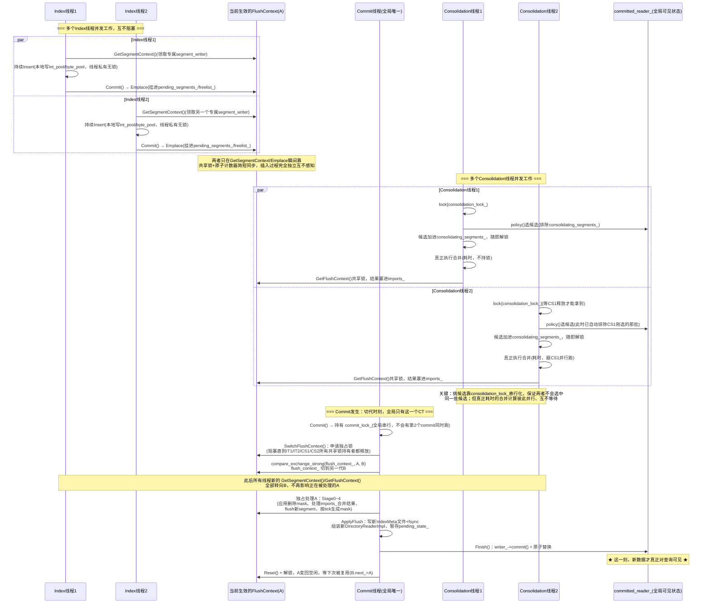
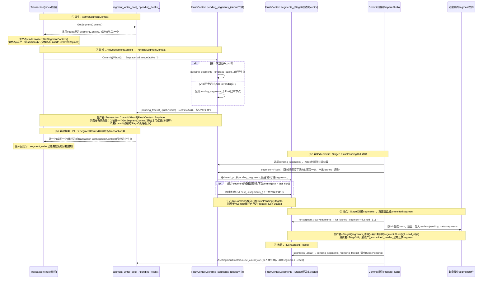
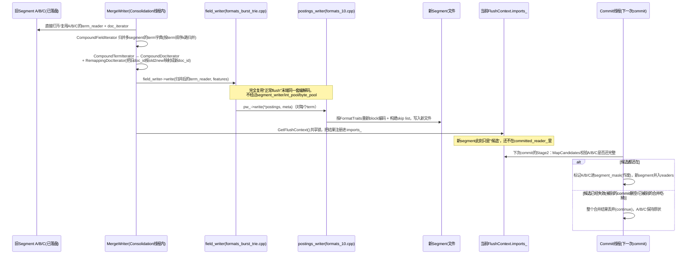
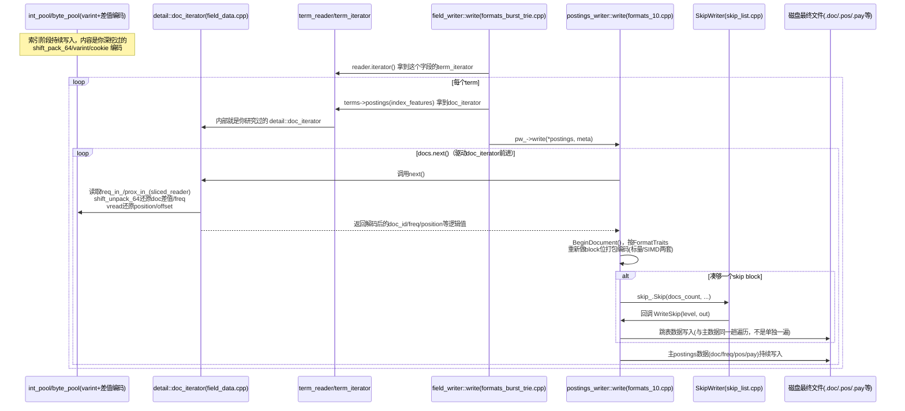

# IndexWriter 三类线程协作关系笔记

个人学习笔记，整理自对 `core/index/index_writer.cpp` / `index_writer.hpp` 的逐行阅读，配合 `utils/index-put.cpp` 的实际线程调度代码。核心结论：三类线程通过 **`FlushContext` 双缓冲环** 作为中枢协调点，彼此之间几乎不直接通信，都是"各自往当前生效的 FlushContext 里塞/取数据"。

---

## 0. 三个线程一览

| 线程 | 数量 | 对应代码(`index-put.cpp`) | 触发方式 | 核心职责 |
|---|---|---|---|---|
| **Index 线程**(indexer) | **多个**(`indexer_threads`个) | `indexer_threads` 循环体 | 持续处理输入数据，来一条插一条 | 把文档写进**自己私有**的 `segment_writer`，攒够了自己触发局部 flush |
| **Commit 线程**(committer) | **只有1个** | `commit_interval_ms` 定时循环 | 固定时间间隔 | 把所有 index 线程攒的新数据 + 已完成的合并结果，一次性落盘并让新状态对外可见 |
| **Consolidation 线程** | **多个**(`consolidation_threads`个) | `consolidation_threads` 循环 | 条件变量唤醒(由commit线程通知)或超时 | 后台把多个小 segment 合并成大 segment，结果异步注册等待下次 commit "转正" |

> 日常实际运行时，Index线程和Consolidation线程都是**并发的一批**，只有Commit线程全局唯一——这一点在下面1.的交互图里会体现出来。

---

## 1. 时间线交互图(一个完整周期)



**多线程并发的关键点**：
- **多个Index线程之间**：各自持有私有`segment_writer`(对象池领取)，`Insert()`主体无锁；只有"第一次领取"和"commit交还"两个瞬间碰共享的`FlushContext`/`segments_active_`，而且碰的是共享锁+原子操作，不是互斥锁，所以N个index线程基本可以线性扩展。
- **多个Consolidation线程之间**："挑候选segment"这一步靠`consolidation_lock_`互斥锁**严格串行化**(见`index_writer.cpp:1358`的`std::lock_guard lock{consolidation_lock_}`)，确保任意两个consolidation线程不会选中重叠的候选集合；但真正耗时的`MergeWriter`合并计算发生在锁释放**之后**，多个线程可以完全并行执行，不会因为合并耗时而互相阻塞。
- **Commit线程只有一个**：`commit_lock_`保证全局任意时刻只有一次commit在跑，`SwitchFlushContext`的独占锁则保证它接管的那一代FlushContext，此刻不会有任何Index/Consolidation线程还在往里塞数据。

### 1.1 `ActiveSegmentContext` / `PendingSegmentContext` / `FlushContext.segments_` 三者的生产消费关系

这三个名字很像的 `*SegmentContext`，其实是**同一个底层 `SegmentContext`(真正持有 `segment_writer` 的那个对象)在不同生命阶段的三种"包装视角"**，不是三份独立的数据。核心区别：

| 类型 | 本质 | 存放位置 |
|---|---|---|
| `ActiveSegmentContext` | `Transaction` 私有持有的"**借用凭证**"，包了一个 `shared_ptr<SegmentContext>` | `Transaction::active_`（线程私有） |
| `PendingSegmentContext` | 继承自 `Freelist::node_type` 的"**登记节点**"，同样包了同一个 `shared_ptr<SegmentContext>` | `FlushContext::pending_segments_`（deque，地址稳定，所有Index线程共享） |
| `FlushContext::segments_` | 一个 `vector<shared_ptr<SegmentContext>>`，commit真正处理这一代数据时的"**工作集**" | `FlushContext::segments_`（commit线程Stage0现造，Stage3消费） |

#### 时间线图：一个 `SegmentContext` 从"借出"到"落盘"的完整生命周期



#### 一句话区分三者

- **`ActiveSegmentContext`**：Index线程"**正在用**"这个segment时的视角——私有、无锁、随Transaction生死。
- **`PendingSegmentContext`**：这个segment"**已交还、等待commit处理**"时的视角——活在 `pending_segments_` 这个共享deque里，同时也是空闲链表的节点，身兼"登记簿"和"复用池"两个角色。
- **`FlushContext::segments_`**：commit线程"**这一轮真正要处理**"的视角——只在Stage0短暂现造出来，专门喂给Stage3遍历处理，处理完连同整个FlushContext一起被清空复用。

三者包的是**同一个** `shared_ptr<SegmentContext>`，只是在"谁能看见它、它处于哪个阶段"这件事上不断变换身份——这也是为什么 `PendingSegmentContext` 要继承 `Freelist::node_type`（你之前研究过的侵入式链表）：省得为"登记"和"复用"这两件事分别造对象。

---

## 2. 各线程自己的处理逻辑

### 2.1 Index 线程

```
GetBatch() → Transaction(私有，move-only)
  循环：
    Insert() / Remove() / Replace()
      → UpdateSegment()
          → 第一次: writer_->GetSegmentContext()（领取专属segment_writer，可能复用空闲池）
          → 写满了: segment.Flush()（局部落盘，不可见）
  Commit() / 析构自动Commit
    → CommitImpl()
        → segment->Commit(queries_, last_tick)
        → writer_->GetFlushContext()->Emplace(active_)（交还给当前代FlushContext）
```

- **只在"第一次拿segment"和"commit交还segment"这两个瞬间**才摸共享状态(`GetSegmentContext`/`GetFlushContext`)，中间大量的 `Insert()` 调用全部发生在**线程私有**的 `segment_writer` 上，无锁、无竞争。

### 2.2 Commit 线程

```
Commit() → std::lock_guard{commit_lock_}（全局串行，同一时刻只有一个commit在跑）
  Start()
    → PrepareFlush()
        Stage0: SwitchFlushContext()（独占锁，等所有共享锁释放后切代）
        Stage1: 遍历已提交旧segment，应用新的删除/替换查询，生成/合并docs_mask
        Stage2: 处理 imports_（后台consolidation结果 + 显式Import），校验候选segment是否还有效
        Stage3/4: 处理这一代里index线程新flush的segment，按tick生成mask，决定要不要落盘
        早退优化: 如果什么都没变(!modified)，直接返回空，零开销
    → ApplyFlush()：写新IndexMeta文件 + fsync所有变更文件 + 组装新reader，暂存pending_state_
  Finish()
    → writer_->commit()（文件级两阶段提交的第二阶段）
    → std::atomic_store(committed_reader_, pending_state_.commit) ★真正生效★
    → pending_state_.FinishReset()（释放这一代FlushContext回池子）
```

### 2.3 Consolidation 线程

```
Consolidate(policy)
  → 读取 *committed_reader_（当前已提交的segment列表）
  → policy(candidates, committed_reader, consolidating_segments_)（排除正在过渡状态的segment）
  → 把入选的候选segment名字加进 consolidating_segments_
  → MergeWriter 真正执行合并（耗时操作，异步跑，不持有任何全局锁）
  → 合并完成后：writer_->GetFlushContext()->imports_.emplace_back(...)
       （结果只是"注册"进当前代，真正生效要等下一次commit的Stage2处理）
```

- 合并本身**不阻塞**任何index线程或commit线程——它只在"读取候选列表"和"注册结果"这两个瞬间短暂接触共享状态。
- 因为合并耗时、是异步的，**合并开始时看到的候选segment，到合并结束时可能已经失效**（被别的commit删空/已被另一次合并吃掉）——这正是Stage2要做"候选校验+重映射"的原因。

---

## 3. 数据结构归属表

### 3.1 Index 线程私有(不共享)

| 数据结构 | 说明 |
|---|---|
| `Transaction` | 每个线程调`GetBatch()`各自拿一份，move-only，不可复制 |
| `ActiveSegmentContext active_` | `Transaction`的成员，持有专属`SegmentContext` |
| `segment_writer`(`postings`/`int_pool`/`byte_pool`/`BufferedColumn`等) | 整条倒排构建链路，线程私有 |
| `QueryContext`（存在`SegmentContext::queries_`里） | 本线程发起的Remove/Replace过滤器 |

### 3.2 Commit 线程私有(单线程串行，无需加锁)

| 数据结构 | 说明 |
|---|---|
| `PrepareFlush`里的局部变量 | `readers`、`pending_meta`、`segment_ctxs`、`partial_sync`等——因为`commit_lock_`保证全局只有一个commit在跑，这些局部容器天然无竞争 |
| `pending_state_` | `IndexWriter`成员，暂存`ApplyFlush`组装好、等`Finish`生效的新状态 |
| `FlushedSegmentContext`/`MakeDocumentMask` | Stage3/4处理新flush segment用的辅助结构 |

### 3.3 Consolidation 线程私有

| 数据结构 | 说明 |
|---|---|
| `MergeWriter` | 真正执行段合并的核心逻辑(对应阅读指南里标记未读的`merge_writer.cpp`) |
| `Consolidation`(候选segment列表) | 本次合并选中的候选集合 |

### 3.4 ★三线程共享/交互用的核心数据结构★

| 数据结构 | 写入方 | 读取方 | 同步机制 |
|---|---|---|---|
| **`flush_context_`**(原子指针) + **`flush_context_pool_{2}`**(双缓冲环) | Commit线程(`SwitchFlushContext`用CAS切换) | Index线程 + Consolidation线程(`GetFlushContext`读取"当前是谁") | 原子CAS + `FlushContext::context_mutex_`(读写锁) |
| **`FlushContext::pending_segments_`**(deque) / **`pending_freelist_`**(无锁栈) | Index线程(`Emplace`/`AddToPending`写入/复用) | Commit线程(Stage3读取处理) | 共享锁(多个index线程) vs 独占锁(commit线程处理时) |
| **`FlushContext::imports_`**(vector) | Consolidation线程(合并完成后写入) | Commit线程(Stage2读取、校验、落地) | 同上，共享锁写入、独占锁处理 |
| **`segments_active_`**(原子计数器) | 所有Index线程 | 所有Index线程(准入控制) | 纯原子fetch_add/fetch_sub，无锁 |
| **`segment_writer_pool_`**(通用对象池，内部也有独立空闲链表) | Index线程 | Index线程 | 池子内部自带无锁栈 |
| **`consolidating_segments_`** | Commit线程(`PrepareFlush`末尾注册"还在过渡状态的segment") | Consolidation线程(选候选时排除这些) | `consolidation_lock_`互斥锁 |
| **`committed_reader_`**(原子shared_ptr) | 仅Commit线程(`Finish`里原子替换) | Consolidation线程(读取当前委交列表)、所有查询请求 | `std::atomic_store_explicit`/`memory_order_release` |
| **`committed_tick_`** | 仅Commit线程 | Commit线程自己(下次PrepareFlush判断tick范围)、间接影响Index线程的tick分配基准 | 无显式锁(由`commit_lock_`串行保护) |

---

## 4. 关键设计洞察(为什么要这么复杂)

1. **Index线程和Commit线程之间，靠"双缓冲FlushContext"解耦**——insert永远只碰"当前代"，commit独占"正被退休的那一代"，两者物理上不会同时碰同一块内存。
2. **Consolidation线程和Commit线程之间，靠"异步注册+下次commit校验"解耦**——合并不持锁、不阻塞，但代价是结果可能"过期"，必须在Stage2重新校验。
3. **真正需要互斥的操作只有两处**：①`SwitchFlushContext`的独占锁(等一瞬间，不是一直锁)；②`commit_lock_`保证全局同一时刻只有一个commit在跑。其余绝大部分操作都是"各自私有数据 + 短暂的原子/共享锁交互"。
4. 整条链路上贯穿的 **`tick`(全局单调递增计数器)**，是协调"谁的变更该不该算进这次commit"的唯一依据，所有segment、query、flushed记录都带着它。

---

## 5. Consolidation 合并的真实数据路径(重要纠正：不经过 int_pool/byte_pool)

最初以为 consolidation 会像 index 线程一样重新构建 `segment_writer`/`int_pool`/`byte_pool`，实际读 `merge_writer.cpp` 后发现**完全不是**——合并时数据早已是"解码好的 postings"，没有重新分词的必要，走的是一条独立的"多 segment 归并迭代器"路径，直接复用正常 flush 末端共用的 `field_writer`/`postings_writer`。

### 5.1 时间线图



### 5.2 跟"正常flush路径"的关键区别对比

| 环节 | 正常Index flush路径 | Consolidation合并路径 |
|---|---|---|
| 数据来源 | 原始文本，需要分词 | 已有旧segment的postings，直接读 |
| 中间暂存结构 | `int_pool`/`byte_pool`(varint+差值编码，追加写优化) | **没有**，直接用归并迭代器实时产出 |
| 核心对象 | `field_data`/`postings`/`new_term`/`add_term` | `CompoundFieldIterator`/`CompoundTermIterator`/`CompoundDocIterator`/`RemappingDocIterator` |
| doc_id处理 | 顺序分配新doc_id | 旧doc_id通过`old2new`docmap重映射成新segment里的doc_id |
| 落盘入口 | `fields_data::flush()` → `fw.write(terms, features)` | `MergeWriter::Flush()` → `field_writer->write(field_itr, features)` |
| 最终编码环节 | **相同**：都走 `postings_writer::write()` | **相同**：都走 `postings_writer::write()` |

关键洞察：**两条路径在"写磁盘"这最后一步是完全共用的**(`field_writer`/`postings_writer`)，差异只在"喂给它的 term/doc 迭代器数据是从哪来的"——一个是解码本进程刚积累的内存编码，一个是归并多个已有文件的现成数据。

### 5.3 产出结果的归属

- 新生成的segment文件先注册进当前 `FlushContext::imports_`(写入方是Consolidation线程，读取方是Commit线程)，**此刻还不属于`committed_reader_`**
- 要等**下一次commit**的Stage2校验通过，才会：①把A/B/C标记进`segment_mask`(作废，不进入新的`readers`列表)；②新segment正式并入`pending_meta.segments`/`readers`
- A/B/C的物理文件不是"立刻删除"，而是引用计数归零(没有任何reader再指向它们)后，由后续的`RemoveAllUnreferenced`清理

---

## 6. int_pool/byte_pool → 磁盘文件的完整落地路径(含跳表构建)

这是"正常flush路径"里，你之前逐字节推演过的内存编码，究竟在哪一步被重新解码、重新编码成磁盘格式(含跳表)的完整链路。

### 6.1 时间线图



### 6.2 关键代码定位

| 步骤 | 函数 | 文件 |
|---|---|---|
| 触发flush总入口 | `fields_data::flush(field_writer&, flush_state&)` | `core/index/field_data.cpp:1125` |
| 按字段逐个驱动写入 | `fw.write(terms, terms.meta().features)` | `core/index/field_data.cpp:1159` |
| term字典遍历 + 调用postings_writer | `field_writer::write(reader, features)` | `core/formats/formats_burst_trie.cpp:1294` |
| **真正的解码+重编码+跳表构建** | `postings_writer<FormatTraits>::write(doc_iterator&, term_meta&)` | `core/formats/formats_10.cpp:943` |
| 跳表触发点 | `skip_.Skip(docs_count, [this](...){ WriteSkip(level, out); ... })` | `core/formats/formats_10.cpp:988` |

### 6.3 数据结构转换表

| 阶段 | 数据表示形式 | 特点 |
|---|---|---|
| 索引期(`int_pool`/`byte_pool`) | varint变长整数 + 差值编码，分片链式存储(你深挖过的slice/cookie机制) | 为"持续追加写"优化，不利于随机读、不利于批量解压 |
| 解码中间态(`doc_iterator`读出的逻辑值) | 普通的`doc_id_t`/`uint32_t`等逻辑数值 | 纯内存中的临时值，不落盘 |
| 磁盘最终态(`postings_writer`写出的格式) | 按`FormatTraits`做block位打包(比如128篇一组定长位打包) + 独立的跳表结构 | 为"批量快速解压+跳跃查找"优化，牺牲了"追加写"的灵活性换查询性能 |

### 6.4 一句话总结

`doc_iterator`(正常flush场景下，就是`field_data.cpp`里的`detail::doc_iterator`)扮演的是"**解码器**"角色，把索引期专为追加写优化的`int_pool`/`byte_pool`编码解出来；`postings_writer::write()`扮演"**重编码器**"角色，一边消费这些解码出的值，一边按磁盘专用的、面向查询优化的block位打包格式重新写，并在同一趟遍历里顺带把跳表也建好——**索引期编码和磁盘期编码是两套完全不同的格式，`doc_iterator`是连接两者的唯一桥梁**。
